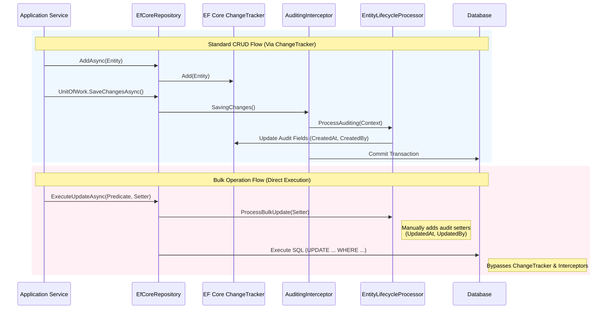

# Data Flow (データフロー)

本ドキュメントでは、`VK.Blocks.Persistence.EFCore` における主要なデータ処理フロー、特に「標準CRUD操作」と「バルク操作」における監査ロジックの違い（Hybrid Auditing Strategy）について解説します。

## Hybrid Auditing Data Flow

## データフローのポイント

### 1. Standard CRUD (青色のフロー)

- EF Core の標準的な `ChangeTracker` を経由します。
- `SaveChangesAsync` が呼ばれたタイミングで `AuditingInterceptor` が発火します。
- **メリット**: ドメインイベントの発行や、複雑なオブジェクトグラフの整合性チェックに適しています。

### 2. Bulk Operations (赤色のフロー)

- EF Core 7+ の `ExecuteUpdate` / `ExecuteDelete` を使用し、SQLを直接生成・実行します。
- **重要**: `ChangeTracker` を経由しないため、**Interceptor は発火しません**。
- そのため、Repository 内部で明示的に `EntityLifecycleProcessor` を呼び出し、監査情報（更新日時、更新者）や論理削除フラグをクエリに注入しています。
- **メリット**: 大量データの処理において、メモリ使用量と実行時間を劇的に削減できます。
