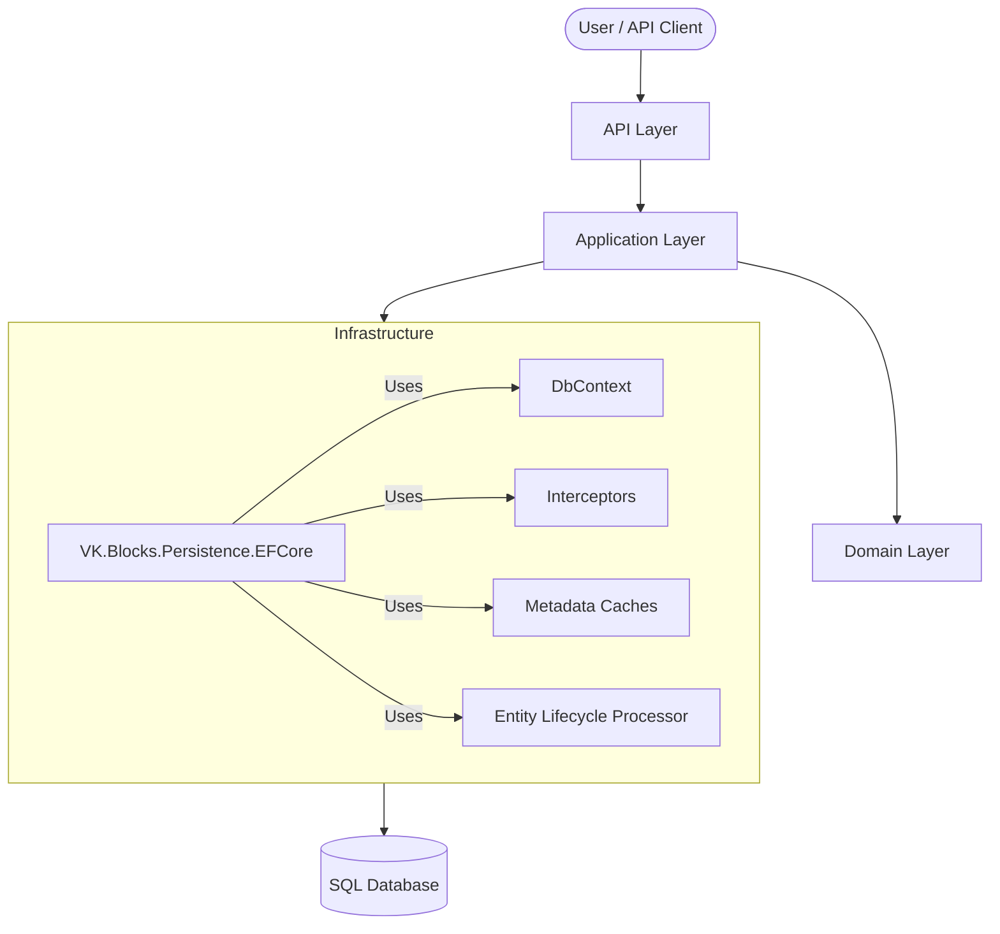
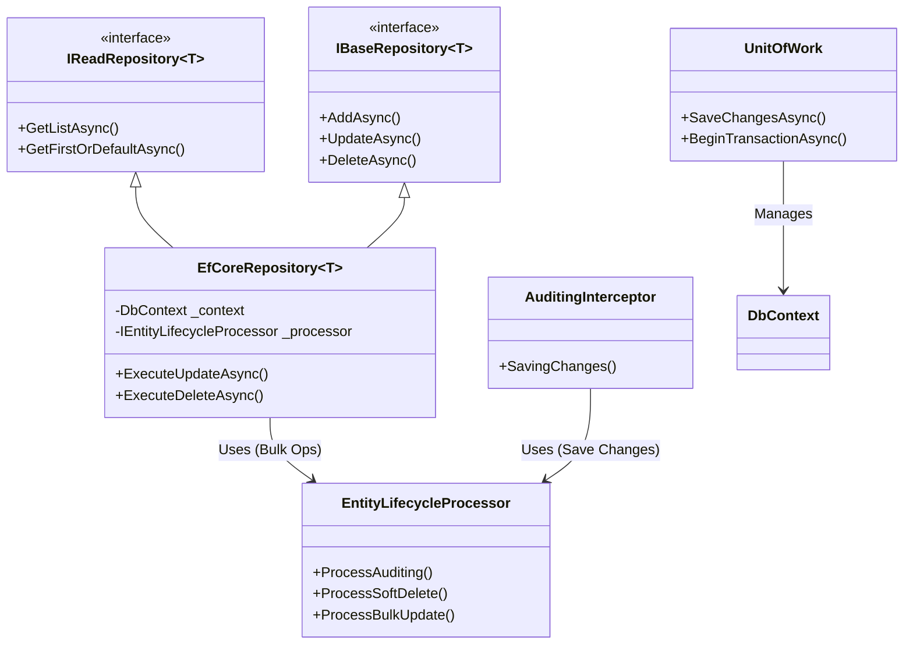

# System Overview (システム全景)

本ドキュメントでは、`VK.Blocks.Persistence.EFCore` モジュールを中心としたシステムの全体像と、各コンポーネントの責務について記述します。

## System Context Diagram (システムコンテキスト図)

## Component Architecture (コンポーネントアーキテクチャ)

`VK.Blocks.Persistence.EFCore` 内部の主要コンポーネントとその関係性を示します。

## モジュールの役割

1.  **Repository Layer**: ドメインオブジェクトのコレクションとして振る舞い、データの永続化と再構築を担当します。
2.  **Unit of Work**: ビジネス・トランザクションの境界を定義し、複数のリポジトリ操作を原子的にコミットします。
3.  **Cross-Cutting Concerns**: 監査ログや論理削除といったインフラストラクチャの関心事を、ビジネスロジックから分離して処理します。
