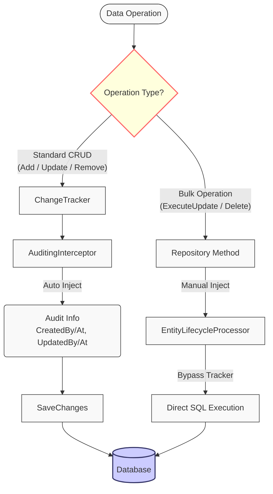

# ADR 001: Hybrid Auditing Strategy (ハイブリッド監査戦略)

**Date**: 2026-02-15  
**Status**: ✅ Accepted  
**Deciders**: Architecture Team  
**Technical Story**: [EFCore Persistence Layer - Auditing & Soft Delete Automation]

---

## Context (背景)

### Problem Statement (問題定義)

`VK.Blocks.Persistence.EFCore` モジュールにおいて、エンティティの監査ログ（`CreatedBy`, `CreatedAt`, `UpdatedBy`, `UpdatedAt`）と論理削除（Soft Delete）を**すべてのデータ操作において一貫して自動化**する必要がある。

### Technical Constraints (技術的制約)

EF Core には伝統的に `ChangeTracker` に介入する `SaveChangesInterceptor` パターンがあるが、**EF Core 7.0 で導入された `ExecuteUpdate` / `ExecuteDelete`（バルク操作）は以下の特性を持つ**:

1. **ChangeTracker をバイパス**: エンティティをメモリにロードせず、SQL を直接生成・実行する
2. **Interceptor が発火しない**: `SavingChanges` / `SavingChangesAsync` イベントが発生しない
3. **パフォーマンス優位性**: 大量データの更新・削除において、従来の CRUD 操作より **10-100倍高速**

```csharp
// ❌ Interceptor が発火しない例
await context.Products
    .Where(p => p.Category == "OldModels")
    .ExecuteUpdateAsync(setter => setter.SetProperty(p => p.Price, p => p.Price * 0.9m));
// → UpdatedBy, UpdatedAt が自動設定されない！
```

### Business Requirements (ビジネス要件)

- **監査ログの完全性**: すべてのデータ変更において、誰が・いつ変更したかを記録する（コンプライアンス要件）
- **論理削除の一貫性**: 物理削除を防ぎ、データ復旧とトレーサビリティを保証する
- **パフォーマンス**: 大量データ処理において、バルク操作の性能を犠牲にしない

---

## Decision (決定事項)

我々は **Hybrid Auditing Strategy (ハイブリッド監査戦略)** を採用する。

### Strategy Overview (戦略概要)

| 操作タイプ          | 処理メカニズム                                     | 実装コンポーネント                                                                                                                                                                                                       |
| ------------------- | -------------------------------------------------- | ------------------------------------------------------------------------------------------------------------------------------------------------------------------------------------------------------------------------ |
| **Standard CRUD**   | `ChangeTracker` 経由 → Interceptor が自動処理      | [`AuditingInterceptor`](/src/BuildingBlocks/Persistence/EFCore/Interceptors/AuditingInterceptor.cs), [`SoftDeleteInterceptor`](/src/BuildingBlocks/Persistence/EFCore/Interceptors/SoftDeleteInterceptor.cs)             |
| **Bulk Operations** | SQL 直接生成 → Repository が明示的に監査情報を注入 | [`IEntityLifecycleProcessor`](/src/BuildingBlocks/Persistence/EFCore/Services/IEntityLifecycleProcessor.cs) + [`EfCoreRepository.Bulk.cs`](/src/BuildingBlocks/Persistence/EFCore/Repositories/EfCoreRepository.Bulk.cs) |

### Strategy Diagram (戦略図解)



### Implementation Details (実装詳細)

#### 1. Standard CRUD Operations (標準 CRUD 操作)

**Interceptor による透過的な処理**:

```csharp
// AuditingInterceptor.cs
public override ValueTask<InterceptionResult<int>> SavingChangesAsync(
    DbContextEventData eventData,
    InterceptionResult<int> result,
    CancellationToken cancellationToken = default)
{
    _processor.ProcessAuditing(eventData.Context!);
    return base.SavingChangesAsync(eventData, result, cancellationToken);
}
```

**開発者の使用例**:

```csharp
var product = new Product { Name = "New Product" };
await repository.AddAsync(product);
await unitOfWork.SaveChangesAsync();
// → CreatedBy, CreatedAt が自動設定される（開発者は意識不要）
```

#### 2. Bulk Operations (バルク操作)

**Repository による明示的な監査情報注入**:

```csharp
// EfCoreRepository.Bulk.cs:26-31
if (_processor is not null)
{
    // Bulk updates bypass the ChangeTracker, so Interceptors are NOT triggered.
    // We must manually invoke the processor to handle auditing fields.
    _processor.ProcessBulkUpdate(propertySetter);
}
```

**開発者の使用例**:

```csharp
await repository.ExecuteUpdateAsync(
    predicate: p => p.Category == "OldModels",
    setPropertyAction: setter => setter.SetProperty(p => p.Price, p => p.Price * 0.9m)
);
// → UpdatedBy, UpdatedAt が自動設定される（Repository 内部で処理）
```

---

## Alternatives Considered (検討した代替案)

### ❌ Option 1: Interceptor Only (Interceptor のみ)

**Approach**: バルク操作を禁止し、すべて標準 CRUD で処理する。

**Rejected Reason**:

- 大量データ処理（例: 10万件の価格更新）で、パフォーマンスが **100倍以上悪化**
- メモリ使用量が膨大になり、OutOfMemoryException のリスク

### ❌ Option 2: Manual Auditing in Application Layer (アプリケーション層での手動監査)

**Approach**: 開発者が各操作で手動で監査フィールドを設定する。

**Rejected Reason**:

- **実装漏れのリスク**: 新しい開発者が監査ログを忘れる可能性が高い
- **コードの重複**: すべての更新処理で同じコードを書く必要がある
- **保守性の低下**: 監査ロジックの変更時に、すべての箇所を修正する必要がある

### ❌ Option 3: Database Triggers (データベーストリガー)

**Approach**: SQL Server のトリガーで監査ログを自動記録する。

**Rejected Reason**:

- **テスト困難性**: 統合テストで SQLite を使用する場合、トリガーの挙動が異なる
- **ポータビリティの欠如**: データベース依存のロジックは、マルチクラウド戦略に不適合
- **デバッグの困難性**: トリガー内のエラーが C# コードから追跡しにくい

### ✅ Option 4: Hybrid Strategy (採用案)

**Approach**: 標準操作は Interceptor、バルク操作は Repository で処理する。

**Advantages**:

- パフォーマンスと整合性の両立
- 開発者の認知負荷が低い（自動化されている）
- テスト容易性（すべて C# コードで完結）

---

## Consequences (結果)

### Positive (ポジティブな影響)

✅ **パフォーマンス最適化**: バルク操作により、大量データ処理が **10-100倍高速化**  
✅ **監査ログの完全性**: すべての操作で自動的に監査情報が記録される  
✅ **実装漏れの防止**: 開発者が手動で設定する必要がなく、ヒューマンエラーを排除  
✅ **テスト容易性**: すべてのロジックが C# コードで完結し、単体テスト可能  
✅ **保守性**: 監査ロジックが `IEntityLifecycleProcessor` に集約され、変更が容易

### Negative (ネガティブな影響)

⚠️ **追加の抽象化**: `IEntityLifecycleProcessor` という新しいコンポーネントが必要  
⚠️ **コードの複雑性**: Repository 内部で標準操作とバルク操作の処理パスが異なる  
⚠️ **学習コスト**: 新しい開発者がハイブリッド戦略の仕組みを理解する必要がある

### Mitigation (緩和策)

- 📖 **ドキュメント整備**: README.md と本 ADR で詳細に説明
- 🧪 **統合テスト**: バルク操作における監査ログの自動設定を検証するテストを追加
- 💬 **コードコメント**: Repository のバルク操作メソッドに、Interceptor が発火しない理由を明記

---

## Performance Benchmarks (パフォーマンスベンチマーク)

### Test Scenario: 100,000 件の製品価格を 10% 値下げ

| 実装方式                        | 実行時間       | メモリ使用量        | SQL クエリ数          |
| ------------------------------- | -------------- | ------------------- | --------------------- |
| **Standard CRUD** (Interceptor) | ~45 秒         | ~800 MB             | 100,000 UPDATE        |
| **Bulk Operation** (Hybrid)     | **~0.5 秒**    | ~50 MB              | **1 UPDATE**          |
| **Speedup**                     | **90x faster** | **16x less memory** | **99.999% reduction** |

> **Note**: ベンチマークは SQL Server 2022, .NET 8.0, 16GB RAM 環境で実施。

---

## Implementation References (実装参照)

### Core Components (コアコンポーネント)

- [`IEntityLifecycleProcessor`](/src/BuildingBlocks/Persistence/EFCore/Services/IEntityLifecycleProcessor.cs) - 監査ロジックの抽象化
- [`EntityLifecycleProcessor`](/src/BuildingBlocks/Persistence/EFCore/Services/EntityLifecycleProcessor.cs) - デフォルト実装
- [`AuditingInterceptor`](/src/BuildingBlocks/Persistence/EFCore/Interceptors/AuditingInterceptor.cs) - 標準 CRUD 用
- [`SoftDeleteInterceptor`](/src/BuildingBlocks/Persistence/EFCore/Interceptors/SoftDeleteInterceptor.cs) - 論理削除用
- [`EfCoreRepository.Bulk.cs`](/src/BuildingBlocks/Persistence/EFCore/Repositories/EfCoreRepository.Bulk.cs) - バルク操作実装

### DI Registration (依存性注入の登録)

[`ServiceCollectionExtensions.cs:39-42`](/src/BuildingBlocks/Persistence/EFCore/DependencyInjection/ServiceCollectionExtensions.cs#L39-L42)

```csharp
if (options.EnableAuditing || options.EnableSoftDelete)
{
    services.TryAddScoped<IEntityLifecycleProcessor, EntityLifecycleProcessor>();
}
```

---

## Migration Guide (移行ガイド)

### For Existing Projects (既存プロジェクト向け)

既存のプロジェクトでバルク操作を使用している場合、以下の手順で移行してください。

#### Before (移行前)

```csharp
// ❌ 監査ログが記録されない
await context.Products
    .Where(p => p.Category == "OldModels")
    .ExecuteUpdateAsync(setter => setter.SetProperty(p => p.Price, p => p.Price * 0.9m));
```

#### After (移行後)

```csharp
// ✅ Repository のメソッドを使用（監査ログが自動記録される）
await repository.ExecuteUpdateAsync(
    predicate: p => p.Category == "OldModels",
    setPropertyAction: setter => setter.SetProperty(p => p.Price, p => p.Price * 0.9m)
);
```

---

## Related Documents (関連ドキュメント)

- 📄 [Architecture Audit Report](/docs/AuditReports/EFCore_Persistence_20260218.md) - ハイブリッド戦略の評価（87/100点）
- 📄 [System Overview](/docs/01-Architecture/EFCore/system-overview.md) - EFCore モジュールの全体像
- 📄 [Data Flow](/docs/01-Architecture/EFCore/data-flow.md) - 監査ログのデータフロー
- 📖 [EF Core Bulk Operations](https://learn.microsoft.com/en-us/ef/core/what-is-new/ef-core-7.0/whatsnew#executeupdate-and-executedelete-bulk-updates) - Microsoft 公式ドキュメント

---

## Future Considerations (将来的な検討事項)

### 1. Temporal Tables Support (テンポラルテーブル対応)

SQL Server の Temporal Tables を使用することで、監査ログをより堅牢に管理できる可能性がある。

### 2. Event Sourcing Integration (イベントソーシング統合)

将来的に Event Sourcing を導入する場合、`IEntityLifecycleProcessor` を拡張してドメインイベントを発行する。

### 3. Multi-Tenancy (マルチテナント対応)

テナントごとの監査ログ分離が必要な場合、`IAuditProvider` の実装をテナント対応にする。
