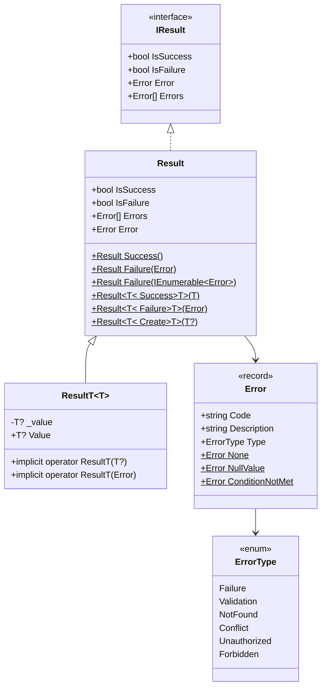
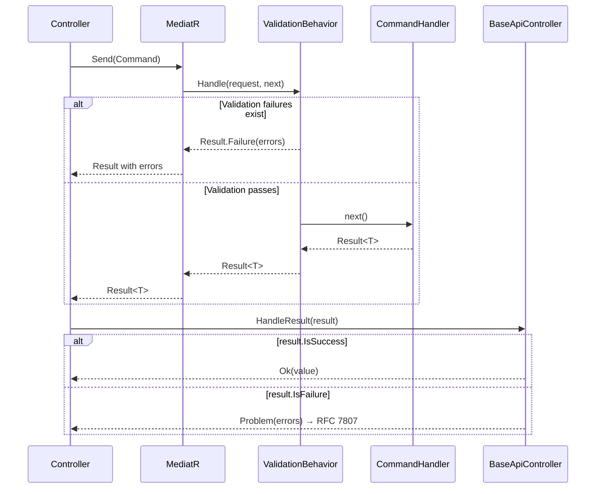

# ADR 001: Result Monad と Railway-Oriented Programming (Result モナド・ROP パターンの採用)

**Date**: 2026-02-17
**Status**: ✅ Accepted
**Deciders**: Architecture Team
**Technical Story**: [Web - Error Handling Strategy]

---

## Context (背景)

### Problem Statement (問題定義)

`VK.Blocks.Web` モジュールにおいて、アプリケーション全体のエラーハンドリング戦略を統一する必要がある。従来の .NET アプリケーションでは例外ベースの制御フロー (try-catch) が主流だが、以下の課題が存在する:

1. **例外の高コスト**: .NET における例外スローは通常のメソッド呼び出しの **~1,000倍のコスト** がかかる
2. **暗黙的なフロー**: どのメソッドがどの例外をスローするかがシグネチャに現れない
3. **ドメインエラーと例外の混同**: 「ユーザーが見つからない」のようなドメインエラーが `NotFoundException` のような技術的例外で表現される
4. **エラー集約の困難**: FluentValidation で複数の検証エラーを集約する場合、例外だけでは扱いにくい

### Business Requirements (ビジネス要件)

- **型安全なエラーハンドリング**: コンパイラがエラー処理漏れを検知可能
- **検証エラーの集約**: 複数のバリデーションエラーを一括返却
- **HTTP レスポンスとの自然なマッピング**: エラー型から HTTP ステータスコードへの変換
- **パイプライン互換性**: MediatR Pipeline Behavior との統合

---

## Decision (決定事項)

**Result Monad パターン** と **Railway-Oriented Programming (ROP)** を組み合わせたエラーハンドリング戦略を採用する。

### Design Overview (設計概要)



### Key Design Decisions (主要設計判断)

#### 1. 不変条件の対称的保護

両コンストラクタでタプルパターンマッチングにより不変条件を一貫して保護:

```csharp
// Result.cs - 単一エラー・複数エラーの両方で同一ロジック
switch (isSuccess, hasError)
{
    case (true, true):
        throw new InvalidOperationException("Success result cannot contain errors.");
    case (false, false):
        throw new InvalidOperationException("Failure result must contain at least one error.");
}
```

#### 2. Railway-Oriented Programming 演算子

5つの ROP 演算子を `ResultExtensions` として実装:

| 演算子   | 機能                                      | 関数型対応           |
| :------- | :---------------------------------------- | :------------------- |
| `Bind`   | 成功値を次の Result 返却関数に渡す        | `>>=` (Monad Bind)   |
| `Map`    | 成功値を変換する                          | `fmap` (Functor Map) |
| `Tap`    | 副作用を実行する（結果変更なし）          | `peek`               |
| `Ensure` | 条件を満たさなければ失敗に変換            | `filter`             |
| `Match`  | 成功/失敗に応じてハンドリング（終端操作） | Pattern Match        |

#### 3. 暗黙的変換演算子

`Result<T>` に暗黙的変換を定義し、ボイラープレートを削減:

```csharp
// return user; → 自動的に Result<User>.Success(user) に変換
public static implicit operator Result<TValue>(TValue? value) => Create(value);

// return Error.NotFound; → 自動的に Result<User>.Failure<User>(error) に変換
public static implicit operator Result<TValue>(Error error) => Failure<TValue>(error);
```

### Integration with MediatR Pipeline (MediatR パイプラインとの統合)



---

## Alternatives Considered (検討した代替案)

### 🚫 Option 1: 例外ベース制御フロー (Exception-Based Flow Control)

**Approach**: `NotFoundException`, `ValidationException` 等のカスタム例外をスロー。

**Rejected Reason**:

- 例外は **例外的状況** に限定すべき (CLR 設計ガイドライン)
- 「ユーザーが見つからない」は例外ではなく、予期される結果
- パフォーマンスコスト (~1,000x slower than method return)
- 複数の検証エラーを集約できない（最初の例外で中断）

### 🚫 Option 2: OneOf / Discriminated Union (判別共用体)

**Approach**: `OneOf<User, NotFoundError, ValidationErrors>` のような型で戻り値を表現。

**Rejected Reason**:

- `OneOf` の型パラメータ数が増えると可読性が低下 (`OneOf<T, Error1, Error2, Error3, ...>`)
- C# 12 時点で言語レベルの Discriminated Union が未サポート
- MediatR Pipeline Behavior との統合が困難

### 🚫 Option 3: nullable 戻り値 + out パラメータ

**Approach**: `bool TryGetUser(int id, out User? user, out Error? error)`

**Rejected Reason**:

- `async/await` と互換性がない (`out` パラメータは async メソッドで使用不可)
- エラーの型安全性が不十分
- 関数合成（パイプライン化）が困難

### ✅ Option 4: Result Monad + ROP (採用案)

**Advantages**:

- 型シグネチャにエラーの可能性が明示される
- 複数の検証エラーを自然に集約
- `ErrorType` → HTTP Status Code のマッピングが宣言的
- MediatR Pipeline との自然な統合
- 関数合成による可読性の高いパイプライン

---

## Consequences (結果)

### Positive (ポジティブな影響)

- ✅ **型安全性**: `Result<T>` の戻り値型がエラーの可能性を明示し、ハンドリング漏れを防止
- ✅ **パフォーマンス**: 例外スローのコスト (~10μs) を回避し、通常のオブジェクト返却 (~10ns) で処理
- ✅ **RFC 7807 準拠**: `ErrorType` → `ProblemDetails` の変換を `ErrorTypeExtensions` で一元管理
- ✅ **テスト容易性**: `Result.Success()` / `Result.Failure()` で期待結果を明確に表現可能
- ✅ **開発者体験**: 暗黙的変換により `return user;` / `return Error.NotFound;` の自然な構文

### Negative (ネガティブな影響)

- ⚠️ **学習コスト**: 関数型プログラミングの概念 (Monad, Bind, Functor) への理解が必要
- ⚠️ **非同期パイプライン**: 現在は同期版の ROP 演算子のみ (`BindAsync` / `MapAsync` 未実装)
- ⚠️ **Value プロパティのアクセス**: `result.Value` へのアクセスにはガード (`IsSuccess` チェック) が必要

### Mitigation (緩和策)

- 📖 暗黙的変換により、ROP を意識せずとも基本的な使用は可能
- 🔄 非同期 ROP 演算子の将来的な追加予定
- 🧪 `Fail-fast` 原則: `Value` アクセス時に明確な例外メッセージで誤用を即座に通知

---

## Implementation References (実装参照)

### Core Components (コアコンポーネント)

- [Result.cs](/src/BuildingBlocks/Web/Shared/Result.cs) - Result モナド基底クラス
- [ResultT.cs](/src/BuildingBlocks/Web/Shared/ResultT.cs) - ジェネリック版 `Result<T>`
- [IResult.cs](/src/BuildingBlocks/Web/Shared/IResult.cs) - Result インターフェース
- [Error.cs](/src/BuildingBlocks/Web/Shared/Error.cs) - 構造化エラー型 (record)
- [ResultExtensions.cs](/src/BuildingBlocks/Web/Extensions/ResultExtensions.cs) - ROP 演算子群

### Integration Points (統合ポイント)

- [ValidationBehavior.cs](/src/BuildingBlocks/Web/Behaviors/ValidationBehavior.cs) - MediatR パイプラインとの統合
- [BaseApiController.cs](/src/BuildingBlocks/Web/Presentation/BaseApiController.cs) - HTTP レスポンスへのマッピング
- [ErrorTypeExtensions.cs](/src/BuildingBlocks/Web/Presentation/ErrorTypeExtensions.cs) - ErrorType → HTTP Status Code 変換

---

## Related Documents (関連ドキュメント)

- 📄 [Architecture Audit Report](/docs/04-AuditReports/Web/Web_20260219.md) - 最新の監査報告書
- 📖 [Railway Oriented Programming (Scott Wlaschin)](https://fsharpforfunandprofit.com/rop/)
- 📖 [Result Pattern (Vladimir Khorikov)](https://enterprisecraftsmanship.com/posts/error-handling-exception-or-result/)
- 📖 [RFC 7807 - Problem Details for HTTP APIs](https://datatracker.ietf.org/doc/html/rfc7807)

---

## Future Considerations (将来的な検討事項)

### 1. 非同期 ROP 演算子の追加

`BindAsync`, `MapAsync`, `TapAsync` を実装し、`Task<Result<T>>` のパイプライン合成を可能にする。

### 2. Discriminated Union への進化 (C# 13+)

C# の言語仕様が Discriminated Union をサポートした場合、`Result<T>` や `record` ベースの DU に移行を検討。

### 3. Source Generator による静的検証

`Result<T>` の `Value` アクセス前に `IsSuccess` チェックが行われているかをコンパイル時に検証する Analyzer の導入。
