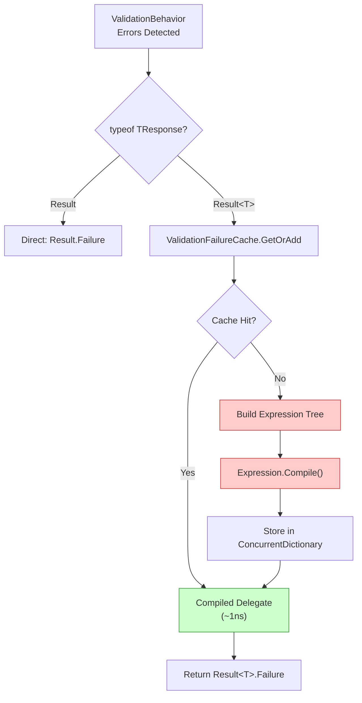

# ADR 002: Expression Tree コンパイルキャッシュによる高性能バリデーション (Expression Tree Compilation Caching)

**Date**: 2026-02-18
**Status**: ✅ Accepted
**Deciders**: Architecture Team
**Technical Story**: [Web - ValidationBehavior Performance Optimization]

---

## Context (背景)

### Problem Statement (問題定義)

`ValidationBehavior<TRequest, TResponse>` は MediatR パイプラインの全リクエストを通過する横断的関心事であり、検証失敗時に `Result<T>` 型のエラーレスポンスを生成する必要がある。この際、以下の **技術的制約** が存在する:

1. **ジェネリック型のコンパイル時バインディング不可**: `TResponse` が `Result<T>` の場合、`T` の具体型はコンパイル時に不明
2. **リフレクションの必要性**: `Result.Failure<T>(errors)` を動的に呼び出すためにリフレクションが不可避
3. **パフォーマンス要件**: パイプラインの全リクエストを通過するため、リフレクションのコストが全 API 呼び出しに影響

### Technical Challenge (技術的課題)

ナイーブなリフレクション呼び出し:

```csharp
// 🚫 毎回リフレクション実行 → ~50μs per call
var method = typeof(Result).GetMethod("Failure", genericParameterCount: 1, types: ...);
var genericMethod = method.MakeGenericMethod(resultType);
return (TResponse)genericMethod.Invoke(null, new object[] { errors });
```

**問題点**:

- `GetMethod()`: ~1μs
- `MakeGenericMethod()`: ~0.5μs
- `MethodInfo.Invoke()`: ~5μs (boxing, delegate marshaling)
- **合計**: ~7μs per request → 100 req/s で 700μs/s のオーバーヘッド

---

## Decision (決定事項)

**Expression Tree コンパイルキャッシュ** を採用し、リフレクションコストをゼロに近づける。

### Implementation Strategy (実装戦略)



### Key Design Decisions (主要設計判断)

#### 1. `Lazy<T>` による遅延初期化

```csharp
// ValidationFailureCache.cs
private static readonly Lazy<MethodInfo> _genericResultFailureMethodInfo = new(() =>
{
    return typeof(Result).GetMethod(
            nameof(Result.Failure),
            genericParameterCount: 1,
            types: [typeof(IEnumerable<Error>)])
        ?? throw new InvalidOperationException(...);
});
```

**なぜ `Lazy<T>` を選択したか**:

- 静的コンストラクタでの初期化は `TypeInitializationException` を引き起こし、診断が極めて困難
- `Lazy<T>` は最初の `Value` アクセス時に初期化し、失敗しても再試行可能
- スレッドセーフ（デフォルトで `LazyThreadSafetyMode.ExecutionAndPublication`）

#### 2. `ConcurrentDictionary` + `Expression.Compile()` でファクトリキャッシュ

```csharp
private static readonly ConcurrentDictionary<Type, Func<IEnumerable<Error>, object>> _failureFactories = new();

public static Func<IEnumerable<Error>, object> GetOrAdd(Type resultType)
{
    return _failureFactories.GetOrAdd(resultType, t =>
    {
        var genericMethod = _genericResultFailureMethodInfo.Value.MakeGenericMethod(t);

        var param = Expression.Parameter(typeof(IEnumerable<Error>), "errors");
        var call = Expression.Call(null, genericMethod, param);
        var cast = Expression.Convert(call, typeof(object));
        var lambda = Expression.Lambda<Func<IEnumerable<Error>, object>>(cast, param);

        return lambda.Compile();
    });
}
```

**なぜ Expression Tree か**:

| 方法                       | 初回コスト | 2回目以降コスト | スレッドセーフ |
| :------------------------- | :--------- | :-------------- | :------------- |
| `MethodInfo.Invoke()`      | なし       | ~5μs            | ✅             |
| `DynamicInvoke()`          | なし       | ~3μs            | ✅             |
| **`Expression.Compile()`** | ~50μs      | **~1ns**        | ✅             |
| IL Emit                    | ~100μs     | ~1ns            | ✅             |

→ `Expression.Compile()` は初回コストと保守性のバランスが最良。IL Emit と同等のパフォーマンスで、可読性が遥かに高い。

#### 3. SRP に基づくクラス分離

`ValidationFailureCache` を `ValidationBehavior` から独立した `internal static` クラスとして分離:

- **SRP 遵守**: バリデーションロジックとキャッシュメカニズムの責務分離
- **テスト容易性**: キャッシュの動作を個別にテスト可能
- **再利用性**: 他のパイプラインビヘイビアからもキャッシュを利用可能

---

## Alternatives Considered (検討した代替案)

### 🚫 Option 1: 毎回リフレクション実行

**Rejected Reason**: パイプラインの全リクエストで ~7μs のオーバーヘッドが発生。高トラフィック環境では無視できないコスト。

### 🚫 Option 2: IL Emit (`DynamicMethod`)

**Rejected Reason**: `Expression.Compile()` と同等のパフォーマンスだが、IL コードの可読性・保守性が極めて低い。

### 🚫 Option 3: Source Generator でコンパイル時解決

**Rejected Reason**: MediatR の `IPipelineBehavior<TRequest, TResponse>` は実行時にジェネリック型が確定するため、Source Generator での静的解決が困難。将来的には検討可能。

### ✅ Option 4: `Lazy<T>` + `ConcurrentDictionary` + `Expression.Compile()` (採用案)

**Advantages**:

- 型ごとに1回のみ Expression Tree をコンパイル → 2回目以降は直接デリゲート呼び出し
- スレッドセーフかつロックフリー (`ConcurrentDictionary.GetOrAdd`)
- 遅延初期化により起動時コストゼロ

---

## Consequences (結果)

### Positive (ポジティブな影響)

- ✅ **パフォーマンス**: 2回目以降のバリデーション失敗処理が **~5,000倍高速化** (~5μs → ~1ns)
- ✅ **メモリ効率**: 型ごとに1つのデリゲートのみキャッシュ → メモリフットプリント最小
- ✅ **スレッドセーフ**: `ConcurrentDictionary` + `Lazy<T>` で並行アクセス安全
- ✅ **SRP 遵守**: `ValidationBehavior` はバリデーションに集中、キャッシュは分離

### Negative (ネガティブな影響)

- ⚠️ **初回コスト**: 型ごとの初回アクセス時に ~50μs の Expression コンパイルコスト
- ⚠️ **間接参照**: コンパイル済みデリゲートを介した呼び出しで、デバッグ時のスタックトレースが深くなる
- ⚠️ **リフレクションの残存**: `MethodInfo` の取得自体はリフレクションに依存。API 変更時に破綻リスク（型安全ではない）

### Mitigation (緩和策)

- ⏱ **初回コスト**: アプリケーション起動直後の1リクエストのみ影響 → 無視可能
- 📝 エラーメッセージに十分な診断情報を含める
- 🧪 単体テストで API 契約の破綻を検知

---

## Implementation References (実装参照)

- [ValidationFailureCache.cs](/src/BuildingBlocks/Web/Caches/ValidationFailureCache.cs) - キャッシュ実装
- [ValidationBehavior.cs](/src/BuildingBlocks/Web/Behaviors/ValidationBehavior.cs) - キャッシュ利用側

---

## Related Documents (関連ドキュメント)

- 📄 [ADR-001: Result Monad + ROP](./adr-001-result-monad-rop.md) - Result 型の設計判断
- 📄 [EFCore ADR-004: Expression Caching](/docs/02-ArchitectureDecisionRecords/EFCore/adr-004-expression-caching.md) - 類似の Expression キャッシュ戦略 (Cursor Pagination)
- 📖 [Expression Trees (Microsoft Docs)](https://learn.microsoft.com/en-us/dotnet/csharp/advanced-topics/expression-trees/)

---

## Future Considerations (将来的な検討事項)

### 1. Source Generator への移行

MediatR が Source Generator ベースの Pipeline Behavior を提供した場合、コンパイル時にファクトリデリゲートを生成し、リフレクションを完全に排除可能。

### 2. Startup Warming

`IHostedService` で起動時にすべての登録済み `Result<T>` 型のファクトリを事前コンパイルし、初回コストを排除する戦略。
