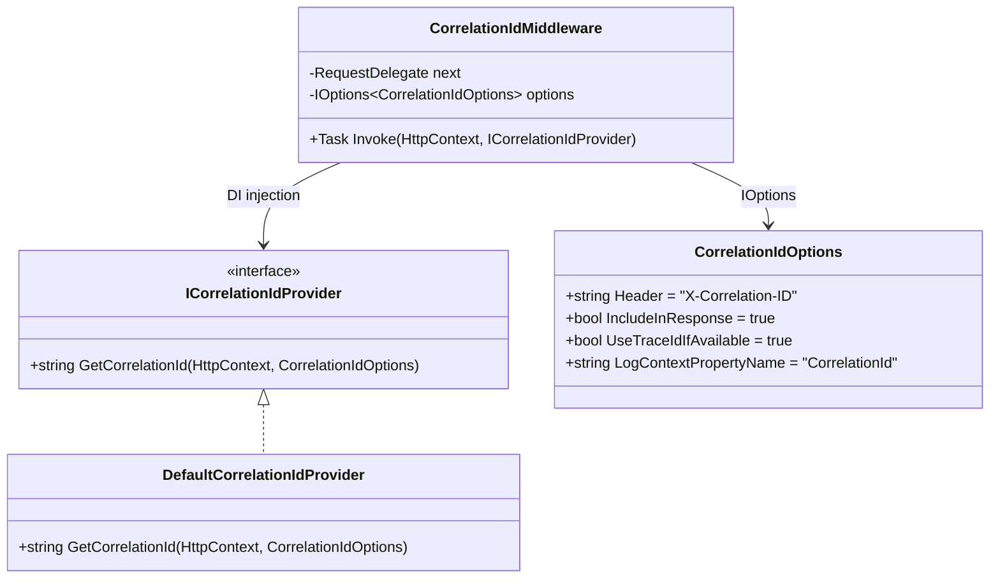

# ADR 003: CorrelationId の Strategy パターンによる抽象化 (CorrelationId Strategy Abstraction)

**Date**: 2026-02-19
**Status**: ✅ Accepted
**Deciders**: Architecture Team
**Technical Story**: [Web - Distributed Tracing & Request Correlation]

---

## Context (背景)

### Problem Statement (問題定義)

マイクロサービスアーキテクチャにおいて、分散システム間のリクエスト追跡は不可欠である。`X-Correlation-ID` ヘッダーを使用してリクエストのトレーサビリティを確保する必要があるが、以下の課題が存在する:

1. **ID 生成戦略の多様性**: OpenTelemetry TraceId、クライアント提供ヘッダー、サーバー生成 GUID の3つのソースが存在
2. **優先順位の柔軟性**: 環境やチームの方針により、どのソースを優先すべきかが異なる
3. **テスト容易性**: ミドルウェア内にハードコードされた ID 生成ロジックはモック困難
4. **拡張性**: 将来的なカスタム ID 生成戦略（例: Snowflake ID）への対応が必要

### Previous Implementation (改善前の実装)

```csharp
// 🚫 ミドルウェア内にハードコードされた優先順位ロジック
private static string GetCorrelationId(HttpContext context)
{
    if (Activity.Current?.TraceId.ToString() is { } traceId)
        return traceId;  // ① Activity TraceId 最優先

    if (context.Request.Headers.TryGetValue("X-Correlation-ID", out var correlationId))
        return correlationId.ToString();  // ② ヘッダー

    return Guid.NewGuid().ToString();  // ③ フォールバック
}
```

**問題点**:

- 優先順位の変更にはソースコードの修正が必要 (**OCP 違反**)
- テスト時に ID 生成をモックできない
- ログコンテキストのプロパティ名がハードコード

---

## Decision (決定事項)

**Strategy パターン** + **Options パターン** を組み合わせた CorrelationId 抽象化を採用する。

### Design Overview (設計概要)



### Key Design Decisions (主要設計判断)

#### 1. `ICorrelationIdProvider` インターフェースの導入

```csharp
public interface ICorrelationIdProvider
{
    string GetCorrelationId(HttpContext context, CorrelationIdOptions options);
}
```

**DIP (依存性逆転の原則)**: ミドルウェアは具象クラスではなくインターフェースに依存。

#### 2. `DefaultCorrelationIdProvider` の優先順位

```csharp
internal class DefaultCorrelationIdProvider : ICorrelationIdProvider
{
    public string GetCorrelationId(HttpContext context, CorrelationIdOptions options)
    {
        // ① クライアント提供ヘッダーを最優先
        if (context.Request.Headers.TryGetValue(options.Header, out var correlationId)
            && !string.IsNullOrWhiteSpace(correlationId))
            return correlationId.ToString();

        // ② OpenTelemetry Activity TraceId (設定で有効化)
        if (options.UseTraceIdIfAvailable && Activity.Current != null)
            return Activity.Current.TraceId.ToHexString();

        // ③ フォールバック: 新規GUID
        return Guid.NewGuid().ToString();
    }
}
```

**前回実装からの変更点**:

- 優先順位を、「**ヘッダー > TraceId > GUID**」に変更（クライアント主導のトレーサビリティを尊重）。
- `UseTraceIdIfAvailable` オプションで TraceId 使用の有無を制御可能。

#### 3. `CorrelationIdOptions` による設定可能化

```csharp
public class CorrelationIdOptions
{
    public string Header { get; set; } = "X-Correlation-ID";
    public bool IncludeInResponse { get; set; } = true;
    public bool UseTraceIdIfAvailable { get; set; } = true;
    public string LogContextPropertyName { get; set; } = "CorrelationId";
}
```

2つの登録パターンを提供:

```csharp
// パターン1: IConfiguration バインディング
services.AddCorrelationId(configuration);

// パターン2: Action<T> コールバック
services.AddCorrelationId(options =>
{
    options.Header = "X-Request-ID";
    options.UseTraceIdIfAvailable = false;
});
```

#### 4. Serilog LogContext との統合

```csharp
// CorrelationIdMiddleware.cs
using (LogContext.PushProperty(optValue.LogContextPropertyName, correlationId))
{
    await next(context);
}
```

- `LogContextPropertyName` が設定可能なため、既存のログ基盤との互換性を保証
- リクエストスコープ全体で CorrelationId がログに自動付与

---

## Alternatives Considered (検討した代替案)

### 🚫 Option 1: ハードコードされたミドルウェア (前回実装)

**Rejected Reason**: OCP 違反。優先順位変更にソースコード修正が必要。テスト時のモック不可。

### 🚫 Option 2: 設定ファイルで優先順位を定義

**Approach**: `appsettings.json` で `["Header", "TraceId", "NewGuid"]` のような優先順位配列を定義。

**Rejected Reason**:

- 優先順位の実装が文字列ベースになり、型安全性が損なわれる
- カスタムロジック（例: ヘッダー値の検証）を挿入できない

### 🚫 Option 3: Decorator パターン

**Approach**: 複数のプロバイダーをDecorator でチェーンする。

**Rejected Reason**:

- 3つのソース（ヘッダー, TraceId, GUID）に対して Decorator チェーンは過剰な設計
- DI 登録が複雑になる

### ✅ Option 4: Strategy パターン + Options パターン (採用案)

**Advantages**:

- `ICorrelationIdProvider` の差し替えで優先順位ロジックを完全カスタマイズ可能
- `CorrelationIdOptions` で共通パラメータを宣言的に設定
- テスト時にモックプロバイダーを注入可能

---

## Consequences (結果)

### Positive (ポジティブな影響)

- ✅ **OCP 遵守**: 新しい ID 生成戦略を追加する際、既存コードの修正不要 (DI 登録のみ)
- ✅ **DIP 遵守**: ミドルウェアは `ICorrelationIdProvider` に依存し、対象実装から疎結合
- ✅ **テスト容易性**: `ICorrelationIdProvider` のモックにより、CorrelationId を制御可能
- ✅ **設定可能性**: ヘッダー名、レスポンス含有、TraceId 使用有無が設定で変更可能
- ✅ **Serilog 統合**: `LogContextPropertyName` で既存ログ基盤との互換性を保証

### Negative (ネガティブな影響)

- ⚠️ **ファイル数の増加**: 1ファイル (`CorrelationIdMiddleware.cs`) から 4ファイルに分離
- ⚠️ **DI 登録の必須化**: `AddCorrelationId()` を明示的に呼び出す必要がある
- ⚠️ **間接参照の増加**: ミドルウェア → インターフェース → 実装のレイヤーが追加

### Mitigation (緩和策)

- 📦 `UseWeb()` で自動的にミドルウェアを有効化
- 📖 XML ドキュメントと使用例の整備
- ⚠️ `AddWeb()` にデフォルト `ICorrelationIdProvider` のフォールバック登録を検討中

---

## Implementation References (実装参照)

### Core Components (コアコンポーネント)

- [ICorrelationIdProvider.cs](/src/BuildingBlocks/Web/CorrelationId/ICorrelationIdProvider.cs) - Strategy インターフェース
- [DefaultCorrelationIdProvider.cs](/src/BuildingBlocks/Web/CorrelationId/DefaultCorrelationIdProvider.cs) - デフォルト実装
- [CorrelationIdOptions.cs](/src/BuildingBlocks/Web/CorrelationId/CorrelationIdOptions.cs) - 設定オプション
- [CorrelationIdMiddleware.cs](/src/BuildingBlocks/Web/CorrelationId/CorrelationIdMiddleware.cs) - ASP.NET Core ミドルウェア

### DI Registration (依存性注入の登録)

- [ServiceCollectionExtensions.cs](/src/BuildingBlocks/Web/Extensions/ServiceCollectionExtensions.cs) - `AddCorrelationId()` / `UseCorrelationId()`

---

## Related Documents (関連ドキュメント)

- 📄 [Architecture Audit Report](/docs/04-AuditReports/Web/Web_20260219.md) - CorrelationId 戦略の評価
- 📖 [Correlation ID Pattern (Microsoft)](https://learn.microsoft.com/en-us/azure/architecture/patterns/correlation-id)
- 📖 [OpenTelemetry .NET](https://opentelemetry.io/docs/languages/dotnet/)

---

## Future Considerations (将来的な検討事項)

### 1. OpenTelemetry Baggage 統合

`Activity.Current.Baggage` にカスタムプロパティを追加し、サービス間で追加のコンテキスト情報を伝搬する。

### 2. W3C Trace Context 完全準拠

`traceparent` / `tracestate` ヘッダーとの統合により、W3C Trace Context 仕様に完全準拠する。

### 3. CorrelationId の検証

クライアント提供の CorrelationId に対する形式バリデーション（UUID v4, 最大長チェック等）を追加し、インジェクション攻撃を防止する。
