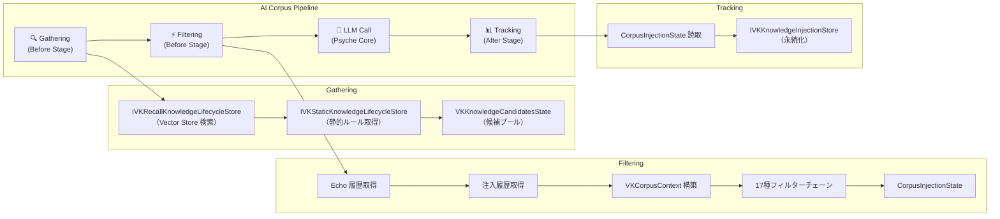
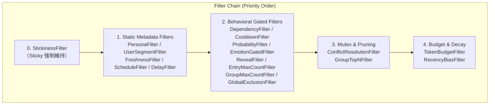

# VK.Blocks.AI.Corpus


## はじめに

**VK.Blocks.AI.Corpus** は、AI 対話パイプラインにおける**ナレッジライフサイクル管理**を担う BuildingBlock です。  
会話コンテキストに応じてナレッジ候補を動的に収集（Gathering）し、17種のフィルタリングエンジンで適切なエントリを選別（Filtering）し、注入履歴を追跡（Tracking）する3段階のパイプラインを提供します。

AI.Psyche パイプラインの `Before` / `After` ステージとして統合され、リクエスト単位で最適なナレッジをプロンプトに注入するためのフレームワーク基盤を構成します。

---

## アーキテクチャ

### 設計原則

| カテゴリ | 適用パターン |
|:---------|:-------------|
| **Design Principles** | SOLID（特に SRP / OCP / DIP）、KISS、DRY |
| **Design Patterns** | Strategy、Pipeline、Builder、Repository、State Object |
| **Architectural Principles** | 関注点分離、カプセル化、高凝集・低結合 |
| **Architectural Styles** | Vertical Slice Architecture、Clean Architecture |
| **Architectural Patterns** | Psyche Pipeline Integration、VKFeature Source Generator |
| **Enterprise Patterns** | 冪等 DI 登録、Feature Toggle、Observability (OpenTelemetry) |

### パイプライン全体像



### フィルターチェーン実行順序



---

## 主な機能

### 🔍 Gathering（ナレッジ収集）

- **動的 Recall**: `IVKRecallKnowledgeLifecycleStore` を介した Vector Store ベースの意味検索によるナレッジ候補の動的取得。
- **静的ルール解決**: `IVKStaticKnowledgeLifecycleStore` による事前登録済みライフサイクルルールのバッチ取得。
- **設定可能パラメータ**: `DefaultTopK`（候補数上限）、`DefaultMinScore`（類似度閾値）、`DefaultTokenBudget`（トークン予算）。

### ⚡ Filtering（フィルタリングエンジン）

17種の独立したフィルターを Options トグルで個別に有効/無効化可能:

| フィルター | 機能 |
|:-----------|:-----|
| `StickinessFilter` | トリガー後の指定ターン数間、エントリを強制維持 |
| `CooldownFilter` | 再トリガー抑制（クールダウン期間） |
| `ProbabilityFilter` | 確率ベースのランダム選択 |
| `PersonaFilter` | ペルソナ ID による制約 |
| `UserSegmentFilter` | ユーザーセグメント（Free/Premium）制約 |
| `FreshnessFilter` | 有効期限ベースのフィルタリング |
| `ScheduleFilter` | ターン範囲制約（StartTurn / EndTurn） |
| `DelayFilter` | トリガー後の遅延注入 |
| `DependencyFilter` | 親エントリの注入を前提条件とする依存関係チェック |
| `EmotionGatedFilter` | 感情パラメータ（affection / anger）ゲーティング |
| `RevealFilter` | シークレットキー解放条件 |
| `EntryMaxCountFilter` | セッション内使用回数上限 |
| `GroupMaxCountFilter` | グループ単位のターン内注入数上限 |
| `GlobalExclusionFilter` | 排他タグによるグローバル排除 |
| `ConflictResolutionFilter` | 競合グループ内の優先度ベース排他 |
| `GroupTopNFilter` | グループ内 Top-N 選択 |
| `TokenBudgetFilter` | トークン予算制約 |
| `RecencyBiasFilter` | 使用頻度に基づく減衰バイアス |

### 📊 Tracking（使用追跡）

- **注入履歴の永続化**: `IVKKnowledgeInjectionStore` を介した注入ログの記録・取得。
- **グレースフルデグラデーション**: 追跡記録の失敗時も Pipeline を中断せず続行。

### 🎯 ライフサイクルプリセット

`VKKnowledgeLifecyclePresets` による T-Shirt Sizing 定数:

```csharp
// Sticky Presets
VKKnowledgeLifecyclePresets.Sticky.Flash;   // 0: 当該ターンのみ
VKKnowledgeLifecyclePresets.Sticky.Short;   // 2: 短期記憶
VKKnowledgeLifecyclePresets.Sticky.Topic;   // 5: 標準ワーキングメモリ
VKKnowledgeLifecyclePresets.Sticky.Scene;   // 15: 長期ワーキングメモリ
VKKnowledgeLifecyclePresets.Sticky.Anchor;  // -1: 無期限

// Cooldown Presets
VKKnowledgeLifecyclePresets.Cooldown.None;   // 0: クールダウンなし
VKKnowledgeLifecyclePresets.Cooldown.Short;  // 3: 連続抑制
VKKnowledgeLifecyclePresets.Cooldown.Once;   // -1: セッション内1回限り
```

---

## 採用技術

| 技術 | 用途 |
|:-----|:-----|
| **.NET 10** | ランタイム基盤 |
| **VK.Blocks.Core** | Result パターン、VKGuard、DI 拡張 |
| **VK.Blocks.AI.Psyche** | Pipeline Stage 統合、VKPsycheContext |
| **VK.Blocks.AI.Recall** | Vector Store 検索 (IVKSearchStrategy) |
| **Source Generator** | `[VKFeature]` / `[VKBlockMarker]` / `[VKBlockDiagnostics]` 自動生成 |
| **OpenTelemetry** | Diagnostics / Metrics / Tracing |

---

## 開始方法

### 前提条件

- .NET 10 SDK
- VK.Blocks.Core / AI.Psyche / AI.Recall の依存解決済み

### DI 登録

```csharp
services.AddVKCorpusBlock(configuration)
    .AddVKGathering()
    .AddVKFiltering(options => options with
    {
        DefaultCooldownTurns = 5,
        EnableTokenBudgetFilter = true,
        EnableRecencyBiasFilter = true
    })
    .AddVKTracking();

// または全機能を一括有効化
services.AddVKCorpusBlock(configuration)
    .AddVKDefaultFeatures();
```

### ナレッジエントリの定義

```csharp
var entry = new VKKnowledgeLifecycleEntry
{
    Knowledge = new VKKnowledgeEntry
    {
        Id = new VKKnowledgeId(Guid.NewGuid()),
        Segment = new VKPromptSegment { Content = "ナレッジ内容", Name = "greeting-01" }
    },
    Lifecycle = new VKKnowledgeLifecycle
    {
        Probability = 0.8,
        StickyTurns = VKKnowledgeLifecyclePresets.Sticky.Topic,
        CooldownTurns = VKKnowledgeLifecyclePresets.Cooldown.Short,
        TargetPersonaId = "persona-001",
        GroupId = "greetings"
    }
};
```

---

## フォルダ構成

```
AI.Corpus/
├── VKAICorpusBlock.cs              # Block Marker [VKBlockMarker]
├── VKAICorpusOptions.cs            # Root Options (IVKToggleableBlockOptions)
├── Common/
│   ├── DependencyInjection/
│   │   ├── IVKAICorpusBuilder.cs
│   │   ├── VKAICorpusBlockExtensions.cs
│   │   ├── VKAICorpusBuilderExtensions.cs
│   │   └── Internal/
│   │       ├── AICorpusBlockBuilder.cs
│   │       └── AICorpusBlockRegistration.cs
│   ├── Diagnostics/
│   │   └── Internal/
│   │       ├── CorpusDiagnostics.cs
│   │       └── CorpusLog.cs
│   └── Models/
│       ├── VKCorpusArgs.cs
│       ├── VKCorpusContext.cs
│       ├── VKKnowledgeLifecycle.cs
│       ├── VKKnowledgeLifecycleEntry.cs
│       ├── VKKnowledgeLifecyclePresets.cs
│       └── Internal/
│           ├── CorpusInjectionState.cs
│           └── RecalledKnowledgeLifecycleState.cs
├── Gathering/
│   ├── VKGatheringOptions.cs
│   ├── Protocols/
│   │   ├── IVKGatheringOptions.cs
│   │   ├── IVKGatheringOverrides.cs
│   │   ├── IVKRecallKnowledgeLifecycleStore.cs
│   │   └── IVKStaticKnowledgeLifecycleStore.cs
│   └── Internal/
│       ├── DefaultGatheringStage.cs
│       ├── DefaultRecallKnowledgeLifecycleStore.cs
│       ├── GatheringFeature.cs
│       └── InMemoryKnowledgeLifecycleStore.cs
├── Filtering/
│   ├── VKFilteringOptions.cs
│   ├── Protocols/
│   │   ├── IVKFilteringOptions.cs
│   │   ├── IVKFilteringOverrides.cs
│   │   └── IVKKnowledgeLifecycleFilter.cs
│   └── Internal/
│       ├── DefaultFilteringStage.cs
│       ├── FilteringFeature.cs
│       └── (17 Filter implementations)
└── Tracking/
    ├── VKTrackingOptions.cs
    ├── Models/
    │   └── VKKnowledgeInjection.cs
    ├── Protocols/
    │   ├── IVKKnowledgeInjectionStore.cs
    │   └── IVKTrackingOptions.cs
    └── Internal/
        ├── DefaultKnowledgeInjectionStage.cs
        ├── InMemoryKnowledgeInjectionStore.cs
        └── TrackingFeature.cs
```

---

## 今後の展望

- **DiagnosticsConstants 追加**: OpenTelemetry セマンティックトークンの標準化
- **動的フィルター切替**: `IOptionsMonitor<T>` による実行時フィルター制御
- **分散永続化**: Redis / PostgreSQL ベースの `IVKKnowledgeInjectionStore` 実装
- **メトリクス計装**: フィルター通過率・候補数・処理時間の Histogram / Counter 可視化
