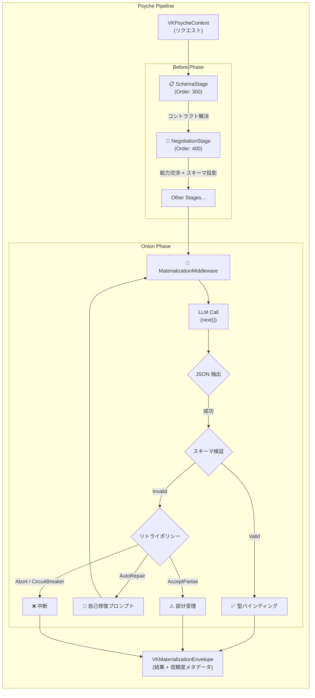

# VK.Blocks.AI.Eidos

[](https://dotnet.microsoft.com/download/dotnet/10.0)
[](https://opensource.org/licenses/MIT)

## はじめに (Introduction)

`VK.Blocks.AI.Eidos` は、LLM（大規模言語モデル）の応答出力を **構造化された型安全なドメインオブジェクト** へ変換するための Building Block です。

従来の「LLM のテキスト出力を手動でパースする」アプローチから脱却し、**スキーマ駆動のコントラクト定義** → **プロバイダー能力交渉** → **出力検証・自己修復** → **型安全バインディング** という一貫したパイプラインを提供します。OpenAI / Azure OpenAI / Anthropic / Google Gemini / Ollama 等の主要プロバイダーに対応し、プロバイダー固有の Structured Output 仕様差を自動的に吸収します。

> **Eidos**（ギリシャ語 εἶδος: 形・本質）— LLM の非構造化出力に「形」を与えるモジュール。

---

## アーキテクチャ (Architecture)

本モジュールは **Vertical Slice Architecture（垂直スライスアーキテクチャ）** に従い、4つの独立したフィーチャースライスで構成されています。

```text
src/BuildingBlocks/AI.Eidos/
├── VKAIEidosBlock.cs                        # [BB.02] モジュールマーカー
├── Common/                                  # 共有基盤
│   ├── Diagnostics/
│   │   ├── VKAIEidosDiagnosticsConstants.cs # [BB.04] セマンティックトークン
│   │   └── Internal/AIEidosDiagnostics.cs   # [VKBlockDiagnostics]
│   ├── Models/                              # 共有ドメインモデル
│   │   ├── VKAIEidosResponseContract.cs     # レスポンスコントラクト
│   │   ├── VKAIEidosSchema.cs               # JSON Schema ラッパー
│   │   ├── VKAIEidosRequestArgs.cs          # リクエスト引数
│   │   ├── IVKContractSpec.cs               # コントラクト仕様インターフェース
│   │   ├── VKTypeContractSpec.cs            # 型ベースコントラクト
│   │   ├── VKNamedContractSpec.cs           # 名前ベースコントラクト
│   │   ├── VKExplicitContractSpec.cs        # 明示的コントラクト
│   │   └── VKContractSpecFactory.cs         # コントラクト仕様ファクトリ
│   ├── Protocols/
│   │   └── IVKSchemaFactory.cs              # スキーマ生成プロトコル
│   ├── Internal/
│   │   └── DefaultSchemaFactory.cs          # リフレクション + キャッシュベース実装
│   └── VKDynamicSchemaBuilder.cs            # フルーエント DSL ビルダー
├── Schema/                                  # スキーマ管理スライス
│   ├── SchemaFeature.cs                     # [BB.06] [VKFeature]
│   ├── VKSchemaOptions.cs                   # [BB.05] オプション
│   ├── Models/ (CompatibilityReport, EvolutionReport)
│   ├── Protocols/ (IVKSchemaResolver, IVKSchemaEvolutionAnalyzer, IVKSchemaMigrator)
│   └── Internal/ (DefaultSchemaResolver, DefaultSchemaStage, SchemaComposer, SchemaFingerprint)
├── Negotiation/                             # フォーマット交渉スライス
│   ├── NegotiationFeature.cs                # [BB.06] [VKFeature]
│   ├── VKNegotiationOptions.cs              # [BB.05] オプション
│   ├── Models/ (VKAIEidosProviderCapabilities)
│   ├── Protocols/ (IVKContractNegotiator, IVKContractProjector, IVKProviderCapabilityDetector)
│   └── Internal/ (DefaultContractNegotiator, DefaultContractProjector, DefaultNegotiationStage, BasicProviderCapabilityDetector)
├── Materialization/                         # 出力具現化スライス
│   ├── MaterializationFeature.cs            # [BB.06] [VKFeature]
│   ├── VKMaterializationOptions.cs          # [BB.05] オプション
│   ├── VKMaterializationEnvelopeFactory.cs  # エンベロープ生成ファクトリ
│   ├── Models/ (Envelope, ConfidenceMetadata, ValidationResult, RetryDecision, ErrorCategory)
│   ├── Protocols/ (IVKMaterializationValidator, IVKMaterializationBinder, IVKMaterializationRepairService, IVKMaterializationRetryPolicy)
│   └── Internal/ (DefaultMaterializationMiddleware, DefaultMaterializationValidator, DefaultMaterializationBinder, DefaultMaterializationRepairService, DefaultMaterializationRetryPolicy)
└── Streaming/                               # ストリーミング解析スライス
    ├── StreamingFeature.cs                  # [BB.06] [VKFeature]
    ├── VKStreamingOptions.cs                # [BB.05] オプション
    ├── Models/ (VKStreamingChunk, VKStreamingChunkType)
    ├── Protocols/ (IVKStreamingParser)
    └── Internal/ (DefaultStreamingParser)
```

### パイプラインアーキテクチャ

AI.Eidos は `VK.Blocks.AI.Psyche` パイプラインに **Stage（前処理フェーズ）** と **Middleware（オニオンフェーズ）** として統合されます。



### 設計原則・パターン

| カテゴリ | 適用パターン |
|:---------|:------------|
| **Design Principles** | SOLID（SRP, OCP, LSP, ISP, DIP）、DRY、KISS |
| **Design Patterns** | Strategy, Factory, Builder, Pipeline / Chain of Responsibility, Cache-Aside |
| **Architectural Styles** | Clean Architecture, Vertical Slice Architecture |
| **Architectural Patterns** | Pipeline Architecture, Contract-First Design |
| **Enterprise Patterns** | Idempotent Registration, Circuit Breaker, Self-Healing Retry, Structured Diagnostics |

---

## 主な機能 (Key Features)

### 1. スキーマ駆動コントラクト (Schema-Driven Contracts)

- **型ベーススキーマ生成**: C# POCO / record 型から JSON Schema を自動生成。`[Description]`, `[JsonRequired]`, `[JsonPropertyName]` 等のメタデータを自動反映。
- **ポリモーフィック Tagged Union**: `[JsonDerivedType]` を活用した `oneOf` + `discriminator` スキーマの自動構築。
- **動的スキーマ DSL**: `VKDynamicSchemaBuilder` による実行時フルーエントスキーマ構築（DB 駆動シナリオ対応）。
- **スキーマ合成（Composition）**: 基底スキーマ + フラグメント（Pagination, Audit 等）のモジュラー合成。
- **構造的フィンガープリント**: SHA-256 ベースの正規化フィンガープリントによるキャッシュキー・互換性比較。

### 2. プロバイダー能力交渉 (Provider Capability Negotiation)

- **自動能力検出**: プロバイダー（OpenAI / Anthropic / Google / Ollama 等）とモデル ID に基づく Native Structured Output 対応判定。
- **表現モード選択**: `StructuredOutput`（API ネイティブ）vs `PromptJson`（プロンプトインジェクション）の自動選択。
- **スキーマ投影**: OpenAI Strict Mode 向け `additionalProperties: false` + 全プロパティ `required` 化、Nullable 型の `anyOf` / `type: ["string", "null"]` 変換を自動適用。
- **Few-Shot Example 自動合成**: PromptJson モード時にスキーマから最小有効 JSON サンプルを自動生成・注入。

### 3. 出力具現化と自己修復 (Materialization & Self-Healing)

- **3段階リトライポリシー**: AutoRepair（修正プロンプト再送）→ AcceptPartial（部分受理）→ Abort + Circuit Breaker（最大試行数制限）。
- **構造化バリデーション**: Required / Type / Enum / Nested Object / Array Items の再帰的検証。Tagged Union の discriminator 解決。
- **自動修復プロンプト生成**: バリデーションエラーからスキーマ付き修正指示を自動構築し、LLM に再送。
- **信頼度メタデータ**: `VKMaterializationConfidenceMetadata` による ComplianceScore（0.0〜1.0）、リトライ回数、所要時間の定量的品質評価。

### 4. ストリーミング JSON 解析 (Streaming JSON Parsing)

- **投機的クロージング**: LLM ストリーミング中の不完全 JSON に対し、複数の closing candidate（`}`, `"]}` 等）を試行してプロパティを早期抽出。
- **ThinkTag 除去**: `<think>...</think>` CoT（Chain-of-Thought）ブロックのリアルタイムフィルタリング。
- **ノイズフィルタリング**: スキーマの `RequiredProperties` とのマッチングによる無関係 JSON フラグメントの自動除外。

### 5. スキーマ進化分析 (Schema Evolution Analysis)

- **互換性レベル判定**: Breaking / Compatible / Identical の3段階分類。プロパティ追加・削除・型変更・Required 昇格を自動検出。
- **歴史的ペイロード検証**: 過去の LLM 応答サンプルを新スキーマに対して一括バリデーション。マイグレーション影響度の定量評価。

---

## 採用技術 (Tech Stack)

| 技術 | 用途 |
|:-----|:-----|
| **.NET 10 / C# 12** | ランタイム・言語基盤 |
| **System.Text.Json** | JSON パース・シリアライズ・スキーマエクスポート |
| **System.Text.Json.Schema** | 型ベース JSON Schema 生成 |
| **System.Text.RegularExpressions** | ThinkTag 除去・JSON 抽出 |
| **ConcurrentDictionary + Lazy\<T\>** | スレッドセーフキャッシュ |
| **SHA-256** | スキーマフィンガープリント計算 |
| **VK.Blocks.Core** | `VKResult<T>`, `VKGuard`, `IVKJsonSerializer`, `IVKGuidGenerator`, Source Generator 基盤 |
| **VK.Blocks.AI.Psyche** | パイプライン統合（`IVKPsychePipelineStage`, `IVKPsycheMiddleware`） |

---

## 開始方法 (Getting Started)

### DI 登録

```csharp
// Program.cs / Startup.cs
services.AddVKAIEidosBlock(builder.Configuration, options =>
{
    // ブロックレベルオプション（省略可）
})
.AddSchema(options =>
{
    options.EnableSchemaCache = true;
    options.InjectSchemaHeader = true;
})
.AddNegotiation(options =>
{
    options.DefaultPreferredMode = VKAIEidosExpressionMode.StructuredOutput;
    options.DisallowPromptJsonForComplexSchemas = true;
})
.AddMaterialization(options =>
{
    options.EnableAutoRepair = true;
    options.MaxRepairAttempts = 2;
    options.MaxTotalAttempts = 5;
    options.ToleranceMode = VKMaterializationToleranceMode.Strict;
})
.AddStreaming(options =>
{
    options.EnableSpeculativeClosing = true;
});
```

### 型ベースコントラクト定義

```csharp
// 1. レスポンス型の定義
public sealed record SentimentAnalysisResult
{
    [Description("感情極性（positive / negative / neutral）")]
    [JsonRequired]
    public required string Sentiment { get; init; }

    [Description("確信度スコア（0.0〜1.0）")]
    public double Confidence { get; init; }

    [Description("分析根拠の要約")]
    public string? Reasoning { get; init; }
}

// 2. スキーマファクトリでコントラクト生成
var contract = schemaFactory.CreateContract<SentimentAnalysisResult>(
    contractName: "SentimentAnalysis",
    description: "テキスト感情分析の構造化応答コントラクト");

// 3. Psyche パイプラインに渡す
var args = VKContractSpecFactory.FromType<SentimentAnalysisResult>("SentimentAnalysis");
```

### 動的スキーマ構築（DB 駆動）

```csharp
var contract = new VKDynamicSchemaBuilder()
    .AddString("category", description: "分類カテゴリ", required: true,
        enumValues: ["bug", "feature", "question"])
    .AddNumber("priority", description: "優先度（1-5）", required: true, isInteger: true)
    .AddArray("tags", itemType: "string", description: "関連タグ")
    .AddObject("metadata", nested =>
    {
        nested.AddString("source", required: true);
        nested.AddBoolean("is_automated");
    })
    .BuildContract("TicketClassification", description: "サポートチケット自動分類");
```
