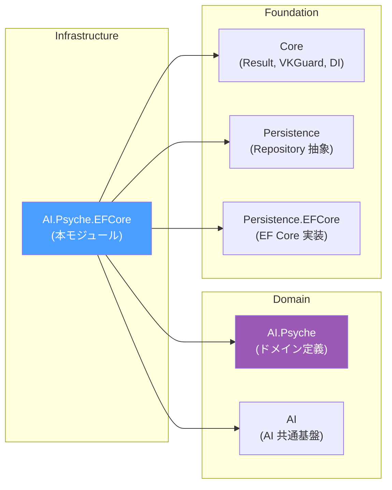

# VK.Blocks.AI.Psyche.EFCore

[](https://dotnet.microsoft.com/)
[](https://opensource.org/licenses/MIT)
[](#)

## はじめに

`VK.Blocks.AI.Psyche.EFCore` は、[VK.Blocks.AI.Psyche](/src/BuildingBlocks/AI.Psyche) が定義するドメインモデル（Directive, Echo, Knowledge, Pattern, Persona, Profile, Session）の **EF Core ベース永続化プロバイダ** です。

Psyche モジュールはデフォルトで InMemory 実装を提供しますが、本モジュールを追加することで、全 7 ドメインストアを **リレーショナルデータベース（SQL Server, PostgreSQL 等）** にシームレスに移行できます。

### 設計思想

- **Plug-and-Play**: `AddVKAIPsycheEFCoreBlock()` 一行の DI 登録で InMemory → EFCore バックエンドに自動切替
- **Source Generator 駆動**: `[VKPersistEntity]` 属性による Entity ↔ Domain マッピング、リポジトリ、クエリ仕様の完全自動生成（手動マッピングコード**ゼロ**）
- **Vertical Slice 構成**: 7 ドメイン毎に Entity + Internal/(Store + Diagnostics) を独立フォルダに配置
- **三位一体 Observability**: `[LoggerMessage]` SG + `[VKMetricHistogram]` + `[VKMetricCounter]` による構造化ログ・メトリクス・分散トレースの統合

---

## アーキテクチャ

### 適用パターン

| カテゴリ                   | パターン                                                                                      |
| -------------------------- | --------------------------------------------------------------------------------------------- |
| **Design Principles**      | SRP, DIP, ISP, Fail-Fast, Sealed-by-Default                                                   |
| **Design Patterns**        | Repository, Unit of Work, Anti-Corruption Layer, Marker (BB.02)                               |
| **Architectural Patterns** | Vertical Slice, Clean Architecture (Infrastructure Layer), Result Pattern                     |
| **Enterprise Patterns**    | Tenant Isolation, Soft Delete, Full Audit Trail, Idempotent Registration, Concurrency Check   |
| **Cross-Cutting**          | Source Generated Logging/Metrics, `VKGuard` Boundary Defense, Distributed Tracing (`VKTrace`) |

### 依存関係



### モジュール構成

```
AI.Psyche.EFCore/
├── Directive/                       # テナント指令 (Directive Charter)
│   ├── VKPsycheDirectiveEntity.cs  # [VKPersistEntity] DB エンティティ
│   └── Internal/
│       └── DirectiveDiagnostics.cs # [LoggerMessage] + [VKMetricHistogram/Counter]
├── Echo/                            # 対話履歴 (Short-Term Memory)
│   ├── VKPsycheEchoEntity.cs       # [VKPersistEntity] DB エンティティ
│   └── Internal/
│       ├── EchoStore.cs            # IVKEchoStore 実装 (2段階先決クエリ + Batch Save)
│       └── EchoDiagnostics.cs      # [LoggerMessage] + [VKMetricHistogram/Counter]
├── Knowledge/                       # 動的ナレッジ (Knowledge Entry + Key)
│   ├── VKPsycheKnowledgeEntity.cs  # [VKPersistEntity] + FlattenBy + ProjectBy
│   ├── VKPsycheKnowledgeKeyEntity.cs # 複合キー子エンティティ
│   └── Internal/
│       └── KnowledgeDiagnostics.cs # [LoggerMessage] + [VKMetricHistogram/Counter]
├── Pattern/                         # Few-Shot パターン
│   ├── VKPsychePatternEntity.cs    # [VKPersistEntity] + FlattenBy
│   └── Internal/
│       └── PatternDiagnostics.cs   # [LoggerMessage] + [VKMetricHistogram/Counter]
├── Persona/                         # ペルソナ (AI 人格定義)
│   ├── VKPsychePersonaEntity.cs    # [VKPersistEntity] + VKPersistJson
│   └── Internal/
│       └── PersonaDiagnostics.cs   # [LoggerMessage] + [VKMetricHistogram/Counter]
├── Profile/                         # ユーザープロファイル
│   ├── VKPsycheProfileEntity.cs    # [VKPersistEntity] + VKPersistJson
│   └── Internal/
│       └── ProfileDiagnostics.cs   # [LoggerMessage] + [VKMetricHistogram/Counter]
├── Session/                         # セッション (対話スレッド)
│   ├── VKPsycheSessionEntity.cs    # [VKPersistEntity] + VKPersistJson + IVKConcurrency
│   └── Internal/
│       └── SessionDiagnostics.cs   # [LoggerMessage] + [VKMetricHistogram/Counter]
├── VKPsycheEFCoreBlock.cs           # [VKBlockMarker] ブロックマーカー
└── VK.Blocks.AI.Psyche.EFCore.csproj
```

---

## 主な機能

### 🗃️ 7 ドメインの EFCore 永続化

| ドメイン          | テーブル名                   | ドメインモデル       |  監査   | テナント | 論理削除 | 同時実行 |
| :---------------- | :--------------------------- | :------------------- | :-----: | :------: | :------: | :------: |
| **Directive**     | `VK_AI_Psyche_Directive`     | `VKDirectiveCharter` | ✅ Full |    ✅    |    ✅    |    -     |
| **Echo**          | `VK_AI_Psyche_Echo`          | `VKEchoTrace`        |   ✅    |    ✅    |    -     |    -     |
| **Knowledge**     | `VK_AI_Psyche_Knowledge`     | `VKKnowledgeEntry`   | ✅ Full |    ✅    |    ✅    |    -     |
| **Knowledge Key** | `VK_AI_Psyche_Knowledge_Key` | `VKKnowledgeKey`     |    -    |    -     |    -     |    -     |
| **Pattern**       | `VK_AI_Psyche_Pattern`       | `VKPatternEntry`     | ✅ Full |    ✅    |    ✅    |    -     |
| **Persona**       | `VK_AI_Psyche_Persona`       | `VKPersonaAnchor`    | ✅ Full |    ✅    |    ✅    |    -     |
| **Profile**       | `VK_AI_Psyche_Profile`       | `VKProfilePresence`  |   ✅    |    ✅    |    -     |    -     |
| **Session**       | `VK_AI_Psyche_Session`       | `VKSessionThread`    |   ✅    |    ✅    |    -     |  ✅ Row  |

### 🔑 インデックス設計

| エンティティ | インデックス名             | 列構成                           |
| :----------- | :------------------------- | :------------------------------- |
| Echo         | `Tenant_Session_Timestamp` | TenantId → SessionId → CreatedAt |
| Knowledge    | `Tenant_Trigger`           | TenantId → TriggerType           |
| Persona      | `Tenant_Name`              | TenantId → Name                  |
| Session      | 個別                       | TenantId, ParentSessionId        |
| Directive    | 個別                       | TenantId                         |
| Pattern      | 個別                       | TenantId                         |
| Profile      | 個別                       | TenantId                         |

### 📊 Source Generator による自動生成

`[VKPersistEntity]` 属性により、以下のコードが Source Generator で自動生成されます:

- **Entity ↔ Domain マッピング**: `ToDomain()` / `ToEntity()` / `MapOnto()` メソッド
- **リポジトリ登録**: `IVKEntityRepository<T>` / `IVKEntityReadRepository<T>` の DI 登録
- **クエリ仕様**: `GetListAsync`, `GetFirstOrDefaultAsync` 等の標準クエリ
- **値オブジェクトの Flatten/Project**: `FlattenBy` による複合プロパティの列展開、`ProjectBy` によるコレクションの子テーブル投影

### 📡 可観測性 (Observability)

全 7 ドメインに以下の計測が自動適用:

| 種別             | メトリクス名パターン                     | 説明                                            |
| :--------------- | :--------------------------------------- | :---------------------------------------------- |
| **Histogram**    | `vk.ai.psyche.efcore.{feature}.duration` | DB 操作時間 (ms) + `operation` / `success` タグ |
| **Counter**      | `vk.ai.psyche.efcore.{feature}.errors`   | エラー総数 + `operation` タグ                   |
| **構造化ログ**   | EventId 731xx-737xx                      | CRUD 操作毎のセマンティックログ                 |
| **分散トレース** | `[VKTrace]`                              | OpenTelemetry Activity 自動計測                 |

---

## 採用技術

| 技術                             | 用途                                                                                          |
| -------------------------------- | --------------------------------------------------------------------------------------------- |
| **.NET 10 / C# 13**              | ランタイム基盤、`sealed`、`required`、Primary Constructor                                     |
| **Entity Framework Core**        | ORM / マイグレーション / Global Filter (テナント分離)                                         |
| **VK.Blocks.Persistence.EFCore** | `IVKEntityRepository<T>`, `IVKUnitOfWork`, `[VKPersistEntity]` SG                             |
| **VK.Blocks.Core**               | Result Pattern, VKGuard, DI Builder, Block Marker                                             |
| **VK.Blocks.AI.Psyche**          | ドメインモデル、Store インターフェース定義                                                    |
| **Source Generator**             | `[LoggerMessage]`, `[VKBlockDiagnostics]`, `[VKPersistEntity]`, `[VKMetricHistogram/Counter]` |

---

## 開始方法

### 1. パッケージ参照

```xml
<ProjectReference Include="..\AI.Psyche.EFCore\VK.Blocks.AI.Psyche.EFCore.csproj" />
```

### 2. DI 登録

```csharp
builder.Services
    .AddVKPsycheBlock(builder.Configuration)
    .AddVKDefaultFeatures();

// EFCore 永続化プロバイダの追加 (InMemory → EFCore に自動切替)
builder.Services.AddVKAIPsycheEFCoreBlock();
```

> [!IMPORTANT]
> `AddVKAIPsycheEFCoreBlock()` は `AddVKPsycheBlock()` の**後**に呼び出してください。EFCore ブロックは Psyche ブロックへの依存を `[VKBlockMarker(Dependencies = [typeof(VKAIPsycheBlock), typeof(VKPersistenceEFCoreBlock)])]` で宣言しています。

### 3. DbContext の構成

```csharp
builder.Services.AddDbContext<AppDbContext>(options =>
    options.UseSqlServer(connectionString));
```

EF Core の `DbContext` に Psyche エンティティが自動検出されます（`[VKPersistEntity]` SG によるモデル構成の自動適用）。

### 4. マイグレーション

```bash
dotnet ef migrations add AddPsycheTables --project YourApp
dotnet ef database update --project YourApp
```

---

## データモデル

### ER 図

```mermaid
erDiagram
    VK_AI_Psyche_Persona {
        guid Id PK
        guid TenantId
        string Name
        string Description
        json Traits
        json Extensions
        bool IsDeleted
        datetimeoffset CreatedAt
        datetimeoffset UpdatedAt
        datetimeoffset DeletedAt
    }

    VK_AI_Psyche_Session {
        guid Id PK
        guid TenantId
        int Mode
        guid ParentSessionId FK
        guid ForkSourceSessionId
        string ForkPointRef
        int Status
        int TurnCount
        json KnowledgeState
        datetimeoffset CreatedAt
        datetimeoffset LastActivityAt
        byte[] RowVersion
    }

    VK_AI_Psyche_Echo {
        guid Id PK
        guid TenantId
        guid SessionId FK
        int Role
        string Content
        int TokenCount
        datetimeoffset CreatedAt
    }

    VK_AI_Psyche_Knowledge {
        guid Id PK
        guid TenantId
        string Content
        string Name
        bool IsEnabled
        int Role
        int TriggerType
        int FilterLogic
        bool IsDeleted
    }

    VK_AI_Psyche_Knowledge_Key {
        guid KnowledgeId PK_FK
        string Text PK
        int MatchType
        bool CaseSensitive
    }

    VK_AI_Psyche_Directive {
        guid Id PK
        guid TenantId
        string BehaviorRules
        string SafetyRules
        string OutputConstraints
        string Overview
        bool IsDeleted
    }

    VK_AI_Psyche_Pattern {
        guid Id PK
        guid TenantId
        string Content
        string Name
        bool IsEnabled
        int Role
        bool IsDeleted
    }

    VK_AI_Psyche_Profile {
        guid Id PK
        guid TenantId
        string DisplayName
        string PreferredLanguage
        string TimeZone
        json Preferences
    }

    VK_AI_Psyche_Session ||--o{ VK_AI_Psyche_Echo : "has many"
    VK_AI_Psyche_Knowledge ||--o{ VK_AI_Psyche_Knowledge_Key : "has many"
```

---

## 🏛️ アーキテクチャ監査

最新の監査レポートは [AI.Psyche.EFCore_20260901.md](/docs/04-AuditReports/AI.Psyche.EFCore/AI.Psyche.EFCore_20260901.md) を参照してください。

| 項目                | 結果         |
| ------------------- | ------------ |
| **総合スコア**      | 100 / 100    |
| **Fast Audit**      | 22/22 (100%) |
| **DI Registration** | ✅ PASS      |
| **重大な懸念事項**  | なし         |

### 監査による改善提案

_該当なし_ — 全ての改善提案が実装完了済み。

---

## 🔭 今後の展望

| 機能                       | 状態 | 概要                                                     |
| -------------------------- | :--: | -------------------------------------------------------- |
| **7 ドメイン永続化**       |  ✅  | Directive/Echo/Knowledge/Pattern/Persona/Profile/Session |
| **SG Entity マッピング**   |  ✅  | `[VKPersistEntity]` による自動マッピング                 |
| **Composite Index**        |  ✅  | テナント + 業務キーの複合インデックス                    |
| **三位一体 Observability** |  ✅  | ログ + メトリクス + トレースの統合計測                   |
| **2段階先決トークンクエリ** |  ✅  | `TokenCount` 先行判定 + 命中 ID 回表（I/O 95% 削減）     |
| **Batch Insert**           |  ✅  | `SaveHistoryBatchAsync` による単一ラウンドトリップ保存   |
| **楽観的同時実行制御**     |  ✅  | `SessionEntity` の `IVKConcurrency` / `RowVersion` 対応   |
| **Compiled Queries**       |  ✅  | `EchoStore` の `EF.CompileAsyncQuery` 預编译熱点クエリ   |
| **Vector Store 連携**      |  📋  | Semantic Knowledge の Embedding ストレージ               |

---

## ライセンス

MIT License — 詳細は [LICENSE](/LICENSE) を参照してください。
