# VK.Blocks.AI.Psyche

[](https://dotnet.microsoft.com/)
[](https://opensource.org/licenses/MIT)
[](#)

## はじめに

`VK.Blocks.AI.Psyche` は、LLM ベースの AI チャットアプリケーション向けに設計された**プロンプトオーケストレーション＆行動パイプライン**です。

Persona（人格定義）、Echo（対話履歴）、Knowledge（動的ナレッジ）、Directive（テナント指令）、Pattern（Few-Shot パターン）の 5 つの情報源を統合的に管理し、トークン予算制約の下で最適なプロンプトを自動組み立てする「**Prompt Weaving（プロンプト織り込み）**」エンジンと、LLM 呼び出しを制御する **Onion Middleware パイプライン** を提供します。

### 設計思想

- **Zero-Infrastructure InMemory Default**: 開発・テスト環境ではインフラ依存なしで即座に動作。全ストアが InMemory 実装をデフォルトで提供
- **Pluggable Store Architecture**: `IVKPersonaStore` / `IVKEchoStore` / `IVKKnowledgeStore` / `IVKDirectiveStore` / `IVKPatternStore` の DI 差し替えのみで永続化層に移行可能
- **Before → Middleware → After**: 3 フェーズパイプラインによるデータ収集 → LLM 制御 → 後処理の明確な分離
- **Parallel Stage Execution**: 独立した抽出ステージ（Persona / Echo / Directive）を `ParallelGroup` による宣言的並列実行で高スループットを実現
- **Token-Aware Truncation**: 対話履歴のトークン予算管理をエンジン内部で自動化し、コンテキストウィンドウの溢れを防止
- **Expression Tree Compilation**: Knowledge エントリのキーワード / 正規表現マッチングを Expression Tree にコンパイルし、`ConcurrentDictionary` でキャッシュ

---

## アーキテクチャ

### 適用パターン

| カテゴリ                   | パターン                                                                                   |
| -------------------------- | ------------------------------------------------------------------------------------------ |
| **Design Principles**      | SRP, DIP, ISP, Fail-Fast, Immutability                                                     |
| **Design Patterns**        | Strategy, Pipeline, Chain of Responsibility, Onion Middleware, Template Method (Generics), Builder (Fluent) |
| **Architectural Patterns** | Vertical Slice (Feature-Driven), Options Pattern, Result Pattern                            |
| **Enterprise Patterns**    | Token Budget Management, Dialogue History Pruning, Expression Tree Compilation & Caching    |
| **Cross-Cutting**          | Source Generated Logging, `VKGuard` Boundary Defense, Thread-Safe Context, Func Transform   |

### パイプライン実行フロー

```mermaid
flowchart TB
    subgraph Input ["入力"]
        REQ[/"VKPsycheRequest<br/>(PersonaId, SessionId,<br/>UserInput, Args)"/]
    end

    subgraph Pipeline ["IVKPsychePipeline"]
        REQ --> CTX["VKPsycheContext 生成<br/>(CorrelationId 自動付与)"]

        subgraph Before ["Before Stages (IVKPsycheBeforePipelineStage)"]
            subgraph Extraction ["Extraction (ParallelGroup=1)"]
                direction LR
                PERSONA["Persona Stage<br/>• PersonaAnchor 取得<br/>• System Prompt 生成"]
                ECHO["Echo Stage<br/>• 対話履歴取得<br/>• Turn/Message Pruning<br/>• Token Budget 適用"]
                DIRECTIVE["Directive Stage<br/>• テナント指令取得<br/>• System 指示注入"]
            end

            subgraph KnowledgePhase ["Knowledge (ParallelGroup=2)"]
                KNOWLEDGE["Knowledge Stage<br/>• キーワード/正規表現マッチ"]
            end

            subgraph PatternPhase ["Pattern (ParallelGroup=3)"]
                PATTERN["Pattern Stage<br/>• Few-Shot パターン注入"]
            end

            subgraph WeavingPhase ["Weaving Stage"]
                FORMAT["FormatterTask<br/>• IVKPromptFormatter<br/>• Fragment → Content"]
                TRUNC["TruncateTask<br/>• Token Budget 適用<br/>• History Eviction"]
                COORD["CoordinateResolveTask<br/>• 座標解決"]
                REPLACE["ReplacementTask<br/>• テンプレート変数置換"]
                TAPESTRY["TapestryWeavingTask<br/>• System 統合<br/>• Timeline 組立<br/>• Depth Injection"]
            end
        end

        CTX --> Extraction
        Extraction --> KnowledgePhase
        KnowledgePhase --> PatternPhase
        PatternPhase --> WeavingPhase

        subgraph MWChain ["Middleware Chain (IVKPsycheMiddleware)"]
            MW["Onion Middleware<br/>• Rate Limit / Cache / Audit<br/>• IVKChatEngine 呼び出し"]
        end

        WeavingPhase --> MWChain

        subgraph After ["After Stages (IVKPsycheAfterPipelineStage)"]
            AFTER["Response Parsing<br/>• Cleanup / Auditing"]
        end

        MWChain --> After
    end

    subgraph Output ["出力"]
        AFTER --> RESULT["VKResult&lt;VKPsycheResponse&gt;<br/>(Messages, SystemInstructions,<br/>ChatResponse, Usage)"]
    end

    style REQ fill:#4a9eff,color:#fff
    style RESULT fill:#22c55e,color:#fff
```



### モジュール構成

```
AI.Psyche/
├── Common/                        # 横断的関心事
│   ├── Constants/                # 共有定数 (VKPsychePipelineScheduler, VKWeavingTaskOrder)
│   ├── DependencyInjection/      # Block-level DI (VKPsycheBlockExtensions, IVKPsycheBuilder)
│   │   ├── Internal/            # BlockRegistration, BlockBuilder
│   │   └── Protocols/           # IVKAIPsycheBuilder
│   ├── Internal/                 # 共有内部ユーティリティ (PromptPositionResolver, PromptConstants)
│   ├── Models/                   # 公開データモデル (VKPsycheContext, VKPsycheRequest/Response, VKPromptFragment)
│   └── Protocols/                # 公開インターフェース (IVKFragmentMetadata)
├── Behaviors/                     # パイプライン実行管理
│   ├── Diagnostics/Internal/     # [LoggerMessage] SG Diagnostics
│   ├── Middleware/Protocols/     # IVKPsycheMiddleware, VKPsycheMiddlewareDelegate
│   ├── Pipeline/Internal/       # DefaultPsychePipeline, DefaultPsychePipelineExecutor, PsychePipelineRunner
│   └── Pipeline/Protocols/      # IVKPsychePipeline, IVKPsychePipelineExecutor, Stage interfaces
├── Directive/                     # テナント指令機能
│   ├── Diagnostics/Internal/     # [LoggerMessage] SG Diagnostics
│   ├── Internal/                 # DefaultDirectiveStage, InMemoryDirectiveStore, DirectiveFeature
│   ├── Models/                   # VKDirectiveCharter, VKDirectiveId, VKDirectiveArgs
│   └── Protocols/                # IVKDirectiveStore, IVKDirectiveOptions
├── Echo/                          # 対話履歴（短期記憶）機能
│   ├── Diagnostics/Internal/     # [LoggerMessage] SG Diagnostics
│   ├── Internal/                 # DefaultEchoStage, InMemoryEchoStore, EchoRenderers, EchoFeature
│   ├── Models/                   # VKEchoTrace, VKEchoPruneUnit, VKSessionId
│   └── Protocols/                # IVKEchoStore, IVKEchoRenderer, IVKEchoOptions, IVKEchoOverrides
├── Knowledge/                     # 動的ナレッジ機能
│   ├── Diagnostics/Internal/     # [LoggerMessage] SG Diagnostics
│   ├── Internal/                 # DefaultKnowledgeStage, DefaultKnowledgeFinalizerStage, InMemoryKnowledgeStore
│   ├── Models/                   # VKKnowledgeEntry, VKKnowledgeKey, FilterLogic, Trigger, MatchType
│   └── Protocols/                # IVKKnowledgeStore, IVKKnowledgeRenderer, IVKKnowledgeOptions/Overrides
├── Pattern/                       # Few-Shot パターン注入機能
│   ├── Internal/                 # DefaultPatternStage, InMemoryPatternStore, PatternFeature
│   ├── Models/                   # Pattern domain models
│   └── Protocols/                # IVKPatternStore, IVKPatternOptions
├── Persona/                       # ペルソナ（人格定義）機能
│   ├── Diagnostics/Internal/     # [LoggerMessage] SG Diagnostics
│   ├── Internal/                 # DefaultPersonaStage, InMemoryPersonaStore, PersonaFeature
│   ├── Models/                   # VKPersonaAnchor, VKOutputSpecification, VKFewShotExample
│   └── Protocols/                # IVKPersonaStore, IVKPersonaRenderer, IVKPersonaOptions
├── Weaving/                       # プロンプト織り込みエンジン
│   ├── Diagnostics/Internal/     # [LoggerMessage] SG Diagnostics
│   ├── Internal/                 # FormatterTask, TruncateTask, TapestryTask, CoordinateResolveTask, ReplacementTask
│   └── Protocols/                # IVKWeavingTask, IVKWeavingTaskEngine, IVKPromptFormatter
├── VKAIPsycheBlock.cs             # [VKBlockMarker] ブロックマーカー
└── VKAIPsycheOptions.cs           # ルート Options (IVKToggleableBlockOptions)
```

---

## 主な機能

### 🧠 Persona（ペルソナ管理）

- **構造化ペルソナ定義**: `VKPersonaAnchor` による名前・説明・性格特性・システム指示・出力仕様・Few-Shot 例の統合管理
- **Pluggable Renderer**: `IVKPersonaRenderer` による Markdown ベースの構造化レンダリング。カスタムフォーマットへの差し替えが可能
- **出力仕様制御**: `VKOutputSpecification` による JSON Schema / 言語コード / トークンヒント / カスタム制約の宣言的指定

### 💬 Echo（対話履歴管理）

- **デュアルプルーニング戦略**: `VKEchoPruneUnit.Turn`（ターン単位）と `Message`（メッセージ単位）の切り替え
- **動的トークンバジェット**: `TokenBudgetRatio`（全体コンテキストに対する比率）と `MaxTokens`（絶対上限）のデュアル制約
- **Turn Budget 制限**: `MaxTurns` による対話ターン数の上限制御
- **スライディングウィンドウ**: `MaxWindowSize` による対話履歴ウィンドウサイズの制御
- **System Message フィルタリング**: `IncludeSystemMessages` による対話内システムメッセージの取捨選択
- **マルチレンダラー**: Default / ChatML / XML / Bracket の 4 つの履歴レンダリング形式を標準提供

### 📚 Knowledge（動的ナレッジ注入）

- **3 種のトリガータイプ**: `Constant`（常時有効）/ `Keyword`（キーワードマッチ）/ `Regex`（正規表現）
- **Expression Tree コンパイル**: キーワード / 正規表現ルールを `System.Linq.Expressions` でコンパイルし、`ConcurrentDictionary` でキャッシュ。ReDoS 防御の Regex タイムアウト（100ms）付き
- **高度なフィルタリング**: `AndAll` / `AndAny` / `NotAny` / `NotAll` の 4 種の論理演算子による複合条件マッチ
- **位置制御**: `AbsolutePosition`（グローバル Depth 挿入）と `RelativePosition`（他ティアとの相対配置）の 2 種

### 📋 Directive（テナント指令）

- **テナント分離**: `DirectiveId` ベースの指令解決により、マルチテナント環境での System Prompt カスタマイズを実現
- **Scoped Store**: `InMemoryDirectiveStore` は `Scoped` ライフタイムで登録され、リクエスト間の分離を保証

### 🎭 Pattern（Few-Shot パターン注入）

- **Pluggable Store**: `IVKPatternStore` によるパターン管理。InMemory デフォルト実装付き
- **宣言的ティア無効化**: `DisabledTiers` により Pattern ティアを選択的に無効化可能
- **Feature Toggle**: `VKPatternOptions.Enabled` による Feature 単位の有効/無効制御

### 🧵 Weaving Engine（プロンプト織り込みエンジン）

- **5 段階処理パイプライン**: Formatter → Truncation → CoordinateResolve → Replacement → Tapestry Assembly
- **宣言的ティア無効化**: `DisabledTiers` による Persona / Echo / Knowledge / Directive / Pattern の選択的無効化
- **レンダー順序オーバーライド**: `TierRenderOrderOverrides` によるティア配置順の動的変更
- **テンプレート変数置換**: `IVKPromptTemplateEngine` による Mustache スタイル変数展開（Echo ティアは Injection 防御でスキップ）
- **Depth Injection**: Absolute Position 挿入（グローバル Depth ベースのメッセージ差し込み）

### 🔄 Behaviors Pipeline（行動パイプライン）

- **3 フェーズ実行**: Before Stages → Middleware Chain → After Stages の明確な分離
- **Onion Middleware**: `IVKPsycheMiddleware` による LLM 呼び出し前後のカスタムロジック注入
- **WeaveOnly モード**: LLM 呼び出しをスキップし、プロンプト織り込み結果のみを返却するデバッグモード
- **Abort 制御**: `VKPsycheContext.Abort()` による実行中パイプラインの安全な中断（`Interlocked` ベース）

### ⚡ 並列実行エンジン

- **ジェネリック設計**: `VKWeavingStepRunner` + `PsychePipelineRunner` による Stage / Task のチャンク化並列実行
- **宣言的並列制御**: `ParallelGroup` と `StageOrder` / `TaskOrder` による同一レイヤーの並列実行とレイヤー間の直列実行
- **Fail-Fast コールバック**: 即時中断と柔軟なエラーハンドリング

### 📡 可観測性 (Observability)

- **Source Generated Logging**: 全 Feature に `[LoggerMessage]` SG + `[VKBlockDiagnostics<VKAIPsycheBlock>]` 準拠の構造化ログ
- **CorrelationId トレーシング**: パイプライン開始時に `IVKGuidGenerator` で自動生成し、全ログメッセージに含める
- **セマンティックイベント ID**: 各 Feature の公開 Diagnostics 定数（`VKBehaviorsDiagnostics`, `VKEchoDiagnostics` 等）でイベント ID を一元管理
- **パイプライン計測**: 開始 / 完了 / 失敗イベントの自動ログ出力、`Stopwatch` による実行時間計測

---

## 採用技術

| 技術                                       | 用途                                                           |
| ------------------------------------------ | -------------------------------------------------------------- |
| **.NET 10 / C# 13**                        | ランタイム基盤、`sealed record`、`required`、Primary Constructor |
| **System.Linq.Expressions**                | Knowledge Matcher の高性能 Expression Tree コンパイル           |
| **ConcurrentDictionary**                   | コンパイル済みマッチャーのスレッドセーフキャッシュ              |
| **System.Threading.Lock**                  | `VKPsycheContext` の Fragment コレクション排他制御             |
| **IOptions / IOptions\<T\>**               | Feature 別の構成管理                                           |
| **Source Generator**                       | `[LoggerMessage]` SG, `[VKBlockDiagnostics]` SG, `[VKFeature]` SG |
| **VK.Blocks.Core**                         | Result Pattern, VKGuard, DI Builder, Block Options, IVKGuidGenerator |
| **VK.Blocks.AI**                           | `IVKTokenCounter`, `IVKChatEngine`, `VKChatRole`, `VKChatMessage` 等の AI 共通基盤 |

---

## 開始方法

### 1. パッケージ参照

```xml
<ProjectReference Include="..\AI.Psyche\VK.Blocks.AI.Psyche.csproj" />
```

### 2. DI 登録

```csharp
builder.Services
    .AddVKPsycheBlock(builder.Configuration)
    .AddVKDefaultFeatures();   // Directive + Echo + Knowledge + Pattern + Persona + Pipeline + Weaving を一括有効化
```

#### 個別 Feature 登録（選択的構成）

```csharp
builder.Services
    .AddVKPsycheBlock(builder.Configuration)
    .AddVKPersona()
    .AddVKEcho(options => options with { TokenBudgetRatio = 0.4, PruneUnit = VKEchoPruneUnit.Turn })
    .AddVKKnowledge(options => options with { MaxEntriesToInject = 10, SemanticThreshold = 0.8f })
    .AddVKDirective()
    .AddVKPattern()
    .AddVKPipeline()
    .AddVKWeaving(options => options with { TotalContextLimit = 65536, MaxResponseTokens = 4096 });
```

### 3. パイプライン実行

```csharp
public sealed class ChatService(IVKPsychePipeline pipeline)
{
    public async Task<VKResult<VKPsycheResponse>> ChatAsync(
        string personaId, string sessionId, string userInput,
        CancellationToken ct = default)
    {
        var request = new VKPsycheRequest
        {
            PersonaId = new VKPersonaId(Guid.Parse(personaId)),
            SessionId = new VKSessionId(Guid.Parse(sessionId)),
            UserInput = userInput
        }
        .WithArgs(new VKWeavingArgs
        {
            TotalContextLimit = 32768,
            MaxResponseTokens = 2048
        })
        .WithArgs(new VKChatArgs
        {
            // LLM-specific parameters
        });

        return await pipeline.RunAsync(request, ct);
    }
}
```

### 4. ストアのカスタマイズ

```csharp
// InMemory デフォルトを永続化ストアに差し替え
builder.Services.AddSingleton<IVKPersonaStore, PostgresPersonaStore>();
builder.Services.AddSingleton<IVKKnowledgeStore, CosmosKnowledgeStore>();
builder.Services.AddScoped<IVKEchoStore, RedisEchoStore>();
builder.Services.AddScoped<IVKDirectiveStore, DatabaseDirectiveStore>();
builder.Services.AddSingleton<IVKPatternStore, DatabasePatternStore>();
```

> [!TIP]
> `TryAdd` パターンにより、カスタムストアの登録は `AddVKDefaultFeatures()` **よりも前**に行う必要があります。先に登録されたサービスが優先されます。

### 5. ミドルウェアの追加

```csharp
// カスタムミドルウェアで LLM 呼び出しの前後にロジックを挿入
builder.Services.TryAddEnumerable(
    ServiceDescriptor.Scoped<IVKPsycheMiddleware, RateLimitMiddleware>());
```

---

## 🏛️ アーキテクチャ監査

最新の監査レポートは [AI.Psyche_20260617.md](/docs/04-AuditReports/AI.Psyche/AI.Psyche_20260617.md) を参照してください。

| 項目             | 結果                  |
| ---------------- | --------------------- |
| **総合スコア**   | 88 / 100              |
| **Fast Audit**   | 17/18 (94%)           |
| **DI Registration** | ✅ PASS (BB.03 完全準拠) |
| **重大な懸念事項** | なし                  |

### 監査による改善提案

| 優先度 | 内容 |
|:-------|:-----|
| 🔴 High | InMemory Stores の `throw new ArgumentException` → `VKGuard` / `Result.Failure` に置換 (CS.01) |
| 🔴 High | `InMemoryKnowledgeStore.Seed` の `KeyNotFoundException` 修正 |
| 🟡 Medium | `DefaultPsychePipelineExecutor` のインライン `new VKError(...)` を定数化 |
| 🟡 Medium | `PsychePipelineRunner` の Abort 時 `VKResult.Success()` 返却を修正 |

---

## 🔭 今後の展望

| 機能                              | 状態 | 概要                                                    |
| --------------------------------- | :--: | ------------------------------------------------------- |
| **Prompt Weaving Pipeline**       |  ✅  | 5 ティア統合パイプラインの実装完了                        |
| **Behaviors Pipeline**            |  ✅  | Before → Middleware → After の 3 フェーズパイプライン     |
| **Onion Middleware**              |  ✅  | LLM 呼び出し制御のための拡張可能なミドルウェアチェーン    |
| **Expression Tree Matching**      |  ✅  | Knowledge キーワード / 正規表現の高性能マッチング          |
| **Parallel Stage Execution**      |  ✅  | ParallelGroup ベースの宣言的並列実行                      |
| **Pattern Feature**               |  ✅  | Few-Shot パターン注入機能                                 |
| **Template Variable Replacement** |  ✅  | IVKPromptTemplateEngine による動的変数置換                |
| **OpenTelemetry Metrics**         |  🔄  | `VKBehaviorsDiagnostics.Metrics` 定義済み、計測コード未実装 |
| **Semantic Knowledge Retrieval**  |  📋  | Vector Store 連携による意味検索ナレッジ取得               |
| **Incremental State Tracking**    |  📋  | Knowledge マッチング状態の増分追跡による大規模対応         |
| **Streaming Tapestry**            |  📋  | ストリーミング応答に対応した段階的 Tapestry 組み立て       |

---

## ライセンス

MIT License — 詳細は [LICENSE](/LICENSE) を参照してください。
