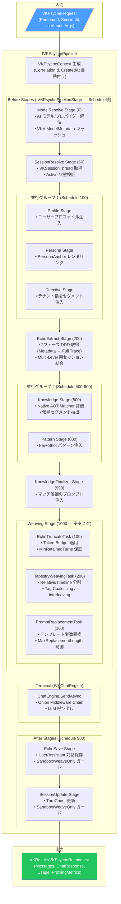

# VK.Blocks.AI.Psyche

[](https://dotnet.microsoft.com/)
[](https://opensource.org/licenses/MIT)
[](#)

## はじめに

`VK.Blocks.AI.Psyche` は、LLM ベースの AI チャットアプリケーション向けに設計された**プロンプトオーケストレーション＆行動パイプライン**です。

9 つの垂直スライスフィーチャー（Echo, Weaving, Session, Pipeline, Persona, Profile, Knowledge, Pattern, Directive）で構成され、7 つの情報源（Persona, Echo, Knowledge, Directive, Pattern, Profile, Session）を統合的に管理。トークン予算制約の下で最適なプロンプトを自動組み立てする「**Prompt Weaving（プロンプト織り込み）**」エンジンと、LLM 呼び出しを制御する **Onion Middleware パイプライン** を提供します。

### 設計思想

- **Zero-Infrastructure InMemory Default**: 開発・テスト環境ではインフラ依存なしで即座に動作。全リポジトリが InMemory 実装をデフォルトで提供
- **Pluggable Repository & Store Architecture**: `IVKPsychePersonaRepository` / `IVKEchoStore` / `IVKPsycheKnowledgeRepository` / `IVKPsycheDirectiveRepository` / `IVKPsychePatternRepository` / `IVKPsycheSessionRepository` / `IVKPsycheProfileRepository` の DI 差し替えのみで永続化層に移行可能（※ 6 つの情報源は識別子ベースの CRUD を担う **DDD Aggregate Repository** パターン、対話履歴 Echo のみ時系列追記・プルーニングに特化した **Event Stream Store** パターンを採用）
- **Before → Terminal → After**: 3 フェーズパイプラインによるデータ収集 → LLM 呼び出し（Terminal） → 後処理の明確な分離
- **Lock-Free Concurrency**: `VKPsycheContext` が `ImmutableList<T>` + `Interlocked.CompareExchange` による CAS ベースの原子的操作で並行安全性を実現
- **Token-Aware Truncation**: 対話履歴のトークン予算管理をエンジン内部で自動化し、コンテキストウィンドウの溢れを防止
- **Expression Tree Compilation**: Knowledge エントリのキーワード / 正規表現マッチングを Expression Tree にコンパイルし、`ConcurrentDictionary` でキャッシュ
- **Sandbox / WeaveOnly Safety Guard**: Sandbox モードと WeaveOnly モードで永続的 DB 副作用を確実にスキップ

---

## アーキテクチャ

### 適用パターン

| カテゴリ                   | パターン                                                                                                                 |
| -------------------------- | ------------------------------------------------------------------------------------------------------------------------ |
| **Design Principles**      | SRP, DIP, ISP, Fail-Fast, Immutability                                                                                   |
| **Design Patterns**        | Strategy, Pipeline, Chain of Responsibility, Onion Middleware, Template Method (Generics), Builder (Fluent)              |
| **Architectural Patterns** | Vertical Slice (Feature-Driven), Options Pattern, Result Pattern                                                         |
| **Enterprise Patterns**    | Token Budget Management, Dialogue History Pruning, Expression Tree Compilation & Caching                                 |
| **Cross-Cutting**          | Source Generated Logging, OpenTelemetry GenAI Metrics, `VKGuard` Boundary Defense, Lock-Free CAS Context, Func Transform |

### パイプライン実行フロー


```mermaid
flowchart TB
    subgraph Input ["入力"]
        REQ[/"VKPsycheRequest<br/>(PersonaId, SessionId,<br/>UserInput, Args)"/]
    end

    subgraph Pipeline ["IVKPsychePipeline"]
        REQ --> CTX["VKPsycheContext 生成<br/>(CorrelationId, CreatedAt 自動付与)"]

        subgraph Before ["Before Stages (IVKPsychePipelineStage — Schedule順)"]
            MODEL["ModelResolve Stage (0)<br/>• AI モデル/プロバイダー解決<br/>• VKAIModelMetadata キャッシュ"]
            SESSION["SessionResolve Stage (50)<br/>• VKSessionThread 取得<br/>• Active 状態検証"]

            subgraph ParallelGroup1 ["並行グループ 1 (Schedule 100)"]
                PROFILE["Profile Stage<br/>• ユーザープロファイル注入"]
                PERSONA["Persona Stage<br/>• PersonaAnchor レンダリング"]
                DIRECTIVE["Directive Stage<br/>• テナント指令セグメント注入"]
            end

            ECHO["EchoExtract Stage (200)<br/>• 2フェーズ DDD 取得 (Metadata → Full Trace)<br/>• Multi-Level 親セッション結合"]

            subgraph ParallelGroup2 ["並行グループ 2 (Schedule 500-600)"]
                KNOWLEDGE["Knowledge Stage (500)<br/>• Native AOT Matcher 評価<br/>• 候補セグメント抽出"]
                PATTERN["Pattern Stage (600)<br/>• Few-Shot パターン注入"]
            end

            KFINAL["KnowledgeFinalizer Stage (990)<br/>• マッチ候補のプロンプト注入"]

            subgraph WeavingPhase ["Weaving Stage (1000 — 子タスク)"]
                TRUNC["EchoTruncateTask (100)<br/>• Token Budget 適用<br/>• MinRetainedTurns 保証"]
                TAPESTRY["TapestryWeavingTask (200)<br/>• Relative/Timeline 分割<br/>• Tag Coalescing / Interleaving"]
                REPLACE["PromptReplacementTask (300)<br/>• テンプレート変数置換<br/>• MaxReplacementLength 防御"]
            end
        end

        CTX --> MODEL --> SESSION --> ParallelGroup1 --> ECHO --> ParallelGroup2 --> KFINAL --> WeavingPhase

        subgraph Terminal ["Terminal (IVKChatEngine)"]
            CHAT["ChatEngine.SendAsync<br/>• Onion Middleware Chain<br/>• LLM 呼び出し"]
        end

        WeavingPhase --> CHAT

        subgraph After ["After Stages (Schedule 900)"]
            ECHOSAVE["EchoSave Stage<br/>• User/Assistant 対話保存<br/>• Sandbox/WeaveOnly ガード"]
            SESSIONUPDATE["SessionUpdate Stage<br/>• TurnCount 更新<br/>• Sandbox/WeaveOnly ガード"]
        end

        CHAT --> ECHOSAVE --> SESSIONUPDATE
    end

    subgraph Output ["出力"]
        SESSIONUPDATE --> RESULT["VKResult&lt;VKPsycheResponse&gt;<br/>(Messages, ChatResponse,<br/>Usage, ProfilingMetrics)"]
    end

    style REQ fill:#4a9eff,color:#fff
    style RESULT fill:#22c55e,color:#fff
```

### フィーチャースライス構成

| スライス | 役割・中核機能 | 拡張点 (Protocols) | 主要モデル・定義 (Models & Definitions) | 構成 (Options) |
| :--- | :--- | :--- | :--- | :--- |
| **Pipeline** | パイプライン全体のライフサイクル制御・Orchestrator・Middleware 統合 | `IVKPsychePipeline`<br/>`IVKPsycheMiddleware` | `VKPsycheContext`<br/>`VKPipelineErrors` | `VKPipelineOptions` |
| **Weaving** | 7 ティア統合・動的 XML タグ結合・テンプレート変数置換・トークン予算 Fail-Fast | `IVKWeavingPipelineTask` | `VKPromptXmlBuilder`<br/>`VKWeavingArgs`<br/>`VKWeavingTaskOrder` | `VKWeavingOptions` |
| **Echo** | 対話履歴管理・2フェーズ DDD 取得・Turn/Message 単位のプルーニング | `IVKEchoStore`<br/>`IVKEchoRenderer` | `VKEchoTrace`<br/>`VKEchoMetadata`<br/>`EchoTurnGrouper` | `VKEchoOptions` |
| **Session** | セッション状態・モード（Continuous/Fork/Sandbox）・TurnCount 管理 | `IVKPsycheSessionRepository` | `VKSessionThread`<br/>`VKSessionId`<br/>`VKSessionErrors` | `VKSessionOptions` |
| **Persona** | 人格定義（名前・性格特性・システム指示・出力仕様）の構造化管理 | `IVKPsychePersonaRepository`<br/>`IVKPersonaRenderer` | `VKPersonaAnchor`<br/>`VKOutputSpecification`<br/>`VKPersonaErrors` | `VKPersonaOptions` |
| **Directive** | マルチテナント指令の注入・システムプロンプトの動的カスタマイズ | `IVKPsycheDirectiveRepository`<br/>`IVKDirectiveRenderer` | `VKDirectiveCharter`<br/>`VKDirectiveErrors` | `VKDirectiveOptions` |
| **Knowledge** | 動的ナレッジ注入・Expression Tree コンパイルキャッシュ・ReDoS タイムアウト | `IVKPsycheKnowledgeRepository` | `VKKnowledgeEntry`<br/>`VKKnowledgeMatcher`<br/>`VKKnowledgeErrors` | `VKKnowledgeOptions` |
| **Pattern** | Few-Shot パターンの管理と動的注入 | `IVKPsychePatternRepository` | `VKPatternEntry`<br/>`VKPatternErrors` | `VKPatternOptions` |
| **Profile** | ユーザープロファイル（属性・嗜好・コンテキスト）の注入 | `IVKPsycheProfileRepository`<br/>`IVKProfileRenderer` | `VKProfilePresence`<br/>`VKProfileErrors` | `VKProfileOptions` |
| **Common** | 横断的基盤（共有コンテキスト、トークン評価、XML フォーマット、グローバルスケジュール） | `IVKPsycheModelFactory`<br/>`IVKPsycheTokenEvaluator` | `VKPsychePipelineScheduler`<br/>`VKPromptSegment`<br/>`VKPsycheTokenExtensions` | N/A (基盤) |

---

## 主な機能

### 🧠 Persona（ペルソナ管理）

- **構造化ペルソナ定義**: `VKPersonaAnchor` による名前・説明・性格特性・システム指示・出力仕様・Few-Shot 例の統合管理
- **Pluggable Renderer**: `IVKPersonaRenderer` による Markdown ベースの構造化レンダリング。カスタムフォーマットへの差し替えが可能
- **出力仕様制御**: `VKOutputSpecification` による JSON Schema / 言語コード / トークンヒント / カスタム制約の宣言的指定

### 💬 Echo（対話履歴管理）

- **デュアルプルーニング戦略**: `VKEchoPruneUnit.Turn`（ターン単位）と `Message`（メッセージ単位）の切り替え
- **動的トークンバジェット**: `TokenBudgetRatio`（全体コンテキストに対する比率）と `MaxTokens`（絶対上限）のデュアル制約
- **Turn Budget 制限**: `MaxTurns` による対話ターン数の上限制御
- **スライディングウィンドウ**: `MaxWindowSize` による対話履歴ウィンドウサイズの制御
- **System Message フィルタリング**: `IncludeSystemMessages` による対話内システムメッセージの取捨選択
- **マルチレンダラー**: Raw / ChatML / XML / Header / Bracket の 5 つの履歴レンダリング形式を標準提供
- **2 フェーズ DDD 取得モデル**: Phase 1 で軽量メタデータ (`VKEchoMetadata`) を取得してトークン予算を in-memory 計算し、Phase 2 で保持対象の ID のみフルコンテンツ (`VKEchoTrace`) を取得。N+1 問題を回避
- **Continuous Multi-Level Parent Tracing**: `VKSessionMode.Continuous` で親セッション履歴を再帰的に辿り、Fork 元の対話コンテキストを自動的に結合
- **MinRetainedTurns 保証**: トークン予算が厳しい場合でも最低限のターン数を保持し、対話コンテキストの断絶を防止

### 📚 Knowledge（動的ナレッジ注入）

- **3 種のトリガータイプ**: `Constant`（常時有効）/ `Keyword`（キーワードマッチ）/ `Regex`（正規表現）
- **Native AOT 述語クロージャコンパイル**: キーワード / 正規表現ルールを高効率な純粋 C# クロージャデリゲートにコンパイルし、`(int StateHash, Func<string, bool> Matcher)` でキャッシュ。JIT コンパイル遅延ゼロかつ Native AOT 完全準拠。ReDoS 防御の Regex タイムアウト（100ms）付き
- **高度なフィルタリング**: `AndAll` / `AndAny` / `NotAny` / `NotAll` の 4 種の論理演算子による複合条件マッチ
- **位置制御**: `AbsolutePosition`（グローバル Depth 挿入）と `RelativePosition`（他ティアとの相対配置）の 2 種

### 📋 Directive（テナント指令）

- **テナント分離**: `DirectiveId` ベースの指令解決により、マルチテナント環境での System Prompt カスタマイズを実現
- **Scoped Repository**: `InMemoryDirectiveRepository` は `Scoped` ライフタイムで登録され、リクエスト間の分離を保証

### 🎭 Pattern（Few-Shot パターン注入）

- **Pluggable Repository**: `IVKPsychePatternRepository` によるパターン管理。InMemory デフォルト実装付き
- **宣言的ティア無効化**: `DisabledTiers` により Pattern ティアを選択的に無効化可能
- **Feature Toggle**: `VKPatternOptions.Enabled` による Feature 単位の有効/無効制御

### 👤 Profile（ユーザープロファイル管理）

- **多次元プロファイル定義**: `VKProfilePresence` による対話トーン（`VKInteractionTone`）、応答詳細度（`VKResponseVerbosity`）、絵文字ポリシー（`VKEmojiPolicy`）、カスタム属性の構造化管理
- **Pluggable Renderer**: `IVKProfileRenderer` によるシステムプロンプトへの構造化レンダリング。フォーマットの完全な差し替えが可能
- **ゼロインフラデフォルト**: `IVKPsycheProfileRepository` と `InMemoryProfileRepository` による即座の開発・テスト実行環境

### 🗂️ Session（セッションライフサイクル管理）

- **多態セッションモード**: `Continuous`（親セッション履歴を自動再帰結合）、`Fork`（過去履歴を分岐した新規対話）、`Sandbox`（永続的 DB 副作用を完全スキップする検証モード）
- **DDD 集約ルート設計**: `VKSessionThread : VKAggregateRoot<VKSessionId>` による TurnCount、状態（Active/Archived/Closed）、メタデータの厳格なカプセル化
- **安全なライフサイクル同期**: パイプライン After フェーズでの自動 TurnCount インクリメントと、Sandbox / WeaveOnly ガードによる永続化保護

### 🧵 Weaving Engine（プロンプト織り込みエンジン）

- **3 段階タスクパイプライン**: EchoTruncateTask → TapestryWeavingTask → PromptReplacementTask
- **Relative/Timeline パーティショニング**: 静的セグメント（Directive, Persona）と動的タイムラインスロット（Echo, UserInput）を分離し、Tag Coalescing で同一 XML タグを自動結合
- **テンプレート変数置換**: `IVKPromptTemplateEngine` による変数展開。`MaxReplacementLength`（デフォルト 32,768 文字）と `SanitizeVariables` によるプロンプトインジェクション防御
- **Timeline Depth Injection**: `TimelineDepth` によるメッセージ間へのセグメント差し込み（スロットベース配置）
- **Token Budget 統合管理**: `MaxContextBudget` / `ResponseReservedTokens` によるプロンプト全体のトークン予算制御。予算超過時は `VKWeavingErrors.ContextBudgetExceeded` で Fail-Fast

### 🔄 Pipelines（パイプライン）

- **3 フェーズ実行**: Before Stages → Terminal (LLM Invocation) → After Stages の明確な分離
- **`VKPipelineExecutorBase` 継承**: ジェネリックパイプライン基盤クラスからの派生による `CheckAborted` / `CheckCompleted` / `BuildResponse` の標準化
- **Onion Middleware**: `IVKPsycheMiddleware` による LLM 呼び出し前後のカスタムロジック注入（`TryAddEnumerable` で登録）
- **WeaveOnly モード**: LLM 呼び出しをスキップし、プロンプト織り込み結果のみを返却。`context.Complete()` でパイプラインを早期完了
- **Abort 制御**: `VKPsycheContext.Abort()` / `Complete()` による実行中パイプラインの安全な中断・完了（`Interlocked` ベース）
- **ステージ単位 Activity Span**: `DefaultPsychePipelineExecutor.ExecuteComponentAsync` が各ステージに自動的に OpenTelemetry Activity を生成し、`ProfilingMetrics` に実行時間を記録

### 📡 可観測性 (Observability)

- **Source Generated Logging**: 全 9 フィーチャに `[LoggerMessage]` SG + `[VKBlockDiagnostics<VKAIPsycheBlock>]` 準拠の構造化ログ。`_logger.LogXxx()` 直接呼び出しゼロ
- **OpenTelemetry GenAI Metrics**: `[VKMetricHistogram]` SG による Pipeline / Stage / LLM Invocation の duration、Echo save/trim/active counts、Weaving token assembly/truncation のカスタムメトリクス
- **CorrelationId トレーシング**: パイプライン開始時に `IVKGuidGenerator` で自動生成し、全 Activity Span と LoggerMessage に含める
- **GenAI セマンティック規約**: `VKPsycheDiagnosticsConstants` で OpenTelemetry GenAI Semantic Conventions 準拠タグ (`gen_ai.system`, `gen_ai.request.model`, `gen_ai.usage.*`) を定義
- **ProfilingMetrics**: `VKPsycheResponse` に各ステージの実行時間と LLM 呼び出し時間を含め、呼び出し元がパフォーマンスボトルネックを特定可能

---

## 採用技術

| 技術                             | 用途                                                                                                       |
| -------------------------------- | ---------------------------------------------------------------------------------------------------------- |
| **.NET 10 / C# 13**              | ランタイム基盤、`sealed record`、`required`、Primary Constructor、Collection Expressions                   |
| **Native AOT Closures**          | Knowledge Matcher の JIT コンパイルオーバーヘッドゼロな高性能述語クロージャ合成（StateHash キャッシュ付き） |
| **System.Collections.Immutable** | `ImmutableList<T>` + CAS による `VKPsycheContext` のロックフリー並行安全操作                               |
| **ConcurrentDictionary**         | コンパイル済みマッチャー、ステージメタデータ、コンテキスト状態のスレッドセーフキャッシュ                   |
| **System.Diagnostics.Activity**  | OpenTelemetry 分散トレーシングとステージ単位 Span 生成                                                     |
| **Source Generator**             | `[LoggerMessage]` SG, `[VKBlockDiagnostics]` SG, `[VKFeature]` SG, `[VKMetricHistogram]` SG                |
| **VK.Blocks.Core**               | Result Pattern, VKGuard, VKPipelineExecutorBase, DI Builder, Block Options, IVKGuidGenerator, TimeProvider |
| **VK.Blocks.AI**                 | `IVKTokenCounter`, `IVKChatEngine`, `VKChatRole`, `VKChatMessage`, `IVKVKAIModelCatalog` 等の AI 共通基盤  |

---

## 開始方法

### 1. パッケージ参照

```xml
<ProjectReference Include="..\AI.Psyche\VK.Blocks.AI.Psyche.csproj" />
```

### 2. DI 登録

```csharp
builder.Services
    .AddVKAIPsycheBlock(builder.Configuration)
    .AddVKDefaultFeatures();   // Directive + Echo + Knowledge + Pattern + Persona + Profile + Pipeline + Session + Weaving を一括有効化
```

#### 個別 Feature 登録（選択的構成）

```csharp
builder.Services
    .AddVKAIPsycheBlock(builder.Configuration)
    .AddVKPersona()
    .AddVKEcho(options => options with { TokenBudgetRatio = 0.4, PruneUnit = VKEchoPruneUnit.Turn })
    .AddVKKnowledge(options => options with { KeywordScanDepth = 3 })
    .AddVKDirective()
    .AddVKPattern()
    .AddVKProfile()
    .AddVKSession()
    .AddVKPipeline()
    .AddVKWeaving(options => options with { MaxContextBudget = 65536, ResponseReservedTokens = 4096 });
```

### 3. パイプライン実行

```csharp
public sealed class ChatService(IVKPsychePipeline pipeline)
{
    public async Task<VKResult<VKPsycheResponse>> ChatAsync(
        string personaId, string sessionId, string userInput,
        CancellationToken ct = default)
    {
        var request = new VKPsycheRequest
        {
            PersonaId = new VKPersonaId(Guid.Parse(personaId)),
            SessionId = new VKSessionId(Guid.Parse(sessionId)),
            UserInput = userInput
        }
        .WithArgs(new VKWeavingArgs
        {
            MaxContextBudget = 32768,
            ResponseReservedTokens = 2048
        })
        .WithArgs(new VKChatArgs
        {
            // LLM-specific parameters (Provider, ModelId, etc.)
        });

        return await pipeline.ExecuteAsync(request, ct);
    }
}
```

### 4. リポジトリ／ストアのカスタマイズ

```csharp
// InMemory デフォルトを永続化リポジトリに差し替え
builder.Services.AddSingleton<IVKPsychePersonaRepository, PostgresPersonaRepository>();
builder.Services.AddSingleton<IVKPsycheKnowledgeRepository, CosmosKnowledgeRepository>();
builder.Services.AddScoped<IVKEchoStore, RedisEchoStore>();
builder.Services.AddScoped<IVKPsycheDirectiveRepository, DatabaseDirectiveRepository>();
builder.Services.AddSingleton<IVKPsychePatternRepository, DatabasePatternRepository>();
builder.Services.AddScoped<IVKPsycheSessionRepository, DatabaseSessionRepository>();
builder.Services.AddSingleton<IVKPsycheProfileRepository, DatabaseProfileRepository>();
```

> [!TIP]
> `TryAdd` パターンにより、カスタムリポジトリの登録は `AddVKDefaultFeatures()` **よりも前**に行う必要があります。先に登録されたサービスが優先されます。

### 5. ミドルウェアの追加

```csharp
// カスタムミドルウェアで LLM 呼び出しの前後にロジックを挿入
builder.Services.TryAddEnumerable(
    ServiceDescriptor.Scoped<IVKPsycheMiddleware, RateLimitMiddleware>());
```

---

## 🏛️ アーキテクチャ監査

最新の監査レポートは [AI.Psyche_20260922.md](/docs/04-AuditReports/AI.Psyche/AI.Psyche_20260922.md) を参照してください。

| 項目                | 結果                        |
| ------------------- | --------------------------- |
| **総合スコア**      | 93 / 100                    |
| **Fast Audit**      | 22/22 (100%)                |
| **DI Registration** | ✅ PASS (BB.03 SG 完全準拠) |
| **重大な懸念事項**  | なし                        |

### 監査による改善提案（最新）

| 優先度 | 内容 | 状態 |
| :----- | :--- | :--: |
| 🟢 Low | `DefaultEchoExtractStage.GetMetaTokens` のフォールバック値（10トークン）のマジックナンバー定数化 | ✅ 完了 |
| 🟢 Low | `DefaultEchoExtractStage` と `DefaultEchoTruncateTask` におけるトークンバジェット解決ロジックの共通化（DRY 強化） | ✅ 完了 |
| 🟢 Low | `DefaultPsychePipelineExecutor` の `[VKTrace]` 属性取得の Source Generator 化（Zero-Reflection 原則の徹底） | 📋 検討中 |

### 過去の改善実績

| 優先度 | 内容 | 状態 |
| :----- | :--- | :--: |
| 🟢 Low | `GroupIntoTurns` の重複ロジックをジェネリック抽象化（`EchoTurnGrouper`）で一元化 | ✅ 完了 |
| 🟢 Low | `NullLogger` フォールバックパターンの統一（`ILogger<T>` を DI 必須パラメータに） | ✅ 完了 |
| 🟢 Low | `VKPsycheContext.UserEchoTrace` 並行保護の強化（`Volatile.Read` / `Interlocked.Exchange`） | ✅ 完了 |
| 🟢 Low | 契約・規則ディレクトリを `Definitions/` に統一（切片ルートを Feature + Options のみに純化） | ✅ 完了 |

---

## 🔭 今後の展望

| 機能                              | 状態 | 概要                                                                                                 |
| --------------------------------- | :--: | ---------------------------------------------------------------------------------------------------- |
| **Prompt Weaving Pipeline**       |  ✅  | 7 ティア統合パイプラインの実装完了（Directive, Persona, Knowledge, Pattern, Profile, Echo, Session） |
| **Pipelines**                     |  ✅  | Before → Terminal → After の 3 フェーズパイプライン                                                  |
| **Onion Middleware**              |  ✅  | LLM 呼び出し制御のための拡張可能なミドルウェアチェーン                                               |
| **Native AOT Matcher Closures**  |  ✅  | Knowledge キーワード / 正規表現の高性能・JIT ゼロマッチング（StateHash キャッシュ付き）             |
| **Lock-Free CAS Context**         |  ✅  | `ImmutableList<T>` + `Interlocked.CompareExchange` による並行安全性                                  |
| **Pattern Feature**               |  ✅  | Few-Shot パターン注入機能                                                                            |
| **Template Variable Replacement** |  ✅  | `IVKPromptTemplateEngine` による動的変数置換 + インジェクション防御                                  |
| **OpenTelemetry Metrics**         |  ✅  | `[VKMetricHistogram]` SG による Pipeline / Stage / LLM / Echo / Weaving メトリクス計装完了           |
| **2-Phase DDD Echo Retrieval**    |  ✅  | Metadata → Full Trace の 2 フェーズ取得による I/O 最適化                                             |
| **Sandbox / WeaveOnly Guard**     |  ✅  | 全 After ステージで永続的 DB 副作用の安全なスキップ                                                  |
| **Streaming Pipeline & Tapestry** |  📋  | `IAsyncEnumerable` ベースのストリーミング LLM レスポンス対応（`AI.PSYCHE-001`）                      |
| **Feature 登録フックの Enabled ガード整理** |  📋  | Source Generator と重複する `options.Enabled` 冗余判定の撤廃（`AI.PSYCHE-002`） |
| **Channels 非同期ストリームとバックプレッシャー** |  📋  | `System.Threading.Channels` によるストリーミング後処理と非同期永続化（`AI.PSYCHE-003`）             |
| **Semantic ベクトル検索拡張 (外部)** |  📋  | `AI.Psyche.Knowledge.Semantic` 外部アダプターライブラリ（`AI.PSYCHE-004`）                         |
| **分散永続化ストレージアダプター (外部)** |  📋  | Redis / EF Core 外部アダプターライブラリ（`AI.PSYCHE-005`）                                         |
| **Prompt Cache 診断・警告システム (PCA)** |  📋  | 非侵入的なプロンプトキャッシュ阻害検知・OTel/ログ警告（`AI.PSYCHE-006`）                               |

---

## ライセンス

MIT License — 詳細は [LICENSE](/LICENSE) を参照してください。
