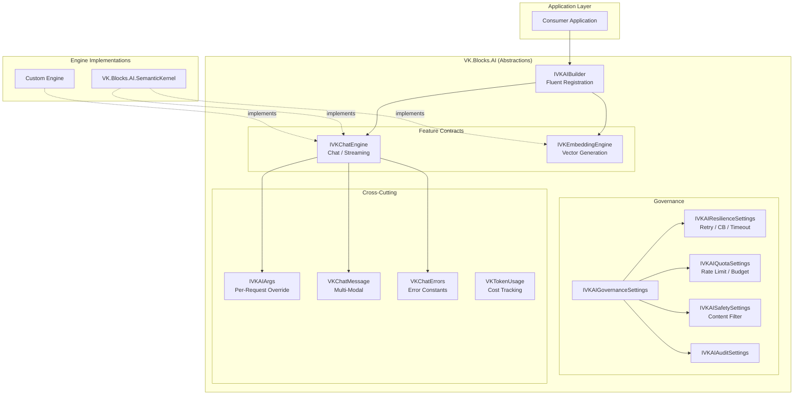

# VK.Blocks.AI

[](https://dotnet.microsoft.com/)
[](LICENSE)
[]()

## はじめに

**VK.Blocks.AI** は、VK.Blocks エコシステムにおける **プロバイダー非依存 AI 抽象ライブラリ**です。

OpenAI、Azure OpenAI、Google Gemini、Anthropic Claude、Ollama 等の LLM プロバイダーに依存しない統一的な API 契約を定義し、アプリケーション層から AI インフラストラクチャの実装詳細を完全に分離します。本ライブラリは **「抽象のみ・実装ゼロ」** の設計思想に基づき、具象プロバイダーとの統合は `VK.Blocks.AI.SemanticKernel` 等の Engine ライブラリに委譲されます。

---

## アーキテクチャ

### 設計原則

| 原則 | 適用 |
|:-----|:-----|
| **SOLID** | ISP による Governance Settings の細粒度分離、DIP によるエンジン抽象化 |
| **DRY** | `IVKAIGovernanceSettings` による共通ガバナンス設定の集約 |
| **KISS** | 直感的な Fluent Builder API（`AddVKAIBlock().AddVKChat().AddVKEmbeddings()`） |

### 設計パターン

| パターン | 適用箇所 |
|:---------|:---------|
| **Strategy** | `IVKChatEngine` / `IVKEmbeddingEngine` — プロバイダー交換可能 |
| **Builder** | `IVKAIBuilder` — Feature の選択的有効化 |
| **Composite** | `IVKChatMessagePart` — マルチモーダルメッセージ（Text / Image / Audio / File） |
| **Null Object** | `DefaultChatEngine` — 未実装を例外ではなく `VKResult.Failure` で表現 |
| **Args Pattern (AP.05)** | Global → Feature → Request の三層構成による設定オーバーライド |

### アーキテクチャ概要



### モジュール構成

```
src/BuildingBlocks/AI/
├── VKAIBlock.cs                     # Block Marker (Source Generated)
├── Audio/                           # 🔊 Speech & Transcription
│   ├── VKAudioArgs.cs
│   ├── VKAudioSpeechOptions.cs
│   ├── VKAudioTranscriptionOptions.cs
│   └── Internal/                    # Feature Registration & Logging
├── Chat/                            # 💬 Chat & Streaming
│   ├── IVKChatEngine.cs             # Core Engine Contract
│   ├── VKChatMessage.cs             # Multi-Modal Message
│   ├── VKChatArgs.cs
│   ├── VKChatErrors.cs              # Error Constants (CS.01)
│   ├── VKChatOptions.cs
│   ├── VKChatSession.cs             # Stateful Session Helper
│   └── Internal/                    # DefaultChatEngine & Registration
├── Common/                          # 🔗 Shared Abstractions
│   ├── IVKAIArgs.cs                 # Args Pattern Base
│   ├── VKAIArgs.cs
│   └── VKAIRequestContext.cs        # Request Tracking
├── Connection/                      # 🔌 Provider Configuration
│   ├── IVKAIConnectionSettings.cs
│   ├── VKAIModelIds.cs              # Model ID Constants
│   └── VKAIProviderType.cs          # Supported Providers Enum
├── DependencyInjection/             # 📦 DI Registration
│   ├── IVKAIBuilder.cs              # Builder Interface
│   ├── VKAIBlockExtensions.cs       # Public API Surface
│   ├── VKAIOptions.cs               # Block-Level Options
│   └── Internal/                    # Registration Logic
├── Diagnostics/                     # 📡 Observability
│   ├── AIDiagnosticsConstants.cs
│   └── Internal/AiLog.cs            # [VKBlockDiagnostics] SG
├── Embeddings/                      # 🧮 Vector Generation
│   ├── IVKEmbeddingEngine.cs
│   ├── VKEmbeddingArgs.cs
│   ├── VKEmbeddingErrors.cs
│   ├── VKEmbeddingOptions.cs
│   ├── VKEmbeddingVector.cs
│   └── Internal/
├── Governance/                      # 🛡️ ISP Governance Contracts
│   ├── IVKAIGovernanceSettings.cs   # Composite Interface
│   ├── IVKAIResilienceSettings.cs
│   ├── IVKAIQuotaSettings.cs
│   ├── IVKAISafetySettings.cs
│   └── IVKAIAuditSettings.cs
├── Moderation/                      # 🚨 Content Moderation
│   ├── VKModerationArgs.cs
│   ├── VKModerationOptions.cs
│   └── Internal/
├── Retrieval/                       # 🔍 RAG Abstractions
│   └── IVKRetrievalSettings.cs
└── Tokenics/                        # 📊 Token Usage & Budget
    ├── VKTokenUsage.cs
    ├── VKTokenicsOptions.cs
    └── Internal/
```

---

## 主な機能

### 🤖 プロバイダー非依存チャットエンジン
- `IVKChatEngine` による統一的な会話 API（同期 / ストリーミング）
- `VKResult<VKChatMessage>` パターンによる型安全なエラーハンドリング
- `VKChatSession` によるステートフルな会話管理

### 🎨 マルチモーダルメッセージ
- `IVKChatMessagePart` Composite パターン
- Text / Image / Audio / File の4種のメディアタイプをサポート
- `VKChatMessage.FromText()` による簡易生成ファクトリ

### 🧮 Embedding ベクトル生成
- `IVKEmbeddingEngine` による統一的なベクトル生成契約
- `ReadOnlyMemory<float>` によるゼロコピーベクトル表現

### ⚙️ 階層的構成パターン (AP.05)
- **Global** (`VKAIOptions`) → **Feature** (`VKChatOptions`) → **Request** (`VKChatArgs`) の三層設定
- すべての `Args` 型が `IVKArgs<T>` を実装し、per-request オーバーライドを提供

### 🛡️ ガバナンス設計 (Interface Segregation)
- `IVKAIResilienceSettings` — Retry / Circuit Breaker / Timeout
- `IVKAIQuotaSettings` — Rate Limit / Token Budget
- `IVKAISafetySettings` — Content Filter
- `IVKAIAuditSettings` — Audit Logging
- `IVKAIGovernanceSettings` — 上記すべてを集約する Composite Interface

### 📡 工業級可観測性
- `[VKBlockDiagnostics<VKAIBlock>]` — ActivitySource / Meter 自動生成
- `[LoggerMessage]` Source Generator — 全フィーチャーで高性能ログ
- `VKTokenUsage` — トークン使用量とコストの構造化追跡

### 🔌 Fluent Builder DI
```csharp
services.AddVKAIBlock(configuration)
    .AddVKChat()
    .AddVKEmbeddings()
    .AddVKAudio()
    .AddVKModeration()
    .AddVKTokenics();

// または一括登録
services.AddVKAIBlock(configuration)
    .AddVKDefaultFeatures();
```

---

## 採用技術

| カテゴリ | 技術 |
|:---------|:-----|
| **フレームワーク** | .NET 10 / C# 12+ |
| **DI** | `Microsoft.Extensions.DependencyInjection` |
| **構成** | `Microsoft.Extensions.Options` + `IValidateOptions<T>` |
| **ログ** | `[LoggerMessage]` Source Generator |
| **診断** | `[VKBlockDiagnostics]` (ActivitySource / Meter SG) |
| **エラー** | `VKResult<T>` Pattern (VK.Blocks.Core) |
| **防御** | `VKGuard` Boundary Protection |
| **設計** | Strategy / Builder / Composite / Null Object / Args Pattern |

---

## 開始方法

### 前提条件
- .NET 10 SDK
- VK.Blocks.Core プロジェクト参照

### インストール

```bash
# リポジトリのクローン
git clone https://github.com/ViktorLK/VK-Common-BE.git
cd VK-Common-BE
```

### 基本的な使用方法

```csharp
// 1. DI 登録
services.AddVKAIBlock(configuration)
    .AddVKChat()
    .AddVKEmbeddings();

// 2. チャットエンジンの利用
public class MyChatService(IVKChatEngine engine)
{
    public async Task<VKResult<VKChatMessage>> ChatAsync(
        string prompt, CancellationToken ct)
    {
        var messages = new[] { VKChatMessage.FromText(VKChatRole.User, prompt) };
        var args = new VKChatArgs { Temperature = 0.7f, MaxTokens = 1024 };
        return await engine.SendAsync(messages, args, ct).ConfigureAwait(false);
    }
}
```

### appsettings.json 構成例

```json
{
  "VKBlocks": {
    "AI": {
      "Enabled": true,
      "Provider": "OpenAI",
      "RetryCount": 3,
      "Timeout": "00:00:30",
      "Chat": {
        "Enabled": true,
        "ModelId": "gpt-4o",
        "Temperature": 0.7,
        "MaxTokens": 512
      },
      "Embeddings": {
        "Enabled": true,
        "ModelId": "text-embedding-3-small",
        "Dimensions": 1536
      }
    }
  }
}
```

---

## ADR (Architecture Decision Records)

本モジュールの主要な設計決定は以下の ADR で文書化されています：

| ADR | タイトル |
|:----|:---------|
| [ADR-001](/docs/02-ArchitectureDecisionRecords/AI/adr-001-provider-agnostic-engine-abstraction.md) | Provider-Agnostic Engine Abstraction |
| [ADR-002](/docs/02-ArchitectureDecisionRecords/AI/adr-002-polymorphic-multi-modal-message-schema.md) | Polymorphic Multi-Modal Message Schema |
| [ADR-003](/docs/02-ArchitectureDecisionRecords/AI/adr-003-hierarchical-configuration-pattern.md) | Hierarchical Configuration Pattern |
| [ADR-004](/docs/02-ArchitectureDecisionRecords/AI/adr-004-standardized-execution-arguments-args-pattern.md) | Standardized Execution Arguments (Args Pattern) |
| [ADR-005](/docs/02-ArchitectureDecisionRecords/AI/adr-005-ai-options-architecture-interface-segregation-over-class-inheritance.md) | Interface Segregation over Class Inheritance |
| [ADR-006](/docs/02-ArchitectureDecisionRecords/AI/adr-006-unified-token-usage-tracking-and-cost-observation.md) | Unified Token Usage Tracking |
| [ADR-007](/docs/02-ArchitectureDecisionRecords/AI/adr-007-standardized-streaming-protocol-with-result-pattern.md) | Standardized Streaming Protocol |
| [ADR-008](/docs/02-ArchitectureDecisionRecords/AI/adr-008-integrated-moderation-and-governance-middleware.md) | Integrated Moderation & Governance |
| [ADR-009](/docs/02-ArchitectureDecisionRecords/AI/adr-009-retrieval-augmented-generation-(rag)-interface-strategy.md) | RAG Interface Strategy |
| [ADR-010](/docs/02-ArchitectureDecisionRecords/AI/adr-010-multi-engine-failover-and-load-balancing.md) | Multi-Engine Failover & Load Balancing |
| [ADR-011](/docs/02-ArchitectureDecisionRecords/AI/adr-011-standardized-prompt-templating-and-versioning.md) | Prompt Templating & Versioning |
| [ADR-012](/docs/02-ArchitectureDecisionRecords/AI/adr-012-automated-ai-evaluation-framework.md) | Automated AI Evaluation Framework |

---

## 今後の展望

- 🔄 **Prompt Templating**: Liquid ベースのプロンプトテンプレートエンジン（ADR-011）
- 📊 **AI Evaluation Framework**: 自動評価パイプライン（ADR-012）
- 🔀 **Multi-Engine Failover**: 複数エンジンのフェイルオーバーとロードバランシング（ADR-010）
- 🧪 **Unit Test Coverage**: 全 Feature の Happy / Failure パステスト

---

## ライセンス

MIT License — 詳細は [LICENSE](LICENSE) を参照してください。
