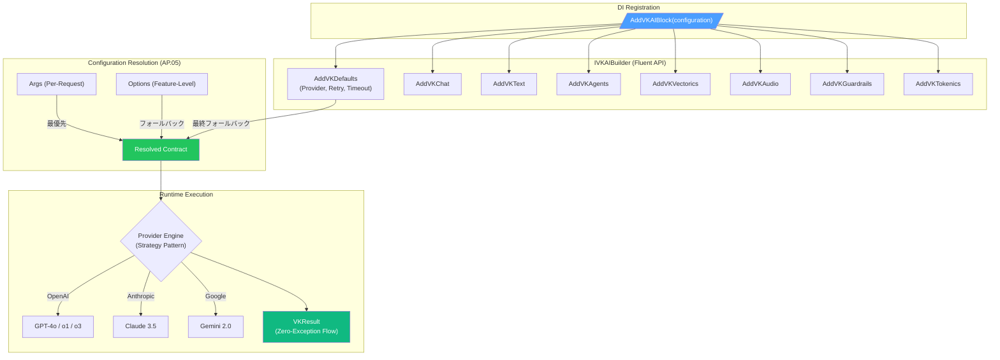

# VK.Blocks.AI

[](https://dotnet.microsoft.com/)
[](https://opensource.org/licenses/MIT)
[](#)

## はじめに

**VK.Blocks.AI** は、.NET 10 をベースとしたプロバイダー非依存の AI オーケストレーション基盤ライブラリです。OpenAI・Anthropic・Google Gemini などの主要 LLM プロバイダーを統一的な抽象レイヤーで包括し、Chat・Text 生成・Agent・Audio・Vectorics・Guardrails・Tokenics の 7 つのピラーを Fluent API で自在に構成できます。

本モジュールは VK.Blocks アーキテクチャの BuildingBlock パターンに厳格に準拠し、**Source Generator 駆動のモジュール登録**、**`Result<T>` による例外レスなエラーハンドリング**、**Immutable Options (`sealed record` + `init`)**、**階層型構成解決 (AP.05)** を実現しています。

### 設計思想

- **Provider Agnosticism**: 全 AI 機能がプロバイダー非依存の `IVK*Engine` インターフェースで抽象化。プロバイダー切替は DI 登録のみで完了
- **NoOp Default Safety**: 全 Engine に NoOp デフォルト実装を提供。Provider 未登録時もランタイム例外なしで安全に動作
- **3-Tier Configuration Resolution**: Args (Per-Request) → Options (Feature-Level) → Defaults (Global) の 3 段階で構成を解決。リクエスト単位でモデル・プロバイダーを動的切替可能
- **Zero-Exception Flow**: 全 AI 操作が `VKResult<T>` を返却。例外伝播を排除し、呼び出し元で明示的なエラーハンドリングを強制

---

## 🧩 拡張モジュール: AI.Cognitive

高度な認知機能（Persona・Knowledge・Memory・Orchestration 等）を利用する場合は、コアライブラリを軽量に保つため、専用の拡張モジュールを使用します。

### 利用シーン

- **Persona (自我: アイデンティティ一貫性)** や **Knowledge (資産: 世界設定・事実管理)** を活用したキャラクターAI を構築する場合
- **Memory (帳簿: 長短期対話の永続化)** や **Engram (代謝: 記憶減衰・忘却制御)** による文脈継続が必要な場合
- **Orchestration (中枢: 意図仲裁・協調制御)** による Intent 解析・Goal 管理が必要な場合
- **Presence (覚知: リアルタイム状況・環境知覚)** や **Reasoning (思考: CoT・内省)** を組み合わせた高度なエージェントを構築する場合

### 特徴

- **Zero Dependency Core**: コアライブラリ `AI` は認知機能に依存しません。必要なプロジェクトのみがこの拡張を導入します
- **Cognitive Pipeline**: `IVKCognitivePipeline` による Intent 解析 → Knowledge 取得 → Memory 統合 → 応答生成の統合パイプライン
- **Knowledge Engine**: トリガーベースの知識注入（Keyword / Semantic / Always-On）、重み付き優先度解決、プロンプトテンプレート位置制御

詳細は [/src/BuildingBlocks/AI.Cognitive/README.md](/src/BuildingBlocks/AI.Cognitive/README.md) を参照してください。

---

## 🤝 Contributing

## アーキテクチャ

### 適用パターン

| カテゴリ                   | パターン                                                                                                  |
| :------------------------- | :-------------------------------------------------------------------------------------------------------- |
| **Design Principles**      | Separation of Concerns, Dependency Inversion, Interface Segregation, Open-Closed                          |
| **Design Patterns**        | Builder (Fluent API), Factory Method, Strategy, Null Object (NoOp), Pipeline/Filter                       |
| **Architectural Patterns** | Vertical Slice (Feature-Driven), BuildingBlock Pattern (BB.01–BB.08), Pillar Aggregate                    |
| **Enterprise Patterns**    | Result Pattern, Hierarchical Configuration Resolution (AP.05), Polly Resilience, Circuit Breaker          |
| **Cross-Cutting**          | Source Generated Logging, OpenTelemetry Instrumentation, Governance (Resilience + Audit + Quota + Safety) |

### AI オーケストレーション概要



### モジュール構成

```
AI/
├── VKAIBlock.cs                  # [VKBlockMarker] モジュールルートマーカー
├── VKAIOptions.cs                # ブロックルート Options (IVKBlockOptions)
├── AtomicTools/                  # エージェント用ツール定義 (IVKAtomicTool, Manifest, Filter)
├── Chat/                         # 会話 AI (IVKChat, IVKChatEngine, Messages, Streaming)
│   ├── Messages/                 # マルチパートメッセージ (Text, Image, Audio, File, Reasoning, ToolCall)
│   └── Internal/                 # BasicChat, NoOpVKChatEngine, ChatLog
├── Text/                         # テキスト生成 (IVKTextEngine, Streaming)
│   └── Internal/                 # BasicText, NoOpVKTextEngine
├── Agents/                       # 自律エージェント (IVKAgent, IVKAgentFactory)
│   └── Internal/                 # BasicAgent, AgentsFactory
├── Vectorics/                    # ベクトル操作ピラー
│   ├── Embeddings/               # ベクトル埋め込み (IVKEmbeddingsEngine)
│   ├── Retrieval/                # セマンティック検索 (IVKRetrievalEngine)
│   ├── SemanticCache/            # 意味的キャッシュ (IVKSemanticCache)
│   └── ReRanking/                # 再ランキング (IVKReRanker)
├── Audio/                        # 音声ピラー
│   ├── Speech/                   # TTS (IVKSpeechEngine)
│   └── Transcription/            # STT (IVKTranscriptionEngine)
├── Guardrails/                   # セキュリティピラー
│   ├── Content/                  # コンテンツモデレーション
│   ├── Privacy/                  # PII 検出・マスキング (IVKPrivacyFilter)
│   └── Injection/                # プロンプトインジェクション検出 (IVKInjectionDetector)
├── Tokenics/                     # トークン管理ピラー
│   ├── Counting/                 # トークンカウント (IVKTokenizer)
│   ├── Costing/                  # コスト計算 (IVKTokenCostCalculator)
│   ├── Limiting/                 # レート制限 (IVKTokenRateLimiter)
│   ├── Quotas/                   # クォータ管理
│   └── Budgeting/                # 予算配分 (IVKTokenBudgeter)
└── Common/                       # 横断的関心事
    ├── Connection/               # 階層型構成解決 (AP.05 Hierarchical Merge)
    ├── Contracts/                # 共有契約 (VKAIErrors, VKAIModelIds, VKAIRequestContext)
    ├── DependencyInjection/      # DI 登録 (IVKAIBuilder, BlockExtensions, BuilderExtensions)
    │   └── Internal/             # AIBlockRegistration, AIBlockBuilder
    ├── Diagnostics/              # OpenTelemetry Constants (public)
    │   └── Internal/             # ActivitySource / Meter / Metadata Provider
    ├── Governance/               # ガバナンス (Resilience + Audit + Quota + Safety)
    └── Shared/                   # 共有ユーティリティ (AIErrorMapper, ChatHistoryHelper)
```

---

## 主な機能

### 🤖 Chat — 会話 AI

- **`IVKChat`**: 高レベルのチャットサービス。履歴管理・システムプロンプト注入・ストリーミングを内部で処理
- **`IVKChatEngine`**: プロバイダー固有のアトミック推論ドライバー。テキスト・マルチモーダル（画像/音声）対応
- **Multi-Part Messages**: `VKTextPart` / `VKImagePart` / `VKAudioPart` / `VKFilePart` / `VKReasoningPart` による構造化メッセージ
- **Streaming**: `IAsyncEnumerable<VKResult<VKChatStreamingResponse>>` による非同期ストリーミング

### 📝 Text — テキスト生成

- **`IVKTextEngine`**: Completion・要約・抽出などの汎用テキスト生成エンジン
- 同期レスポンスとストリーミングの両方をサポート

### 🕵️ Agents — 自律エージェント

- **`IVKAgent`**: Tool Calling と自律的なマルチステップ推論を行うインテリジェントエージェント
- **`IVKAgentFactory`**: エージェントのファクトリーパターンによるインスタンス生成
- **`IVKAtomicTool`**: エージェントが呼び出し可能なアトミックツール。マニフェスト駆動の自己記述型 API
- **`IVKAtomicToolFilter`**: ツール実行のインターセプター（前処理・後処理・ロギング）
- 並列ツール呼び出し、反復回数制限、ツール結果のトランケーション制御

### 🔊 Audio ピラー

- **Speech (TTS)**: `IVKSpeechEngine` — テキストから音声への変換。ボイス選択対応
- **Transcription (STT)**: `IVKTranscriptionEngine` — 音声からテキストへの文字起こし。タイムスタンプ付きセグメント出力

### 🧮 Vectorics ピラー

- **Embeddings**: `IVKEmbeddingsEngine` — テキストのベクトル表現を生成
- **Retrieval**: `IVKRetrievalEngine` — セマンティック検索と RAG (Retrieval-Augmented Generation)
- **SemanticCache**: `IVKSemanticCache` — プロンプトの意味的類似性に基づく AI レスポンスキャッシュ
- **ReRanking**: `IVKReRanker` — 検索結果の関連度スコアリングと再ランキング

### 🛡️ Guardrails ピラー

- **Content Moderation**: AI 出力の安全性フィルタリング
- **Privacy (PII)**: `IVKPrivacyFilter` — PII（個人情報）の検出とマスキング
- **Injection Detection**: `IVKInjectionDetector` — プロンプトインジェクション攻撃の検出。信頼スコアとパターン分類

### 📊 Tokenics ピラー

- **Counting**: `IVKTokenizer` — トークン数のカウントと事前予測
- **Costing**: `IVKTokenCostCalculator` — モデル別のトークンコスト計算
- **Limiting**: `IVKTokenRateLimiter` — トークンベースのレート制限
- **Quotas**: テナント/グローバル単位でのトークンクォータ管理
- **Budgeting**: `IVKTokenBudgeter` — トークン予算の配分と追跡

### 📡 可観測性 (Observability)

- **分散トレース**: `ActivitySource` ベースの Chat / Agent / Tool / Text / Audio / Vectorics トレーシング
- **メトリクス**: エージェント実行数・所要時間、チャットリクエスト数・所要時間、トークン使用量・コスト、ベクトル/音声操作数
- **Source Generated Logging**: `[LoggerMessage]` によるゼロアロケーションログ生成（全 Feature カバー: 24+ エントリ）
- **TenantId + TraceId**: 全ログメッセージに `{TenantId}` `{TraceId}` 構造化テンプレートを強制
- **セマンティックタグ**: `vk.ai.model.name`, `vk.ai.provider.name`, `vk.ai.tenant_id` 等の標準化タグキー

### ⚙️ Source Generator 連携

本モジュールは `VK.Blocks.Generators` の Source Generator と連携し、以下のコードをコンパイル時に自動生成します：

- **`[VKBlockMarker]`**: `VKAIBlock` のモジュールメタデータと `BlockName` 定数を生成
- **`[VKFeature]`**: 各 Feature の登録クラス (`XxxFeature`)、`RegisterCustom` / `ValidateCustom` の partial method hooks を生成
- **`[VKBlockDiagnostics]`**: `ActivitySource` / `Meter` / `MetadataProvider` の診断インフラを自動生成
- **`GenerateArgs = true`**: Options に対応する Args クラス（`VKChatArgs` 等）を自動生成
- **`GenerateValidator = true`**: `IValidateOptions<T>` バリデータを自動生成

```csharp
// 1. Feature の定義 — 属性を付与するだけで登録・バリデーション・Args が自動生成
[VKFeature(typeof(VKAIBlock), GenerateArgs = true, GenerateValidator = true)]
public sealed partial record VKChatOptions : IVKChatOptions, IVKToggleableBlockOptions
{
    public bool Enabled { get; init; } = true;
    public string? ModelId { get; init; }
    public float? Temperature { get; init; } = 0.7f;
    // ...
}

// 2. コンパイル時に以下が自動生成されます：
// - ChatFeature.Register(builder, transform) — DI 登録ロジック
// - VKChatArgs — per-request overrides
// - ChatFeatureValidator : IValidateOptions<VKChatOptions>
```

---

## 採用技術

| 技術                                         | 用途                                                             |
| :------------------------------------------- | :--------------------------------------------------------------- |
| **.NET 10 / C# 12+**                         | ランタイム基盤、`sealed record`、`required` keyword              |
| **Microsoft.Extensions.DependencyInjection** | DI コンテナ、`TryAdd` パターン                                   |
| **Microsoft.Extensions.Options**             | 構成管理 + `IValidateOptions<T>`                                 |
| **Microsoft.Extensions.Logging**             | `[LoggerMessage]` Source Generator ロギング                      |
| **OpenTelemetry**                            | 分散トレース (`ActivitySource`) + メトリクス (`Meter`)           |
| **Polly**                                    | Retry / Circuit Breaker / Timeout (Governance 層)                |
| **VK.Blocks Source Generator**               | `[VKBlockMarker]`, `[VKFeature]`, `[VKBlockDiagnostics]`         |
| **VK.Blocks.Core**                           | `VKResult<T>`, `VKGuard`, `VKSensitiveString`, `IVKBlockOptions` |

---

## 開始方法

### 1. パッケージ参照

```xml
<ProjectReference Include="..\AI\VK.Blocks.AI.csproj" />
```

> [!IMPORTANT]
> **明示的オプトイン (Explicit Opt-in) モデル**
>
> `VK.Blocks.AI` は、各 Feature ごとに `AddVKChat()` / `AddVKAgents()` 等で明示的に有効化する必要があります。
> `AddVKAIDefaultFeatures()` を使用することで全 Feature を一括有効化することも可能です。

### 2. 構成 (appsettings.json)

```jsonc
{
    "VKBlocks": {
        "AI": {
            "Enabled": true, // ブロック全体の有効化スイッチ (default: true)

            "AIDefaults": {
                "Provider": "OpenAI", // デフォルトプロバイダー: "OpenAI" | "Anthropic" | "Google" (default: "OpenAI")
                "RetryCount": 3, // グローバルリトライ回数 (default: 3)
                "Timeout": "00:00:30", // グローバルタイムアウト (default: 30秒)
                "EnableAudit": true, // 監査ログの有効化 (default: true)
                "CircuitBreakerThreshold": 5, // サーキットブレーカー閾値 (default: 5)
                "CircuitBreakerBreakDuration": "00:00:15", // ブレーク期間 (default: 15秒)
            },

            "Chat": {
                "Enabled": true, // Chat 機能の有効化 (default: true)
                "ModelId": "gpt-4o", // 使用モデル
                "Temperature": 0.7, // 生成温度 (default: 0.7)
                "TopP": 1.0, // Top-P サンプリング (default: 1.0)
                "MaxTokens": 512, // 最大生成トークン数 (default: 512)
                "ContextWindowSize": 4096, // コンテキストウィンドウサイズ (default: 4096)
                "StreamingEnabled": true, // ストリーミングの有効化 (default: true)
                "DefaultSystemPrompt": null, // デフォルトシステムプロンプト (任意)
                "MaxHistoryMessages": null, // 履歴保持数上限 (null=無制限)
                // ApiKey, Endpoint: プロバイダー固有の接続情報
            },

            "Agents": {
                "Enabled": false, // Agents 機能の有効化 (default: false)
                "MaxIterations": 10, // 最大反復回数 (default: 10)
                "MaxToolCallsPerIteration": 5, // 反復あたり最大ツール呼び出し数 (default: 5)
                "AllowParallelToolCalls": true, // 並列ツール呼び出し (default: true)
                "LogToolData": false, // ツールデータのログ出力 (default: false, PII注意)
                "MaxToolResultLength": 4000, // ツール結果の最大長 (default: 4000)
            },

            // Vectorics, Audio, Guardrails, Tokenics: 各ピラーも同様に構成可能
        },
    },
}
```

> [!TIP]
> **コードによる構成のカスタマイズ**
>
> 不変レコード (`record`) と `with` 式を利用して、設定ファイルの内容をコード上で型安全に上書きできます。
>
> ```csharp
> .AddVKChat(o => o with { ModelId = "gpt-4o", Temperature = 0.5f })
> ```

### 3. DI 登録

```csharp
builder.Services.AddVKAIBlock(builder.Configuration)
    .AddVKDefaults(o => o with { Provider = VKAIProviderType.OpenAI, RetryCount = 3 })
    .AddVKChat(o => o with { ModelId = VKAIModelIds.OpenAI.Gpt4O, Temperature = 0.7f })
    .AddVKText()
    .AddVKAgents()
    .AddVKVectorics()      // Embeddings + Retrieval + SemanticCache + ReRanking
    .AddVKGuardrails()     // Content + Privacy + Injection
    .AddVKTokenics();      // Counting + Costing + Limiting + Quotas + Budgeting

// または全機能を一括登録
builder.Services.AddVKAIBlock(builder.Configuration)
    .AddVKAIDefaultFeatures();
```

### 4. 基本的な使い方

```csharp
// Chat
var result = await chat.SendAsync("日本の首都は？", cancellationToken: ct);
if (result.IsSuccess)
    Console.WriteLine(result.Value.Content);

// Streaming Chat
await foreach (var chunk in chat.SendStreamingAsync("長い回答を生成して", cancellationToken: ct))
{
    if (chunk.IsSuccess)
        Console.Write(chunk.Value.Delta);
}

// Agent with Tools
var agent = agentFactory.CreateAgent("Researcher", "情報を収集して回答する", tools);
var agentResult = await agent.ExecuteAsync("最新のAIトレンドを調べて", cancellationToken: ct);
```

---

## 🛠️ 技術的詳細: カスタムプロバイダー実装

本ライブラリは Provider-Agnostic な設計のため、`IVKChatEngine` 等の Engine インターフェースを実装することで任意の AI プロバイダーを統合できます。

### Engine 実装と登録

```csharp
// 1. Engine インターフェースを実装
internal sealed class MyCustomChatEngine(IOptions<VKChatOptions> options) : IVKChatEngine
{
    public async Task<VKResult<VKChatResponse>> SendAsync(
        IEnumerable<VKChatMessage> messages,
        IVKAIArgs? args = null,
        CancellationToken cancellationToken = default)
    {
        // プロバイダー固有の実装
        return VKResult.Success(new VKChatResponse { /* ... */ });
    }
    // ...
}

// 2. DI で差し替え (TryAdd パターンにより NoOp が自動的にスキップされます)
services.AddSingleton<IVKChatEngine, MyCustomChatEngine>();
```

> [!NOTE]
> デフォルトでは全 Engine に `NoOp` 実装が `TryAdd` で登録されています。カスタム実装を先に登録するか、`Replace` を使用してください。

---

## 🏛️ アーキテクチャ監査

最新の監査レポートは [AI_20260516.md](/docs/04-AuditReports/AI/AI_20260516.md) を参照してください。

| 項目                | 結果                     |
| ------------------- | ------------------------ |
| **総合スコア**      | 88 / 100                 |
| **Fast Audit**      | 34.5/35 (98.6%)          |
| **DI Registration** | ✅ PASS (BB.03 完全準拠) |
| **重大な懸念事項**  | 2 件 (CS.01, CS.03)      |

### 監査による改善提案

- `BasicChat.SendAsync` の汎用例外を `VKResult.Failure<T>` にマッピング (CS.01)
- `BasicAgent.ExecuteAsync` の CancellationToken ユーザー/タイムアウト区別を追加 (CS.03)
- `SendStreamingAsync` に Timeout 制御を適用

---

## 🔭 今後の展望

| 機能                          | 状態 | 概要                                                                      |
| ----------------------------- | :--: | ------------------------------------------------------------------------- |
| **Core AI Pillars**           |  ✅  | Chat / Text / Agents / Audio / Vectorics / Guardrails / Tokenics 実装完了 |
| **Fluent Builder API**        |  ✅  | Pillar Aggregate パターンによる一括登録 API 実装完了                      |
| **3-Tier Config Resolution**  |  ✅  | AP.05 準拠の Args → Options → Defaults 階層型解決                         |
| **Multi-Agent Orchestration** |  🔄  | 複数エージェント間の協調と委譲パターン                                    |
| **AI.Cognitive Integration**  |  🔄  | Persona / Knowledge / Memory ベースの高度な認知レイヤー                   |
| **Advanced Budgeting**        |  📋  | テナント別のリアルタイムコスト追跡ダッシュボード                          |
| **Plugin Architecture**       |  📋  | サードパーティプロバイダーの動的ロード                                    |
| **Guardrails v2**             |  📋  | カスタムルールエンジンによるポリシーベースの出力制御                      |
| **Streaming Timeout**         |  📋  | `SendStreamingAsync` への Timeout / CancellationToken 制御                |

---

## ライセンス

MIT License — 詳細は [LICENSE](/LICENSE) を参照してください。
