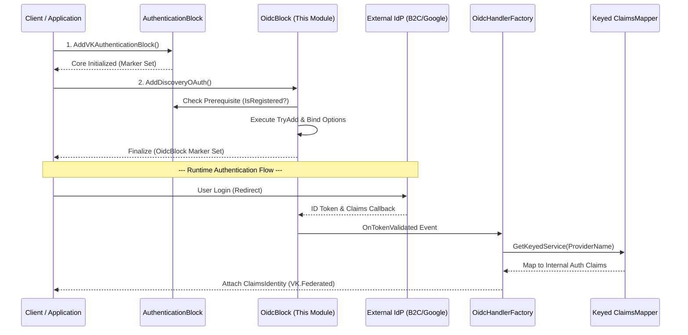

# 🛡️ VK.Blocks.Authentication.OpenIdConnect


## 📖 はじめに (Introduction)

**VK.Blocks.Authentication.OpenIdConnect** は、`VK.Blocks` アーキテクチャの中核となる認証基盤 (`VK.Blocks.Authentication`) を拡張し、OpenID Connect (OIDC) プロトコルを用いたフェデレーション認証（シングルサインオン等）をシームレスに統合するためのインフラストラクチャ拡張モジュールです。

当モジュールは、ただの OIDC ラッパーではなく、**Fail-Fast バリデーション**、**冪等なトランザクション登録 (Idempotent Registration / Service Marker)**、および **OpenTelemetry 分散トレーシング** といったエンタープライズグレードの非機能要件を内包しています。

---

## 🏗️ アーキテクチャ (Architecture)

本モジュールは **Core モジュールへの依存を一切持たせず (Dependency Inversion)**、独立した Vertical Slice として構築されています。拡張モジュール独自のマーカー (`OidcBlock`) を用いて、堅牢なDI登録サイクルの整合性を保ちます。

### 認証フローとコンポーネント相互作用



### 設計原則 (Design Principles)

1. **Transactional Registration (トランザクション登録)**: `Check-Self -> Check-Prerequisite -> Actual Registration -> Mark-Self` の４ステップにより、DIコンテナの汚染を防ぎ、絶対的な冪等性を保証。
2. **Strategy Pattern via Keyed DI**: プロバイダー固有のクレームマッピング（Azure B2C、Googleなど）を、.NET の `Keyed Services` を活用して動的に解決。
3. **High-Performance Diagnostics**: 文字列補間を排除した `[LoggerMessage]` による構造化ロギングと、`ActivitySource` によるトレーシングの標準化。

---

## ✨ 主な機能 (Key Features)

*   **🔒 標準 OIDC 統合**: Authorization Code Flow を標準対応し、必要に応じて `ResponseType` (Hybrid/Implicit Flow 等) のカスタマイズが可能。
*   **🛠 Fail-Fast オプション検証**: 起動時に `ValidateOnStart()` を用いて重要設定（Authority, ClientId 等）の欠落を即座に検知。
*   **🔌 Keyed Claims Mapper**: 外部 IdP の独自クレームを、システム内部の標準クレームに変換する拡張ポイント (`IOAuthClaimsMapper`)。
*   **⚡ 高性能ロギング & テレメトリ**: 
    *   ソースジェネレーターによるアロケーションフリーな `[LoggerMessage]` 実装。
    *   OpenTelemetry (`System.Diagnostics.Metrics`) 準拠の `OidcDiagnostics`。Histogram (`vk.auth.oidc.duration`) を用いたフェデレーション処理の遅延監視を標準搭載。
*   **🛡 堅牢なバックチャネル**: OAuth Discovery を行う内部 HTTP クライアントに独自名 (`OidcBackchannelName`) を付与し、呼び出し側での Polly 再試行ポリシー適用を可能に。

---

## 💻 採用技術 (Tech Stack)

*   **Framework**: `.NET 10`
*   **Authentication**: `Microsoft.AspNetCore.Authentication.OpenIdConnect`
*   **DI/IoC**: `Microsoft.Extensions.DependencyInjection` (Keyed Services 対応)
*   **Diagnostics**: `System.Diagnostics.DiagnosticSource`, OpenTelemetry API
*   **Code Generation**: C# 12+ Source Generators (`[LoggerMessage]`)

---

## 🚀 開始方法 (Getting Started)

### 1. DIコンテナへの登録

必ずコアブロック (`AuthenticationBlock`) を登録した **後** に登録してください。

```csharp
// 1. 基盤となる認証ブロックの登録
builder.Services.AddVKAuthenticationBlock(builder.Configuration);

// 2. OIDC 拡張ブロックの登録（依存チェックとappsettings内の全有効プロバイダーの動的登録が自動実行されます）
builder.Services.AddDiscoveryOAuth(builder.Configuration);
```

### 2. AppSettings の設定構成

`appsettings.json` にて、必要な OpenID Connect オプションを構成します。`Enabled` フラグにより、機能全体のオン/オフを制御可能です。

```json
{
  "Authentication": {
    "Enabled": true,
    "DefaultScheme": "Bearer",
    "OAuth": {
      "Enabled": true,
      "Providers": {
        "AzureB2C": {
          "Enabled": true,
          "SchemeName": "AzureB2C",
          "Authority": "https://tenant.b2clogin.com/tenant.onmicrosoft.com/B2C_1_POLICY/v2.0/",
          "ClientId": "your-client-id",
          "ClientSecret": "your-client-secret",
          "CallbackPath": "/signin-oidc-b2c",
          "ResponseType": "code",
          "Scopes": ["openid", "profile", "offline_access"]
        }
      }
    }
  }
}
```

---

## 🔭 今後の展望と拡張ロードマップ (Evolutionary Roadmap)

現在のアーキテクチャは基礎的な堅牢性を完全に備えていますが、SaaS や大規模エンタープライズへの適用に向け、以下の高度な拡張機能（Advanced Hooks）を計画しています。

1. **🌍 マルチテナント OIDC ランタイム構成 (Multi-Tenancy)**:
   > 起動時の静的な `IConfiguration` 構成から脱却し、`IConfigureNamedOptions<OpenIdConnectOptions>` を用いて **テナントごとに動的な OIDC 証明書とエンドポイント** を注入する機構のサポート。
2. **🔌 イベント インターセプター (Advanced Event Hooks)**:
   > `OidcHandlerFactory` 内のパイプラインに `IOidcEventInterceptor` を導入。IDトークン検証後の「外部ブラックリストチェック」や「JITプロビジョニング（ユーザーの自動作成）」を、ファクトリのフックとして独立登録可能にする。
3. **🔄 エンドポイント・メタデータのレジリエンス強化**:
   > 提供元 (`.well-known/openid-configuration`) の一時的なネットワーク障害に備え、HTTP Backchannel に対する高度なキャッシュ機構と Circuit Breaker を標準内包する。
4. **🔑 Token Exchange / Refresh フローのネイティブ対応**:
   > アクセストークンの取得およびリフレッシュトークン管理をアプリケーション側に委ねるだけでなく、バックエンド API 連携時のための Token Exchange 機構を本モジュール内で標準実装する。
