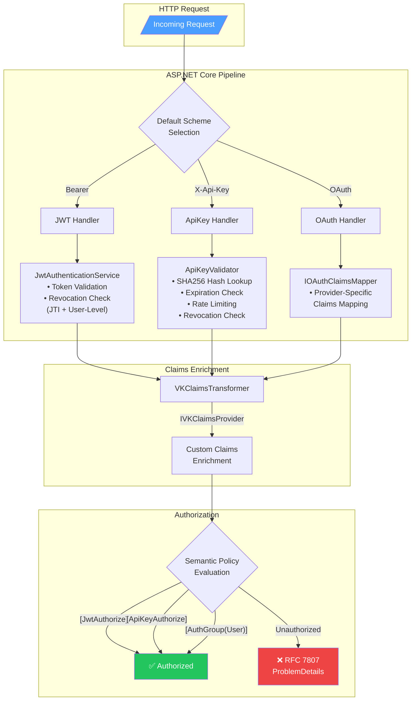

# VK.Blocks.Authentication

[](https://dotnet.microsoft.com/)
[](https://opensource.org/licenses/MIT)
[](#)

## はじめに

`VK.Blocks.Authentication` は、ASP.NET Core アプリケーション向けに設計された**構成駆動型 (Configuration-Driven) のマルチ戦略認証基盤**です。

JWT (自己発行 / OIDC)、API Key、OAuth の 3 つの認証戦略を `appsettings.json` の設定のみで切り替え可能にし、開発者がセキュリティの実装詳細ではなく**ビジネスロジックに集中できる**環境を提供します。

### 設計思想

- **Zero-Dependency InMemory Default**: 開発・テスト環境ではインフラ依存なしで即座に動作
- **Production-Ready Extensibility**: Redis / Azure Cache 等への差し替えは DI 登録のみで完了
- **Fail-Fast Validation**: 不正な設定は起動時に即座に検出し、ランタイムエラーを未然に防止
- **Self-Adaptive Resource Management**: InMemory プロバイダーの自動クリーンアップと、外部ストア切替時の自動スキップ

---

## アーキテクチャ

### 適用パターン

| カテゴリ                   | パターン                                                                            |
| -------------------------- | ----------------------------------------------------------------------------------- |
| **Design Principles**      | Separation of Concerns, Dependency Inversion, Fail-Fast                             |
| **Design Patterns**        | Strategy, Factory Method, Template Method, Builder (Fluent API)                     |
| **Architectural Patterns** | Vertical Slice (Feature-Driven), Options Pattern, Background Service                |
| **Enterprise Patterns**    | Result Pattern, Claims Transformation Pipeline, Token Revocation (JTI + User-Level) |
| **Cross-Cutting**          | Source Generated Logging, OpenTelemetry Instrumentation, RFC 7807 Error Responses   |

### 認証フロー概要



### モジュール構成

```
Authentication/
├── Abstractions/             # 共有ドメインモデル (AuthenticatedUser, ExternalIdentity, VKClaimTypes)
├── Common/                   # 横断的関心事 (Constants, AuthGroups, InMemoryCleanup, ResponseHelper)
│   └── Extensions/           # ClaimsPrincipal 拡張メソッド
├── DependencyInjection/      # Fluent Builder API, Options, Validators
├── Diagnostics/              # OpenTelemetry ActivitySource / Meter / Constants
└── Features/                 # Vertical Slice 機能群
    ├── ApiKeys/              # API Key 認証 (Validator, Store, RateLimiter, Revocation)
    ├── Jwt/                  # JWT 認証 (Symmetric / OIDC Discovery)
    │   └── RefreshTokens/    # リフレッシュトークン (Rotation Validation, Revocation)
    ├── OAuth/                # OAuth Claims Mapping (Provider-Agnostic)
    │   └── Mappers/          # プロバイダー固有マッパー (GitHub, etc.)
    └── SemanticAttributes/   # 型安全な認証属性 ([JwtAuthorize], [ApiKeyAuthorize], [AuthGroup])
```

---

## 主な機能

### 🔑 JWT 認証

- **デュアルモード対応**: 対称鍵 (Symmetric) と OIDC Discovery の両方を構成で切り替え可能
- **トークン失効管理**: JTI 単位 + ユーザー単位の二段階失効チェック
- **リフレッシュトークンローテーション**: Family ID ベースのリプレイ攻撃検出
- **カスタムイベントパイプライン**: `JwtEventsFactory` による失効検証・期限切れヘッダー付与の自動化

### 🗝️ API Key 認証

- **SHA256 ハッシュ検証**: `stackalloc` ベースの高パフォーマンスハッシュ生成（GC プレッシャー最小化）
- **スライディングウィンドウ型レート制限**: `ConcurrentDictionary` + `ConcurrentQueue` による O(1) 判定
- **多段階バリデーション**: 失効 → 有効期限 → 有効化状態 → レート制限の順序で短絡評価
- **Last-Used-At トラッキング**: Fire-and-Forget パターンによる非同期利用記録

### 🌐 OAuth クレームマッピング

- **Source Generator 駆動の自動登録**: `[OAuthProvider]` 属性によるリフレクション不使用のマッパー登録
- **Template Method パターン**: `OAuthClaimsMapperBase` を継承することで、プロバイダー固有のマッピングを最小限のコードで実装
- **Keyed Service 統合**: .NET 10 の Keyed DI を活用したプロバイダー別マッパー解決

### 🛡️ セマンティック認証属性

マジックストリングを排除し、型安全な認証指定を実現：

```csharp
[JwtAuthorize]           // JWT 認証のみ許可
[ApiKeyAuthorize]        // API Key 認証のみ許可
[AuthGroup(AuthGroups.User)]     // JWT + OAuth を許可 (人間ユーザー)
[AuthGroup(AuthGroups.Service)]  // API Key + JWT を許可 (M2M 通信)
[AuthGroup(AuthGroups.Internal)] // API Key のみ許可 (内部管理)
```

### 📡 可観測性 (Observability)

- **分散トレース**: `ActivitySource` ベースの JWT 検証・API Key 検証・Claims 変換トレーシング
- **メトリクス**: 認証試行数、レート制限違反数、失効ヒット数、リプレイ攻撃検出数、Claims 変換回数・所要時間
- **RFC 7807 エラーレスポンス**: `TraceId` 付き構造化エラーによる運用時のインシデント調査効率化
- **Source Generated Logging**: `[LoggerMessage]` によるゼロアロケーションログ生成

### ♻️ Self-Adaptive InMemory Cleanup

- `IInMemoryCacheCleanup` インターフェースによる統一的なクリーンアップ契約
- `ReferenceEquals` ベースのアクティブプロバイダー検出 — Redis 等に切替時にクリーンアップを自動スキップ
- プロバイダー 0 件時のバックグラウンドサービス即座終了によるリソース効率化

---

## 採用技術

| 技術                                              | 用途                                                                  |
| ------------------------------------------------- | --------------------------------------------------------------------- |
| **.NET 10 / C# 13**                               | ランタイム基盤、Primary Constructor、`sealed record`                  |
| **ASP.NET Core Authentication**                   | 認証ミドルウェア、スキーム管理                                        |
| **Microsoft.AspNetCore.Authentication.JwtBearer** | JWT Bearer トークン検証                                               |
| **System.TimeProvider**                           | テスト容易性のための時刻抽象化                                        |
| **OpenTelemetry**                                 | 分散トレース (`ActivitySource`) + メトリクス (`Meter`)                |
| **Source Generator**                              | `[LoggerMessage]` SG, `[VKBlockDiagnostics]` SG, `[OAuthProvider]` SG |
| **ConcurrentDictionary / ConcurrentQueue**        | スレッドセーフ InMemory ストア                                        |
| **IOptions / IOptionsMonitor**                    | 構成管理 + ホットリロード                                             |
| **VK.Blocks.Core**                                | Result Pattern, DI Builder, Block Options                             |

---

## 開始方法

### 1. パッケージ参照

```xml
<ProjectReference Include="..\Authentication\VK.Blocks.Authentication.csproj" />
```

### 2. 構成 (appsettings.json)

```json
{
    "Authentication": {
        "Enabled": true,
        "DefaultScheme": "Bearer",
        "InMemoryCleanupIntervalMinutes": 10,
        "Jwt": {
            "Enabled": true,
            "AuthMode": "Symmetric",
            "SecretKey": "your-256-bit-secret-key-here...",
            "Issuer": "VK.Blocks",
            "Audience": "VK.API",
            "SchemeName": "Bearer"
        },
        "ApiKey": {
            "Enabled": true,
            "HeaderName": "X-Api-Key",
            "MinLength": 32,
            "EnableRateLimiting": true,
            "RateLimitPerMinute": 60,
            "RateLimitWindowSeconds": 60
        },
        "OAuth": {
            "Enabled": true,
            "Providers": {
                "GitHub": {
                    "Enabled": true,
                    "Authority": "https://github.com",
                    "ClientId": "your-client-id",
                    "ClientSecret": "your-client-secret",
                    "CallbackPath": "/signin-github",
                    "GetClaimsFromUserInfoEndpoint": true,
                    "Scopes": ["user:email"]
                }
            }
        }
    }
}
```

### 3. DI 登録

```csharp
builder.Services
    .AddVKAuthenticationBlock(builder.Configuration)
    .AddClaimsProvider<MyCustomClaimsProvider>()          // カスタム Claims エンリッチメント
    .AddApiKeyRevocationProvider<RedisRevocationProvider>() // Redis ベース失効管理
    .AddOAuthMapper<GoogleClaimsMapper>("Google");         // 追加プロバイダーマッパー
```

---

## 今後の展望

| 機能                             | 概要                                                  |
| -------------------------------- | ----------------------------------------------------- |
| **Dynamic Session Revocation**   | 全デバイスログアウト / セッション単位のリモート無効化 |
| **Scoped API Keys**              | リソース単位のアクセス制御 (PoLP)                     |
| **Multi-Tenant Auth Isolation**  | テナントごとの OIDC プロバイダー動的切り替え          |
| **Identity Enrichment Pipeline** | Redis キャッシュ連携による RBAC ロール自動取得        |
| **Security Observability**       | 異常検知アラート / RFC 5424 準拠セキュリティログ      |

---

## ライセンス

MIT License — 詳細は [LICENSE](../../../LICENSE) を参照してください。
