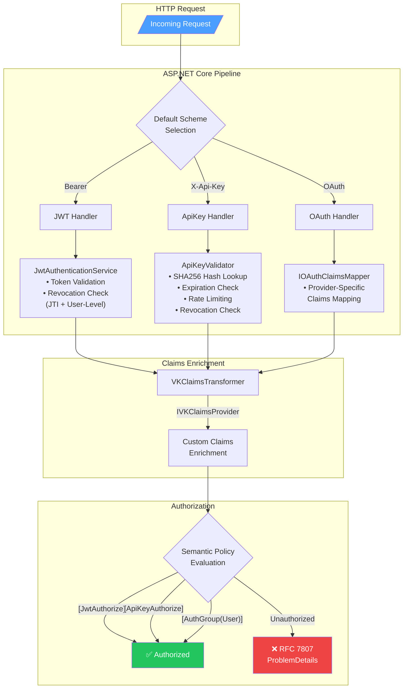

# VK.Blocks.Authentication

[](https://dotnet.microsoft.com/)
[](https://opensource.org/licenses/MIT)
[](#)

## はじめに

`VK.Blocks.Authentication` は、ASP.NET Core アプリケーション向けに設計された**構成駆動型 (Configuration-Driven) のマルチ戦略認証基盤**です。

JWT (自己発行 / OIDC)、API Key、OAuth の 3 つの認証戦略を `appsettings.json` の設定のみで切り替え可能にし、開発者がセキュリティの実装詳細ではなく**ビジネスロジックに集中できる**環境を提供します。

### 設計思想

- **Zero-Dependency InMemory Default**: 開発・テスト環境ではインフラ依存なしで即座に動作
- **Production-Ready Extensibility**: Redis / Azure Cache 等への差し替えは DI 登録のみで完了
- **Fail-Fast Validation**: 有効化された機能の設定不備を起動時に即座に検出し、ランタイムエラーを防止
- **Self-Adaptive Resource Management**: InMemory プロバイダーの自動クリーンアップと、外部ストア切替時の自動スキップ

---

## 🧩 拡張モジュール: Authentication.OpenIdConnect

外部 Identity Provider (IdP) と連携する場合は、コアライブラリを軽量に保つため、専用の拡張モジュールを使用します。

### 利用シーン

- **Azure AD B2C** / **Auth0** / **Google** などの外部認証基盤を利用する場合。
- OAuth2 / OpenID Connect プロトコルによる認証が必要な場合。
- 外部から提供される Claim を `VKClaimsTransformer` を通じて正規化したい場合。

### 特徴

- **Zero Dependency Core**: コアライブラリ `Authentication` は、ASP.NET Core の OpenIdConnect ライブラリに依存しません。必要なプロジェクトのみがこの拡張を導入します。
- **Multi-Provider Support**: 設定ファイル（`appsettings.json`）の定義に基づき、複数の OIDC プロバイダーを動的に登録可能です。
- **Claim Mapping**: 外部 IdP 固有の Claim 名を、システム内部で共通のセマンティクス（Role, TenantId, UserId 等）に自動マッピングします。
- **Resilience-Ready Backchannel**: OIDC 通信用の HttpClient 名 (`OidcBackchannelName`) を公開しており、アプリケーション層で任意の例外リトライやサーキットブレーカー（Polly 等）を自由に構成可能です。

### 導入例

```csharp
builder.Services.AddVKAuthenticationBlock(builder.Configuration)
    .AddDiscoveryOAuth(builder.Configuration); // 構成駆動で OIDC プロバイダーを自動検証・登録
```

詳細は [/src/BuildingBlocks/Authentication.OpenIdConnect/README.md](/src/BuildingBlocks/Authentication.OpenIdConnect/README.md) を参照してください。

---

## 🤝 Contributing

## アーキテクチャ

### 適用パターン

| カテゴリ                   | パターン                                                                            |
| -------------------------- | ----------------------------------------------------------------------------------- |
| **Design Principles**      | Separation of Concerns, Dependency Inversion, Fail-Fast                             |
| **Design Patterns**        | Strategy, Factory Method, Template Method, Builder (Fluent API)                     |
| **Architectural Patterns** | Vertical Slice (Feature-Driven), Options Pattern, Background Service                |
| **Enterprise Patterns**    | Result Pattern, Claims Transformation Pipeline, Token Revocation (JTI + User-Level) |
| **Cross-Cutting**          | Source Generated Logging, OpenTelemetry Instrumentation, RFC 7807 Error Responses   |

### 認証フロー概要



### モジュール構成

```
Authentication/
├── Abstractions/             # 共有ドメインモデル (AuthenticatedUser, ExternalIdentity, VKClaimTypes)
├── Common/                   # 横断的関心事 (Constants, AuthGroups, InMemoryCleanup, ResponseHelper)
│   └── Extensions/           # ClaimsPrincipal 拡張メソッド
├── DependencyInjection/      # Module-level DI 登録 (AuthenticationBlock, Options)
├── Diagnostics/              # OpenTelemetry ActivitySource / Meter / Constants
└── Features/                 # Vertical Slice 機能群
    ├── ApiKeys/              # API Key 認証 (Metadata, Internal, Persistence, DI)
    ├── Jwt/                  # JWT 認証 (Metadata, Internal, Persistence, DI)
    ├── OAuth/                # OAuth クレームマッピング (Metadata, Internal, Mappers, DI)
    └── SemanticAttributes/   # 型安全なメタデータ属性 (Metadata)
```

---

## 主な機能

### 🔑 JWT 認証

- **デュアルモード対応**: 対称鍵 (Symmetric) と OIDC Discovery の両方を構成で切り替え可能
- **トークン失効管理**: JTI 単位 + ユーザー単位の二段階失効チェック
- **リフレッシュトークンローテーション**: Family ID ベースのリプレイ攻撃検出
- **カスタムイベントパイプライン**: `JwtEventsFactory` による失効検証・期限切れヘッダー付与の自動化

### 🗝️ API Key 認証

- **SHA256 ハッシュ検証**: `stackalloc` ベースの高パフォーマンスハッシュ生成（GC プレッシャー最小化）
- **スライディングウィンドウ型レート制限**: `ConcurrentDictionary` + `ConcurrentQueue` による O(1) 判定
- **多段階バリデーション**: 失効 → 有効期限 → 有効化状態 → レート制限の順序で短絡評価
- **Last-Used-At トラッキング**: Fire-and-Forget パターンによる非同期利用記録

### 🌐 OAuth クレームマッピング

- **Source Generator 駆動の自動登録**: `[OAuthProvider]` 属性によるリフレクション不使用のマッパー登録
- **個別認可ポリシーの自動生成**: 各プロバイダーに対し、`VK.Group.{ProviderName}` (例: `VK.Group.GitHub`) という名称の認可ポリシーが自動登録されます。
- **コンパイル時ディスカバリ**: `OAuthProviderMetadata` を利用した動的なポリシー構成 (`IConfigureOptions<AuthorizationOptions>`) により、DI 登録ロジックの肥大化を防止
- **Template Method パターン**: `OAuthClaimsMapperBase` を継承することで、プロバイダー固有のマッピングを最小限のコードで実装
- **Keyed Service 統合**: .NET 10 の Keyed DI を活用したプロバイダー別マッパー解決

### 🛡️ セマンティック認証属性

マジックストリングを排除し、型安全な認証指定を実現：

```csharp
[JwtAuthorize]           // JWT 認証のみ許可
[ApiKeyAuthorize]        // API Key 認証のみ許可
[AuthGroup(AuthGroups.User)]     // JWT + OAuth を許可 (人間ユーザー)
[AuthGroup(AuthGroups.Service)]  // API Key + JWT を許可 (M2M 通信)
[AuthGroup(AuthGroups.Internal)] // API Key のみ許可 (内部管理)
[Authorize(Policy = "VK.Group.GitHub")] // 特定のプロバイダー（GitHub等）による認証のみ許可
```

### 📡 可観測性 (Observability)

- **分散トレース**: `ActivitySource` ベースの JWT 検証・API Key 検証・Claims 変換トレーシング
- **メトリクス**: 認証試行数、レート制限違反数、失効ヒット数、リプレイ攻撃検出数、Claims 変換回数・所要時間
- **OIDC 遅延監視**: Histogram (`vk.auth.oidc.duration`) による外部 IdP フェデレーション処理の所要時間計測（TenantId タグ対応によりマルチテナント監視に最適化）
- **RFC 7807 エラーレスポンス**: `TraceId` 付き構造化エラーによる運用時のインシデント調査効率化
- **Source Generated Logging**: `[LoggerMessage]` によるゼロアロケーションログ生成

### 🛡️ カスタムクレーム拡張 (Custom Claims Enrichment)

`VK.Blocks.Authentication` は、認証成功後に独自のビジネスロジック（DBからの追加属性取得など）を実行し、`ClaimsPrincipal` を動的に拡張するパイプラインを提供します。

#### 1. IVKClaimsProvider の実装
`GetUserClaimsAsync` を実装し、追加したいクレームを返します。このクラスは Scoped サービスとして解決されるため、データベース (`DbContext`) 等に安全にアクセスできます。

```csharp
public sealed class MyDatabaseClaimsProvider(IMyRepository repository) : IVKClaimsProvider
{
    public async ValueTask<IEnumerable<Claim>> GetUserClaimsAsync(string userId, CancellationToken ct = default)
    {
        var user = await repository.GetByIdAsync(userId, ct);
        return [new Claim("organization_id", user.OrgId)];
    }
}
```

#### 2. プロバイダーの登録
`AddVKAuthenticationBlock` の後に、`TryAddClaimsProvider` を使って登録します。

```csharp
builder.Services.AddVKAuthenticationBlock(builder.Configuration)
    .TryAddClaimsProvider<MyDatabaseClaimsProvider>();
```

> [!TIP]
> **なぜ IClaimsTransformation を直接実装しないのか？**
> ASP.NET Core 標準の `IClaimsTransformation` はリクエスト中に何度も呼ばれる可能性があり、DBアクセスを含む重い処理を記述するには不向きです。VK.Blocks では `VKClaimsTransformer` が内部で一度だけ実行されるように管理し、複数の Provider を連鎖 (Pipeline) させることで、安全かつクリーンな拡張を実現しています。

### ♻️ Self-Adaptive InMemory Cleanup

- `IInMemoryCacheCleanup` インターフェースによる統一的なクリーンアップ契約
- `ReferenceEquals` ベースのアクティブプロバイダー検出 — Redis 等に切替時にクリーンアップを自動スキップ
- プロバイダー 0 件時のバックグラウンドサービス即座終了によるリソース効率化

### ⚙️ Source Generator 連携 (`OAuthProviderMapperGenerator`)

本モジュールは `VK.Blocks.Generators` の **`OAuthProviderMapperGenerator`** と連携し、以下のコードをコンパイル時に自動生成します：

- **Keyed DI 自動登録**: `[OAuthProvider("GitHub")]` 属性が付与されたすべての `IOAuthClaimsMapper` 実装を検出し、`AddKeyedScoped` による DI 登録コードを生成（リフレクション不使用）
- **重複検出**: 同一プロバイダー名に対して複数のマッパーが検出された場合、`VK0001` コンパイラ警告を発行
- **プロバイダーメタデータ生成**: `VKOAuthGeneratedMetadata.AllProviders` として、登録済みプロバイダー名のコンパイル時リストを生成。`IConfigureOptions<AuthorizationOptions>` による動的ポリシー構成はこのメタデータを消費

> [!NOTE]
> このジェネレーターはアセンブリ名ベースでスコープが制限されており、`VK.Blocks.Authentication` プロジェクトでは `VKOAuth` プレフィックス、`VK.Blocks.Authentication.OpenIdConnect` プロジェクトでは `VKOidc` プレフィックスで生成されます。両プロジェクト間でのマッパー衝突は発生しません。

#### 💡 実装例 (OAuth Mapper)

```csharp
// 1. マッパーの実装に属性を付与するだけ
[OAuthProvider("GitHub")]
internal sealed class GitHubClaimsMapper : OAuthClaimsMapperBase
{
    protected override Result<IEnumerable<Claim>> MapClaims(ExternalIdentity identity)
    {
        // GitHub 固有のクレーム正規化ロジックを実装
        return Result.Success(identity.Claims);
    }
}

// 2. コンパイル時に以下の DI 登録コードが自動生成されます
// services.AddKeyedScoped<IOAuthClaimsMapper, "GitHub", typeof(GitHubClaimsMapper)>();
```

---

## 採用技術

| 技術                                              | 用途                                                                  |
| ------------------------------------------------- | --------------------------------------------------------------------- |
| **.NET 10 / C# 13**                               | ランタイム基盤、Primary Constructor、`sealed record`                  |
| **ASP.NET Core Authentication**                   | 認証ミドルウェア、スキーム管理                                        |
| **Microsoft.AspNetCore.Authentication.JwtBearer** | JWT Bearer トークン検証                                               |
| **System.TimeProvider**                           | テスト容易性のための時刻抽象化                                        |
| **OpenTelemetry**                                 | 分散トレース (`ActivitySource`) + メトリクス (`Meter`)                |
| **Source Generator**                              | `[LoggerMessage]` SG, `[VKBlockDiagnostics]` SG, `[OAuthProvider]` SG |
| **ConcurrentDictionary / ConcurrentQueue**        | スレッドセーフ InMemory ストア                                        |
| **IOptions / IOptionsMonitor**                    | 構成管理 + ホットリロード                                             |
| **VK.Blocks.Core**                                | Result Pattern, DI Builder, Block Options                             |

---

### 1. パッケージ参照

```xml
<ProjectReference Include="..\Authentication\VK.Blocks.Authentication.csproj" />
```

> [!IMPORTANT]
> **明示的オプトイン (Explicit Opt-in) モデル**
>
> `VK.Blocks.Authentication` は、安全性の観点から**すべての機能がデフォルトで無効化 (Enabled: false)** されています。
>
> - ルートの `Authentication:Enabled` スイッチを含め、JWT や API Key などのすべての認証戦略はデフォルトで有効になりません。
> - 利用したい機能およびルートブロックについて、`appsettings.json` で明示的に `"Enabled": true` を設定する必要があります。
> - 有効化（Enabled: true）した際、必須設定（Issuer や SecretKey 等）が不足している場合は、**Fail-Fast 原則に基づきアプリケーションは起動時に停止（Crash）**します。

### 2. 構成 (appsettings.json)

```json
{
    "VKBlocks": {
        "Authentication": {
            "Enabled": true,
            "DefaultScheme": "Bearer",
            "InMemoryCleanupIntervalMinutes": 10,
            "Jwt": {
                "Enabled": true,
                "AuthMode": "Symmetric",
                "SecretKey": "your-256-bit-secret-key-here...",
                "Issuer": "VK.Blocks",
                "Audience": "VK.API",
                "SchemeName": "Bearer"
            },
            "ApiKey": {
                "Enabled": true,
                "HeaderName": "X-Api-Key",
                "MinLength": 32,
                "EnableRateLimiting": true,
                "RateLimitPerMinute": 60,
                "RateLimitWindowSeconds": 60
            },
            "OAuth": {
                "Enabled": true,
                "Providers": {
                    "GitHub": {
                        "Enabled": true,
                        "Authority": "https://github.com",
                        "ClientId": "your-client-id",
                        "ClientSecret": "your-client-secret",
                        "CallbackPath": "/signin-github",
                        "ResponseType": "code",
                        "GetClaimsFromUserInfoEndpoint": true,
                        "Scopes": ["user:email"]
                    }
                }
            }
        }
    }
}
```

> [!TIP]
> **Microsoft Identity Platforms (B2C / CIAM) 利用時の注意点**
>
> - **Azure AD B2C**: `Authority` には必ず `p=B2C_1_xxx` (User Flow) を含むか、上記のように V2.0 エンドポイントを正しく構成してください。
> - **Claim Mapping**: マイクロソフト固有の `oid` や `tfp` といった Claim は、このモジュールの `[OAuthProvider]` スキーム（`AzureB2COidcClaimsMapper`等）によって自動的に共通セマンティクスへ変換介入されます。

### 3. DI 登録

```csharp
builder.Services
    .AddVKAuthenticationBlock(builder.Configuration)
    // .AddDiscoveryOAuth(builder.Configuration)             // ※ OIDC拡張パッケージ導入時のみ利用可能
    .TryAddClaimsProvider<MyCustomClaimsProvider>()       // カスタム Claims エンリッチメント
    .WithApiKeyRevocationProvider<RedisRevocationProvider>() // Redis ベース失効管理
    .TryAddOAuthMapper<GoogleClaimsMapper>("Google");      // (任意) 特定のプロバイダーに対するマッパーの手動上書き・追加
```

> [!NOTE]
> `AddDiscoveryOAuth` を利用するには、別パッケージの `VK.Blocks.Authentication.OpenIdConnect` を参照し、名前空間 `VK.Blocks.Authentication.OpenIdConnect.DependencyInjection` をインポートする必要があります。

---

## 🛠️ 技術的詳細: バリデータ登録

本ライブラリは `TryAddEnumerable` パターンを用いた、安全で拡張可能なオプション検証を提供しています。

### カスタムバリデータの追加

`AddVKBlockOptions` を呼び出した後、さらに独自の `IValidateOptions<T>` を追加する場合は、必ず **`TryAddEnumerableSingleton`**（または `TryAddEnumerable`）を使用してください。

```csharp
// ❌ 悪い例: 定義済みのバリデータがスキップされてしまいます
services.TryAddSingleton<IValidateOptions<MyOptions>, MyValidator>();

// ✅ 良い例: 安全に複数のバリデータを併存させることができます
services.TryAddEnumerableSingleton<IValidateOptions<MyOptions>, MyValidator>();
```

**理由:** `AddVKBlockOptions` 内部で `DataAnnotations` 等の標準バリデータが既に登録されているため、単純な `TryAdd` では後続のバリデータが「登録済み」とみなされてスキップされてしまうためです。

---

## 🔭 今後の展望

| 機能                             | 概要                                                  |
| -------------------------------- | ----------------------------------------------------- |
| **Auth Scheme Hot-Reload**       | IOptionsMonitor による認証スキーム (JWT/API Key 等) のリアルタイム構成更新 |
| **Dynamic Session Revocation**   | 全デバイスログアウト / セッション単位のリモート無効化 |
| **Scoped API Keys**              | リソース単位のアクセス制御 (PoLP)                     |
| **Multi-Tenant Auth Isolation**  | テナントごとの OIDC プロバイダー動的切り替え          |
| **Identity Enrichment Pipeline** | Redis キャッシュ連携による RBAC ロール自動取得        |
| **Security Observability**       | 異常検知アラート / RFC 5424 準拠セキュリティログ      |

---

## ライセンス

MIT License — 詳細は [LICENSE](/LICENSE) を参照してください。
