# VK.Blocks.Authorization


---

## はじめに

**VK.Blocks.Authorization** は、ASP.NET Core の `IAuthorizationHandler` パイプラインを拡張し、エンタープライズ環境で求められる多次元認可ロジックを **Vertical Slice Architecture** で実装した BuildingBlock モジュールです。

ロール・パーミッション・テナント分離・勤務時間帯制限・内部ネットワーク制御・動的ポリシーなど、ビジネスで頻出する認可パターンを **宣言的属性 (Attribute-Driven)** と **Result 型パターン** で統一的に提供します。すべてのハンドラーは `IAuthorizationRequirementData` を活用し、文字列ベースのポリシー解析を完全に排除しています。

---

## アーキテクチャ

### 設計原則・パターン

| カテゴリ | 採用パターン |
|---|---|
| **Design Principles** | Separation of Concerns, Interface Segregation (ISP), Open/Closed (OCP), Dependency Inversion (DIP), **Zero-Reflection** |
| **Architectural Style** | Vertical Slice Architecture (Feature-Driven), **BB.01-BB.05 Compliance** |
| **Architectural Pattern** | BuildingBlock Composition, Provider-Evaluator-Handler Pipeline, **Modular Registration** |
| **Design Patterns** | Strategy (Provider/Evaluator の差し替え), Template Method (AuthorizationHandler 基盤), Builder (Fluent DI Registration), **Marker Interface (IVKBlockMarker)** |
| **Enterprise Patterns** | Result Pattern (構造化エラー伝播), Options Validation (Fail-Fast), Source Generator (自動コード生成), **Immutable Options (init-only records)** |
| **Cross-Cutting** | SuperAdmin バイパス, Global Query Filter 連携, ConfigureAwait(false) 徹底 |

### 認可パイプライン全体像

```mermaid
flowchart TB
    subgraph Request["HTTP リクエスト"]
        A["Controller / Minimal API"]
    end

    subgraph Attributes["宣言的属性レイヤー"]
        B["AuthorizePermissionAttribute"]
        C["AuthorizeRolesAttribute"]
        D["DynamicAuthorizeAttribute"]
    end

    subgraph RequirementData["IAuthorizationRequirementData"]
        E["PermissionRequirement"]
        F["RoleRequirement"]
        G["DynamicRequirement"]
        H["MinimumRankRequirement"]
        I["WorkingHoursRequirement"]
        J["InternalNetworkRequirement"]
        K["SameTenantRequirement"]
        ENT["TenantFeatureRequirement"]
    end

    subgraph Handlers["AuthorizationHandler Pipeline"]
        L["PermissionHandler"]
        M["RoleHandler"]
        N["DynamicRequirementHandler"]
        O["MinimumRankAuthorizationHandler"]
        P["WorkingHoursAuthorizationHandler"]
        Q["InternalNetworkAuthorizationHandler"]
        R["TenantAuthorizationHandler"]
        RH["TenantFeatureAuthorizationHandler"]
    end

    subgraph Providers["Provider / Evaluator レイヤー"]
        S["IPermissionProvider"]
        T["IRoleProvider"]
        U["IVKDynamicPoliciesEvaluator"]
        V["IRankProvider"]
        W["IWorkingHoursProvider"]
        X["IIpAddressProvider"]
        Y["IUserTenantProvider"]
        TF["ITenantFeatureProvider"]
    end

    subgraph Infrastructure["横断的関心事"]
        Z["Result&lt;T&gt; パターン"]
        AA["AuthorizationDiagnostics"]
        AB["SuperAdmin バイパス"]
        AC["IVKBlockMarker (Metadata)"]
    end

    A --> B & C & D
    B --> E
    C --> F
    D --> G

    E --> L
    F --> M
    G --> N
    H --> O
    I --> P
    J --> Q
    K --> R
    ENT --> RH

    L --> S
    M --> T
    N --> U
    O --> V
    P --> W
    Q --> X
    R --> Y
    RH --> TF

    L & M & N & O & P & Q & R & RH --> Z & AA & AB & AC
```



### フォルダ構成

```
Authorization/
├── VKAuthorizationBlock.cs              # Public Marker ([VKBlockMarker] SG)
├── Common/                              # 共通型定義
│   ├── VKAuthorizationClaimTypes.cs     # クレーム型定数
│   ├── VKAuthorizationErrors.cs         # VKError 定数クラス (CS.01)
│   ├── VKAuthorizationHandlerInfo.cs    # ハンドラーメタデータ型
│   ├── VKAuthorizationPolicies.cs       # 名前付きポリシー定数
│   └── VKEndpointAuthorizationInfo.cs   # エンドポイント認可情報
├── Contracts/                           # 公開インターフェース
│   └── IVKAuthorizationRequirement.cs   # VKError 付き Requirement 契約
├── DependencyInjection/                 # DI 登録 (BB.03 準拠)
│   ├── IVKAuthorizationBuilder.cs       # Builder インターフェース
│   ├── VKAuthorizationBlockExtensions.cs # Public Wrapper (AddVKAuthorizationBlock)
│   ├── VKAuthorizationBuilderExtensions.cs # Fluent Builder 拡張メソッド
│   ├── VKAuthorizationExtensions.cs     # 横断ユーティリティ (SuperAdmin, RecordEvaluation, ApplyResult)
│   ├── VKAuthorizationOptions.cs        # Public Options (IVKBlockOptions)
│   └── Internal/
│       ├── AuthorizationBlockBuilder.cs       # Builder 実装 (sealed internal)
│       ├── AuthorizationBlockRegistration.cs  # 主登録ロジック (8-Step Sequence)
│       ├── AuthorizationOptionsValidator.cs   # オプション検証
│       └── AuthorizationPolicyProvider.cs     # Semantic Scheme ベースポリシー設定
├── Diagnostics/                         # OpenTelemetry メトリクス・トレース
│   ├── VKAuthorizationDiagnosticsConstants.cs # セマンティックトークン定数
│   └── Internal/
│       ├── AuthorizationDiagnostics.cs        # Counter/Histogram/Metadata ([VKBlockDiagnostics] SG)
│       └── AuthorizationMetadataProvider.cs   # IVKSecurityMetadataProvider 実装
├── Permissions/                         # パーミッション認可
│   ├── IVKPermissionEvaluator.cs        # Evaluator インターフェース
│   ├── IVKPermissionProvider.cs         # Provider インターフェース
│   ├── IVKPermissionStore.cs            # 永続化抽象
│   ├── VKAuthorizePermissionAttribute.cs # 宣言的属性 (SG 基底)
│   ├── VKPermission.cs / VKPermissionArgs.cs / VKPermissionOptions.cs
│   ├── VKPermissionRequirement.cs       # Requirement 定義
│   └── Internal/                        # 7-file Feature Slice
│       ├── PermissionsConstants.cs / PermissionsFeature.cs
│       ├── PermissionsRegistration.cs / PermissionsLog.cs
│       ├── PermissionHandler.cs / DefaultPermissionProvider.cs
│       ├── PermissionOptionsValidator.cs / PermissionStoreExtensions.cs
│       └── VKGeneratePermissionsAttribute.cs / VKGeneratePermissionHandlerAttribute.cs
├── Roles/                               # ロール認可
│   ├── IVKRoleEvaluator.cs / IVKRoleProvider.cs
│   ├── VKAuthorizeRolesAttribute.cs / VKRoleRequirement.cs
│   ├── VKRoleArgs.cs / VKRoleOptions.cs
│   └── Internal/ (RoleHandler, DefaultRoleProvider, RolesRegistration, ...)
├── TenantIsolation/                     # マルチテナント隔離
│   ├── IVKTenantEvaluator.cs / IVKUserTenantProvider.cs
│   ├── VKAuthorizeTenantIsolationAttribute.cs / VKTenantIsolationRequirement.cs
│   ├── VKTenantIsolationArgs.cs / VKTenantIsolationOptions.cs
│   └── Internal/ (TenantAuthorizationHandler, DefaultUserTenantProvider, ...)
├── Entitlements/                        # テナント機能認可
│   ├── VKRequireTenantFeatureAttribute.cs / VKTenantFeatureRequirement.cs
│   ├── VKEntitlementsOptions.cs
│   └── Internal/ (EntitlementsRegistration, ...)
├── DynamicPolicies/                     # 動的ポリシー (Attribute Evaluator)
│   ├── IVKDynamicPoliciesEvaluator.cs / IVKDynamicPoliciesProvider.cs
│   ├── VKDynamicAuthorizeAttribute.cs / VKAuthorizeDynamicPoliciesAttribute.cs
│   ├── VKDynamicRequirement.cs / VKDynamicPoliciesArgs.cs / VKDynamicPoliciesOptions.cs
│   └── Internal/ (DefaultDynamicPoliciesEvaluator, DynamicRequirementHandler, ...)
├── MinimumRank/                         # 職位ランク制限
│   ├── IVKMinimumRankEvaluator.cs / IVKRankProvider.cs
│   ├── VKAuthorizeMinimumRankAttribute.cs / VKMinimumRankRequirement.cs
│   ├── VKMinimumRankArgs.cs / VKMinimumRankOptions.cs / VKEmployeeRank.cs
│   └── Internal/ (MinimumRankAuthorizationHandler, DefaultRankProvider, ...)
├── WorkingHours/                        # 勤務時間制限
│   ├── IVKWorkingHoursEvaluator.cs / IVKWorkingHoursProvider.cs
│   ├── VKAuthorizeWorkingHoursAttribute.cs / VKWorkingHoursRequirement.cs
│   ├── VKWorkingHoursArgs.cs / VKWorkingHoursOptions.cs
│   └── Internal/ (WorkingHoursAuthorizationHandler, DefaultWorkingHoursProvider, ...)
└── InternalNetwork/                     # ネットワーク制御
    ├── IVKInternalNetworkEvaluator.cs / IVKIpAddressProvider.cs
    ├── VKAuthorizeInternalNetworkAttribute.cs / VKInternalNetworkRequirement.cs
    ├── VKInternalNetworkArgs.cs / VKInternalNetworkOptions.cs
    └── Internal/ (InternalNetworkAuthorizationHandler, DefaultIpAddressProvider, ...)
```

---

## 主な機能

### 🔐 パーミッション認可 (Permissions)

- **Attribute-Driven**: `[AuthorizePermission("finance.read")]` で宣言的にパーミッションを要求
- **評価モード**: `PermissionEvaluationMode.All` (AND) / `PermissionEvaluationMode.Any` (OR) を選択可能
- **複数 Provider 対応**: `IPermissionProvider` を複数登録し、OR ロジックで横断的に評価
- **永続化抽象**: `IPermissionStore` によるパーミッション永続化インターフェース

### 👥 ロールベースアクセス制御 (Roles)

- **Attribute-Driven**: `[AuthorizeRoles("Admin", "Manager")]` で複数ロールを指定
- **Provider パターン**: `IRoleProvider` による柔軟なロール解決
- **IRoleEvaluator**: プログラマティックなロール検証 API

### 🏢 マルチテナント分離 & テナント機能 (Tenant Isolation & Entitlements)

- **SameTenantRequirement**: テナント横断アクセスを防止
- **StrictTenantIsolation**: 厳密モードでは SuperAdmin もテナント分離を迂回不可
- **Entitlements (New)**: `[VKRequireTenantFeature("X")]` による、テナントの契約プランや有効化機能に基づく認可をサポート
- **IUserTenantProvider / ITenantFeatureProvider**: カスタムテナント/機能解決ロジックの差し替え対応

### 📊 職位ランク認可 (Minimum Rank)

- **Enum ベース比較**: `EmployeeRank` 等の enum 値による順序付き認可
- **数値/文字列パース**: 整数値または enum 名による柔軟なランク解決
- **IVKRankProvider**: 外部システムからのランク取得を抽象化

### ⏰ 勤務時間帯制限 (Working Hours)

- **時間帯ウィンドウ**: `TimeOnly` ベースの勤務時間制限
- **夜間シフト対応**: 日付をまたぐ overnight window をサポート
- **IVKWorkingHoursProvider**: ユーザー/部署単位の動的勤務時間を Provider で解決
- **TimeProvider 注入**: テスト容易性のための `TimeProvider` 差し替え

### 🌐 内部ネットワーク制御 (Internal Network)

- **CIDR ベース制御**: RFC 1918 プライベートレンジによるデフォルト制限
- **IPv4/IPv6 対応**: IPv4-mapped IPv6 の自動正規化
- **高性能実装**: `stackalloc` / `Span<T>` によるゼロアロケーション CIDR マッチング
- **IVKIpAddressProvider**: プロキシ環境でのリモート IP 解決をカスタマイズ可能

### 🔄 動的ポリシー評価 (Dynamic Policies)

- **`[DynamicAuthorize]` 属性**: 属性名・演算子・値による汎用的な動的認可
- **IAuthorizationRequirementData**: 文字列ベースのポリシーパーシングを完全排除
- **IVKDynamicPoliciesEvaluator**: 動的ロジックの差し替えが可能

### 🛡️ SuperAdmin バイパス

- 全ハンドラーに統一的な SuperAdmin バイパスロジックを実装
- `VKAuthorizationOptions.SuperAdminRole` で設定可能
- `StrictTenantIsolation` フラグでテナント分離のバイパス可否を制御

### 🛡️ 認可の指定方式 (Attribute-Driven vs Named Policy)
 
 本モジュールは、モダンな属性駆動（IAuthorizationRequirementData）と、従来の ASP.NET Core 名前付きポリシーの両方をサポートしています。
 
 | 方式 | 対象機能 | 指定例 | 特徴 |
 |---|---|---|---|
 | **属性駆動 (Attribute)** | Permissions, Roles, Dynamic, Entitlements | `[RequireFinanceRead]` | **推奨。** SGにより自動生成。ポリシー文字列を介さず型安全で高性能。 |
 | **名前付きポリシー (Policy)** | WorkingHours, InternalNetwork, MinimumRank | `[Authorize(Policy = "WorkingHoursOnly")]` | 共通の定型ルールを文字列で一括指定。`AddVKAuthorizationPolicies` で登録が必要。 |
 
 ---
 
 ### 📈 組み込みオブザーバビリティ

- **OpenTelemetry 準拠**: `ActivitySource` / `Meter` による分散トレーシングとメトリクス
- **Counter**: `authorization.decisions` — 認可判定回数 (Allowed/Denied)
- **Counter**: `authorization.failure.reasons` — エラーコード別の失敗回数
- **Histogram**: `authorization.evaluation.duration` — 評価処理時間 (ms)
- **Source Generator 連携**: `[VKBlockDiagnostics]` によるメトリクスインフラの自動生成

### ⚙️ Fluent DI 統合

```csharp
services.AddVKAuthorizationBlock(configuration)
    .AddPermissions(options => options with { Enabled = true }) // Use 'with' for immutable options (ADR-016)
    .AddRoles(options => options with { RoleClaimType = "custom_role" })
    .AddWorkingHours(options => options with { WorkStart = new(8, 0) })
    .AddEntitlements()
    .AddMinimumRank()
    .AddInternalNetwork()
    .AddTenantIsolation()
    .AddRoleProvider<CustomRoleProvider>();
 // カスタムプロバイダーの注入
```

### ⚙️ Source Generator 連携 (`VK.Blocks.Generators`)

本モジュールは `VK.Blocks.Generators` の以下6つのソースジェネレーターと連携し、ボイラープレートの排除とコンパイル時安全性を実現します：

| ジェネレーター | 生成内容 |
|---|---|
| **`PermissionsCatalogGenerator`** | `[GeneratePermissions]` / `[AuthorizePermission]` の定義・使用箇所を二重スキャンし、`PermissionsCatalog` 定数クラスと型安全な `[Require{Permission}]` 属性を生成。FNV-1a ハッシュによるメタデータ変更検知付き |
| **`PermissionHandlerGenerator`** | `[GeneratePermissionHandler]` 属性から Claims ベースまたは Database ベースの `IPermissionProvider` 実装を自動生成 |
| **`EnumPolicyGenerator`** | `[GeneratePolicy]` 属性付き `enum` から Requirement + Attribute + Handler の三点セットを生成。`Equals` / `GreaterThanOrEqual` / `In` 等の比較演算子をサポート |
| **`MinimumRankGenerator`** | `[GenerateRankAuthorize]` 属性付き `enum` から `[Require{Rank}Attribute]` を生成し、`MinimumRankRequirement` に接続 |
| **`AuthorizationHandlersGenerator`** | `IAuthorizationHandler` / `IPermissionEvaluator` 実装と上記生成ハンドラーを統合的にスキャンし、`TryAddEnumerable` による DI 一括登録コードを生成 |
| **`AuthorizationMetadataGenerator`** | コントローラー / アクションメソッドに付与された認可属性を横断的にスキャンし、エンドポイント別の認可トポロジーマップ (`AuthorizationMetadata.Endpoints`) をコンパイル時に生成。FNV-1a ハッシュによる構成変更検知に対応 |

> [!TIP]
> これらのジェネレーターにより、新しいパーミッションや認可ポリシーの追加は **属性を1つ付与するだけ** で完了します。DI 登録・ハンドラー・メタデータはすべてコンパイル時に自動生成されるため、**名前付きポリシーの事前登録 (`AddPolicy`) は一切不要** です。

#### 💡 実装例 (Source Generators の連携)

**1. パーミッションの定義とプロバイダーの自動生成**

```csharp
// [GeneratePermissions]: 型安全な属性 ([RequireFinanceManageInvoices]) とカタログ定数を生成
// [GeneratePermissionHandler]: DB ベースの IPermissionProvider を自動生成し DI に登録
[GeneratePermissions(Module = "Finance")]
[GeneratePermissionHandler(Source = PermissionSource.Database)]
public static class FinancePermissions
{
    [Display(Name = "請求書管理", Description = "全ての請求書を操作可能")]
    public const string ManageInvoices = "finance.invoices.manage";
}
```

**2. 階層や比較を伴う属性の自動生成**

```csharp
// [GenerateRankAuthorize]: ランク定義から [RequireEmployeeRank] 属性と検証ロジックを生成
[GenerateRankAuthorize]
public enum EmployeeRank { Junior = 1, Middle = 2, Senior = 3 }

// [GeneratePolicy]: Operatorに基づく比較属性 ([RequireSubscriptionLevel]) を生成
[GeneratePolicy(Operator = AuthorizationOperator.GreaterThanOrEqual)]
public enum SubscriptionLevel { Free, Pro, Enterprise }
```

**3. コントローラーでの使用 (宣言的認可)**

```csharp
// 自動生成された属性を組み合わせるだけで、強固で型安全な認可が完了
[RequireFinanceManageInvoices]
[RequireEmployeeRank(EmployeeRank.Middle)]
[RequireSubscriptionLevel(SubscriptionLevel.Pro)]
public IActionResult ProcessHighValueInvoice() => Ok();
```

**4. 🔧 コンパイルの裏側で自動生成されるコード (手動記述は一切不要)**

```csharp
// A. DI 一括登録 (AuthorizationHandlersGenerator)
services.TryAddEnumerable(ServiceDescriptor.Scoped<IPermissionProvider, FinancePermissionProvider>());
services.TryAddEnumerable(ServiceDescriptor.Scoped<IAuthorizationHandler, EmployeeRankAuthorizationHandler>());

// B. エンドポイントの構成メタデータ (AuthorizationMetadataGenerator)
//    現在の全エンドポイントの認可設定を抽出。API Gateway連携や診断ダッシュボードに活用可能
AuthorizationMetadata.Endpoints["ProcessHighValueInvoice"] = new EndpointAuthorizationInfo 
{
    Permissions = ["finance.invoices.manage"],
    MinimumRank = "Middle",
    // 構成変更を検知するためのDeterministic Hash (FNV-1a) も同時生成
};
```

---

## 採用技術

| 技術 | 用途 |
|---|---|
| **.NET 10** | ターゲットフレームワーク |
| **ASP.NET Core Authorization** | `IAuthorizationHandler` / `IAuthorizationRequirementData` パイプライン |
| **Microsoft.Extensions.Options** | 構成バインディング・ValidateOnStart |
| **Source Generator** | `[VKBlockDiagnostics]` による診断コード自動生成 |
| **OpenTelemetry Semantic Conventions** | メトリクス名・タグ設計 |
| **System.Diagnostics.Metrics** | Counter / Histogram によるランタイム計測 |
| **System.Net.IPAddress** | CIDR マッチング / IPv4-IPv6 正規化 |
| **Span\<T\> / stackalloc** | ゼロアロケーション IP バイト比較 |
| **Result\<T\> Pattern** | 構造化エラーハンドリング (例外排除) |
| **VK.Blocks.Core** | BuildingBlock マーカー / DI 基盤 / Result 型 |

---

## 開始方法

### 前提条件

- [.NET 10 SDK](https://dotnet.microsoft.com/download) 以上
- `VK.Blocks.Core` が事前登録済みであること

### クローン & ビルド

```bash
git clone https://github.com/ViktorLK/VK-Common-BE.git
cd VK-Common-BE
dotnet build
```

### サービス登録

```csharp
// Program.cs or Startup.cs
services.AddVKCoreBlock();

// VK 認可ブロックと標準機能（ハンドラー・ポリシー等）を一括登録
services.AddVKAuthorizationBlock(configuration)
    .AddDefaultFeatures() // パーミッション、ロール、各ポリシー等を一括有効化
    .AddPermissionProvider<MyPermissionProvider>();
```

### appsettings.json 設定例

```json
{
  "VKBlocks": {
    "Authorization": {
      "Enabled": true,
      "SuperAdminRole": "SuperAdmin",
      "Permissions": {
        "Enabled": true,
        "PermissionClaimType": "permissions"
      },
      "Roles": {
        "Enabled": true,
        "RoleClaimType": "role"
      },
      "TenantIsolation": {
        "Enabled": true,
        "StrictTenantIsolation": true,
        "TenantClaimType": "tenant_id"
      },
      "Entitlements": {
        "Enabled": true
      },
      "WorkingHours": {
        "Enabled": true,
        "WorkStart": "09:00",
        "WorkEnd": "18:00"
      },
      "InternalNetwork": {
        "Enabled": true,
        "InternalCidrs": ["10.0.0.0/8", "172.16.0.0/12", "192.168.0.0/16", "127.0.0.1/32"]
      },
      "MinimumRank": {
        "Enabled": true,
        "RankClaimType": "rank"
      },
      "DynamicPolicies": {
        "Enabled": true
      }
    }
  }
}
```

### エンドポイントでの使用例

```csharp
[AuthorizePermission("finance.read")]
[AuthorizeRoles("Admin", "Manager")]
[DynamicAuthorize("department", "Equals", "Engineering")]
public async Task<IResult> GetFinancialReport() { ... }
```

### テスト実行

```bash
dotnet test --filter "FullyQualifiedName~VK.Blocks.Authorization"
```

---

## 今後の展望

- [ ] **ポリシー合成エンジン**: 複数ポリシーの AND/OR 合成をデコレーターパターンで宣言的に実現
- [ ] **分散キャッシュ連携**: Redis を利用したパーミッション/ロール評価結果のキャッシュ
- [ ] **監査ログ統合**: 認可判定結果の永続化と監査証跡の自動生成
- [ ] **API ゲートウェイ連携**: YARP / Ocelot でのポリシー伝播サポート
- [ ] **リアルタイムポリシー更新**: SignalR を利用した認可ポリシーのホットリロード

---

## 監査履歴

| 日付 | スコア | レポート |
|---|---|---|
| 2026-05-10 | 96/100 (Fast: 98%) | [Authorization_20260510.md](/docs/04-AuditReports/Authorization/Authorization_20260510.md) |

---

## ライセンス

本プロジェクトは [MIT License](/LICENSE) の下で公開されています。


