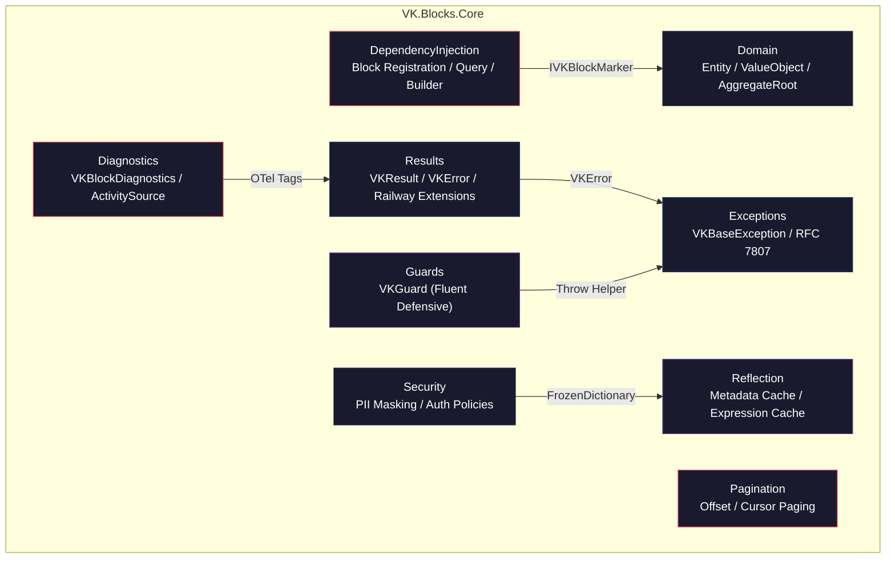

# VK.Blocks.Core

[](https://dotnet.microsoft.com/)
[](../../LICENSE)
[](../../docs/04-AuditReports/Core/Core_20260422.md)

## はじめに

`VK.Blocks.Core` は、VK.Blocks フレームワークの **基盤モジュール（Foundation Layer）** です。すべての BuildingBlock モジュールが共有する、クロスカッティング・コンサーン（横断的関心事）を一元的に定義・提供します。

本モジュールは以下の設計原則を貫徹しています:

- **ゼロリフレクション**: Static Abstract Interface Member と Source Generator により、ランタイムリフレクションを完全に排除
- **アロケーションフリー**: ホットパスにおける LINQ 排除、`Span<T>` / `stackalloc` / `HashCode` 構造体の活用
- **Fail-Fast 検証**: DI コンテナ構築時の再帰的依存関係チェックにより、設定ミスを起動時に即座に検出

---

## アーキテクチャ



### 設計原則とパターン

| カテゴリ | 適用パターン |
|---|---|
| **Design Principles** | SOLID, DRY, Fail-Fast, Defensive Programming |
| **Design Patterns** | Result Pattern (Railway-Oriented), Null Object, Marker Interface, Static Generic Caching, Throw Helper |
| **Architectural Principles** | Separation of Concerns, Dependency Inversion, Zero-Reflection |
| **Enterprise Patterns** | Value Object, Entity, Aggregate Root, Domain Event |

---

## 主な機能

### 🧱 依存性注入パイプライン (`DependencyInjection/`)

- **4ファイル責務分離**: Query / Registration / Builder / ServiceCollection に明確に分離
- **マーカーパターン**: `IVKBlockMarker` + `IVKBlockMarkerProvider<TSelf>` による型安全なブロック識別
- **再帰的依存解決**: `EnsureDependenciesRegistered` による Pre-order トラバーサルと循環依存検出
- **冪等二重登録**: `AddVKBlockOptions<T>` による IOptions + Singleton の安全な同時登録

### 🎯 Result Pattern (`Results/`)

- **`VKResult` / `VKResult<T>`**: 成功・失敗を型安全に表現
- **`VKError`**: `VKErrorType` と構造化エラーコードによるドメインエラー管理
- **Railway Extensions**: `Bind`, `Map`, `Tap`, `Ensure`, `Match` の同期・非同期全バリアント
- **成功キャッシュ**: `VKResult.Success()` のシングルトンインスタンスによる GC 負荷低減

### 🛡️ ガード節 (`Guards/`)

- **`VKGuard`**: `NotNull`, `NotNullOrWhiteSpace`, `NotEmpty`, `Positive`, `NotDefault`, `DefinedEnum`, `Against`
- **Fluent チェーン**: `VKGuard.NotNull(services).AddXxx()` による 1 行表現
- **Throw Helper**: `[DoesNotReturn]` によるJIT最適化と `[CallerArgumentExpression]` による自動パラメータ名解決
- **リソース安全**: `HasElements` のフォールバックにおける `IDisposable` 安全破棄

### 📊 診断・可観測性 (`Diagnostics/`)

- **`[VKBlockDiagnostics]`**: Source Generator による `ActivitySource` / `Meter` の自動生成
- **`VKStopwatchExtensions.RecordProcess`**: `Activity.Current` への自動タグ付け
- **OTel Semantic Conventions**: `CoreDiagnosticsConstants` による標準化されたメトリクス名

### 🏛️ ドメインプリミティブ (`Domain/`)

- **`VKEntity<TId>`**: 型安全な ID ベースの等価比較と ORM 互換性
- **`VKValueObject`**: アロケーションフリーな構造的等価比較（LINQ 非依存）
- **`VKAggregateRoot<TId>`**: ドメインイベント管理

### 🔒 セキュリティ基盤 (`Security/`)

- **`VKSensitiveDataAttribute`** / **`VKRedactedAttribute`**: プロパティレベルの PII マスキング宣言
- **`PropertySecurityCache<T>`**: `FrozenDictionary` による高速セキュリティメタデータ参照
- **`VKAuthPolicies`**: 認証グループポリシー定数（User / Service / Internal）

### ⚡ 高性能ユーティリティ (`Reflection/`, `Guids/`)

- **`VKEntityMetadata`**: `ConcurrentDictionary` + BitFlags によるエンティティ機能キャッシュ
- **`VKTypeMetadataCache`**: JIT 特殊化される Static Generic Caching
- **`VKExpressionCache`**: `ExpressionEqualityComparer` による Expression Tree キャッシュ
- **`SequentialGuidGenerator`**: `stackalloc` + `BinaryPrimitives` によるアロケーションフリー GUID 生成

### 📄 ページネーション (`Pagination/`, `Results/`)

- **`VKPagedResult<T>`**: オフセットベースのページネーション結果（`sealed record`）
- **`VKCursorPagedResult<T>`**: カーソルベースのページネーション結果（`sealed record`）

---

## 採用技術

| 技術 | 用途 |
|---|---|
| **.NET 10** | ランタイム・フレームワーク |
| **C# 12+** | Collection expressions, Primary constructors, Static abstract members |
| **Microsoft.Extensions.DependencyInjection** | DI コンテナ抽象化 |
| **Microsoft.Extensions.Options** | 構成バインディング・バリデーション |
| **Microsoft.Extensions.Configuration** | 構成セクション解決 |
| **System.Diagnostics.DiagnosticSource** | OpenTelemetry 統合用 ActivitySource |
| **FrozenDictionary** (.NET 8+) | 読み取り専用キャッシュの最適化 |

---

## 開始方法

```bash
# リポジトリのクローン
git clone https://github.com/ViktorLK/VK-Common-BE.git
cd VK-Common-BE

# ビルド
dotnet build src/BuildingBlocks/Core/VK.Blocks.Core.csproj

# テスト実行
dotnet test test/BuildingBlocks/Core/VK.Blocks.Core.UnitTests.csproj
```

### 他モジュールからの参照

```csharp
services.AddVKCoreBlock();
```

---

## 今後の展望

- **`FrozenDictionary`** への `VKEntityMetadata._capabilityCache` 移行検討
- **Source Generator** による `VKGuard` の CallerInfo コンパイル時解決
- **Covariant Return Types** を活用した `IVKBlockMarker.Dependencies` の型安全性強化

---

## 関連ドキュメント

- [ADR 一覧 (Core)](/docs/02-ArchitectureDecisionRecords/Core/README.md) — 13 件の設計決定記録
- [監査レポート (2026-04-22)](/docs/04-AuditReports/Core/Core_20260422.md) — スコア: 100/100

---

**Last Updated**: 2026-04-22
