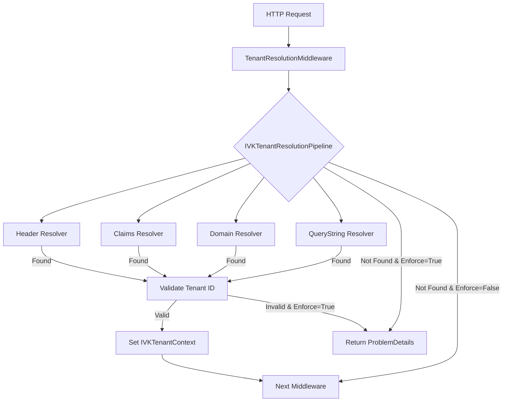

# VK.Blocks.MultiTenancy

[](https://dotnet.microsoft.com/download/dotnet/10.0)
[](https://opensource.org/licenses/MIT)
[]()

## はじめに (Introduction)

`VK.Blocks.MultiTenancy` は、現代的な .NET 10 クラウドネイティブアプリケーション向けに設計された、高度に拡張可能なマルチテナンシー・フレームワークです。

本モジュールは、単一のデプロイメントで複数の顧客（テナント）を安全かつ効率的に分離して運用するためのコア機能を提供します。識別、検証、およびコンテキスト管理のプロセスを抽象化し、ビジネスロジックからインフラレベルのテナント管理を切り離すことを目的として設計されています。

---

## アーキテクチャ (Architecture)

本モジュールは、以下の設計原則とパターンに基づいて構築されています。

### 解像フロー (Resolution Flow)

以下の Mermaid ダイアグラムは、リクエスト受信からテナント確定までのプロセスを示しています。



### 設計パターン
- **Strategy Pattern (IVKTenantResolver)**:
  テナント識別ロジックをリゾルバーとして抽象化しています。HTTP ヘッダー、クエリストリング、ホスト名、JWT クレームなど、多様なソースからの識別を柔軟に切り替え・拡張可能です。
- **Pipeline Pattern (IVKTenantResolutionPipeline)**:
  複数のリゾルバーを連結し、優先順位に従ってテナントを特定する解決パイプラインを採用しています。
- **Middleware Integration**:
  ASP.NET Core のミドルウェアとして動作し、リクエストのライフサイクル初期段階でテナントを確定させます。
- **Ambient Context Pattern (IVKTenantContext)**:
  `TenantContextAccessor` を介して、アプリケーションのどのレイヤーからでも現在のテナント情報に型安全にアクセスできる環境を提供します。
- **Options Pattern**:
  `.NET Options` パターンを全面的に採用し、テナント識別の強制（Enforcement）やリゾルバーの動作設定を外部化しています。

---

## 主な機能 (Key Features)

- **Pluggable Tenant Resolvers**: 以下の標準リゾルバーを同梱し、独自のカスタムリゾルバーの追加も容易です。
  - `HeaderTenantResolver`: カスタム HTTP ヘッダーによる識別。
  - `QueryStringTenantResolver`: URL パラメータによる識別。
  - `DomainTenantResolver`: リクエストのホスト名（サブドメイン等）による識別。
  - `ClaimsTenantResolver`: JWT 等の認証クレームによる識別。
- **Resolution Enforcement**: テナント未特定時に自動的に `401 Unauthorized` や `400 BadRequest` を返却する強制適用オプション。
- **Tenant Context Accessor**: `IHttpContextAccessor` ライクな `TenantContextAccessor` により、DI を通じてどこからでも現在のテナントにアクセス可能。
- **Domain Mapping Support**: テナント ID だけでなく、ドメイン名からテナント情報を引くための `IVKTenantStore` インターフェースを提供。
- **Seamless Integration**: `VK.Blocks` シリーズの他のモジュール（監査ログ、ソフトデリート、データベース分離）と密接に連携。

---

## 採用技術 (Tech Stack)

- **Runtime**: .NET 10
- **Framework**: ASP.NET Core
- **DI/Options**: Microsoft.Extensions.DependencyInjection / Options
- **Architecture**: Domain-Driven Design (Building Blocks)

---

## 開始方法 (Getting Started)

### 1. サービスの登録

`Program.cs` 等でマルチテナンシーサービスを登録します。

```csharp
builder.Services.AddMultiTenancyBlock(builder.Configuration, options =>
{
    // テナント解決を強制する場合
    options.EnforceTenancy = true;
});
```

### 2. ミドルウェアの使用

リクエストパイプラインにマルチテナンシーの解決処理を挿入します。

```csharp
var app = builder.Build();

// 認証・認可の後に実行（ClaimsResolver を使用する場合）
app.UseAuthentication();
app.UseMultiTenancyBlock();
app.UseAuthorization();
```

### 3. テナント情報の利用

コンストラクタ注入により、現在のテナント情報を取得します。

```csharp
public sealed class MyService(IVKTenantContext tenantContext)
{
    public void DoWork()
    {
        var currentTenantId = tenantContext.CurrentTenant?.Id;
        // ビジネスロジックの実行...
    }
}
```

---

## 今後の展望 (Future Roadmap)

- [ ] 分散キャッシュ（Redis 等）を利用したテナントストアのデフォルト実装。
- [ ] テナント固有の設定（Settings）管理機能。
