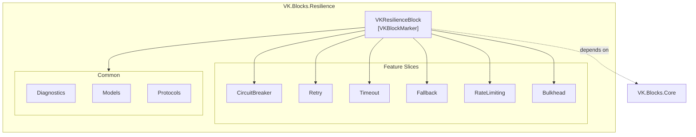
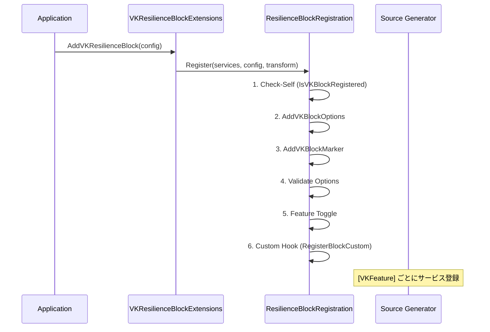

# VK.Blocks.Resilience

[](https://dotnet.microsoft.com/)
[](https://opensource.org/licenses/MIT)
[](https://github.com/)

## はじめに

**VK.Blocks.Resilience** は、分散システムにおける障害耐性（レジリエンス）を実現するための軽量ビルディングブロックです。外部ライブラリ（Polly 等）に依存せず、VK.Blocks アーキテクチャに完全準拠した自己完結型のレジリエンス戦略を提供します。

各戦略は独立した垂直スライス（Vertical Slice）として設計されており、Source Generator による自動化された DI 登録、`VKResult<T>` ベースのエラーハンドリング、そして `TimeProvider` 注入によるテスタブルな時間制御を特徴としています。

---

## アーキテクチャ

### 設計原則・パターン

| カテゴリ | 適用パターン |
|:---------|:-------------|
| **設計原則** | SOLID, KISS, YAGNI, DRY |
| **設計パターン** | Strategy, Builder, Feature Toggle |
| **アーキテクチャ原則** | 関心の分離, カプセル化, 高凝集・低結合 |
| **アーキテクチャスタイル** | Clean Architecture, Vertical Slice Architecture |
| **エンタープライズパターン** | Circuit Breaker, Retry, Timeout, Rate Limiting, Bulkhead, Fallback |

### モジュール構造



### 垂直スライスの内部構造

各 Feature Slice は統一されたパターンで構成されています：

```
{Feature}/
├── Protocols/
│   └── IVK{Feature}.cs          # Public インターフェース
├── Internal/
│   └── Local{Feature}.cs        # Internal 実装（Basic 接頭辞）
├── VK{Feature}Options.cs        # sealed partial record + IVKBlockOptions
└── {Feature}Feature.cs          # [VKFeature] SG-driven 登録
```

### DI 登録フロー



---

## 主な機能

### 🔄 リトライ（Retry）
- 指数バックオフ（Exponential Backoff）+ ジッター（Jitter）対応
- 最大リトライ回数・最大遅延時間の設定可能
- カスタム `shouldRetry` フィルターによる選択的リトライ
- `VKResult<T>` による型安全なエラー返却

### ⏱️ タイムアウト（Timeout）
- `CancellationTokenSource.CreateLinkedTokenSource` によるリンク型キャンセル
- 外部キャンセルとタイムアウトキャンセルの明確な区別
- 値返却型 / void 型の両オーバーロード対応

### ⚡ サーキットブレーカー（Circuit Breaker）
- スライディングウィンドウ方式の失敗率追跡
- `ConcurrentDictionary` ベースのキー別状態管理
- `TimeProvider` 注入によるテスタブルなクールダウン制御

### 🛡️ フォールバック（Fallback）
- プライマリアクション失敗時のフォールバック自動実行
- フォールバック自体の失敗もハンドリング
- `VKResult<T>` でプライマリ・フォールバック両方の結果を統一

### 🚦 レート制限（Rate Limiting）
- スライディングウィンドウ方式のリクエスト制限
- キー別（テナント別・エンドポイント別等）の制御

### 📦 バルクヘッド（Bulkhead）
- 同時実行数の制御による障害分離
- キー別の並列実行スロット管理
- Acquire / Release パターンによる明示的なリソース管理

### 🔧 共通基盤
- **`IVKResiliencePipeline`**: 複合レジリエンスパイプラインの契約定義
- **`VKResilienceContext`**: 操作コンテキスト（`OperationKey` + カスタムプロパティ）
- **`ResilienceDiagnostics`**: `[VKBlockDiagnostics]` による OpenTelemetry メトリクス・トレーシング

---

## 採用技術

| 技術 | 用途 |
|:-----|:-----|
| **.NET 10** | ランタイム基盤 |
| **C# 12+** | `sealed record`, Collection expressions, Primary constructors |
| **VK.Blocks.Core** | `VKResult<T>`, `VKGuard`, `VKBlockMarker`, `TimeProvider` |
| **Source Generators** | `[VKBlockMarker]`, `[VKFeature]`, `[VKBlockDiagnostics]` による自動コード生成 |
| **Microsoft.Extensions.DependencyInjection** | DI コンテナ統合 |
| **Microsoft.Extensions.Options** | Options パターン + `IValidateOptions<T>` |
| **System.Diagnostics** | `ActivitySource` / `Meter` / `Counter` による可観測性 |

---

## 開始方法

### 前提条件

- .NET 10 SDK
- VK.Blocks.Core プロジェクトへの参照

### インストール

```csharp
// Program.cs / Startup.cs
services.AddVKResilienceBlock(configuration);
```

### Feature の有効化（Builder パターン）

```csharp
services.AddVKResilienceBlock(configuration)
    .AddRetry()
    .AddTimeout()
    .AddCircuitBreaker()
    .AddFallback()
    .AddRateLimiting()
    .AddBulkhead();
```

### Options のカスタマイズ

```csharp
services.AddVKResilienceBlock(configuration, options => options with
{
    Enabled = true
})
.AddRetry(options => options with
{
    MaxRetries = 5,
    InitialDelay = TimeSpan.FromMilliseconds(500),
    BackoffMultiplier = 2.0,
    UseJitter = true
})
.AddTimeout(options => options with
{
    Duration = TimeSpan.FromSeconds(10)
});
```

### 使用例

```csharp
public sealed class MyService(IVKRetryExecutor retryExecutor)
{
    public async Task<VKResult<string>> FetchDataAsync(CancellationToken ct)
    {
        return await retryExecutor.ExecuteWithRetryAsync<string>(
            async token =>
            {
                // ビジネスロジック
                return await httpClient.GetStringAsync("https://api.example.com", token);
            },
            cancellationToken: ct);
    }
}
```

---

## 今後の展望

- [ ] `IVKResiliencePipeline` の具体実装（複合レジリエンスパイプライン）
- [ ] Redis-backed CircuitBreaker / RateLimiter（分散環境対応）
- [ ] `[LoggerMessage]` SG によるイベントログ追加
- [ ] `VKResilienceErrors` 定数クラスの導入
- [ ] ConcurrentDictionary の TTL / Eviction メカニズム
- [ ] Polly v8 / `Microsoft.Extensions.Resilience` との統合検討

---

## ライセンス

MIT License — 詳細は [LICENSE](../../LICENSE) を参照してください。
