# VK.Blocks.Resilience

[](https://dotnet.microsoft.com/)
[](https://opensource.org/licenses/MIT)
[](https://github.com/)

## はじめに

**VK.Blocks.Resilience** は、分散システム、外部 HTTP サービス、および AI / LLM ワークロードにおける障害耐性（レジリエンス）を実現するためのエンタープライズ対応ビルディングブロックです。外部ライブラリ（Polly 等）に依存せず、VK.Blocks アーキテクチャに完全準拠した自己完結型のレジリエンス戦略・複合責任連鎖パイプラインを提供します。

各戦略は独立した垂直スライス（Vertical Slice）として設計されており、Source Generator による自動化された DI 登録、`VKResult<T>` ベースのエラーハンドリング、そして `TimeProvider` 注入によるテスタブルな時間制御を特徴としています。

---

## アーキテクチャ

### 設計原則・パターン

| カテゴリ | 適用パターン |
|:---------|:-------------|
| **設計原則** | SOLID, KISS, YAGNI, DRY |
| **設計パターン** | Strategy, Pipeline (Chain of Responsibility), Builder, Registry, Feature Toggle |
| **アーキテクチャ原則** | 関心の分離, カプセル化, 高凝集・低結合 |
| **アーキテクチャスタイル** | Clean Architecture, Vertical Slice Architecture |
| **エンタープライズパターン** | Composite Pipeline, Circuit Breaker, Exponential Retry with Jitter, Optimistic/Pessimistic Timeout, Sliding/Token-Bucket Rate Limiting, Queued Bulkhead, Graceful Fallback, AI Provider/Model Failover, SWR Caching |

### モジュール構造

```mermaid
graph TB
    subgraph "VK.Blocks.Resilience"
        direction TB
        Block["VKResilienceBlock<br/>[VKBlockMarker]"]
        
        subgraph "Pipeline Engine"
            Pipeline["DefaultResiliencePipeline"]
            Builder["IVKPolicyBuilder"]
            Registry["IVKPolicyRegistry"]
        end

        subgraph "Feature Slices"
            direction LR
            CB["CircuitBreaker<br/>(3-State StateMachine)"]
            RT["Retry<br/>(Exp Backoff + Jitter + OnRetry)"]
            TO["Timeout<br/>(Optimistic + Pessimistic)"]
            FB["Fallback<br/>(VKResult + Exception)"]
            RL["RateLimiting<br/>(Sliding + TokenBucket)"]
            BH["Bulkhead<br/>(Concurrency + Queue)"]
            AI["AI Resilience<br/>(Provider/Model Failover)"]
            Cache["Caching SWR<br/>(Stale While Revalidate)"]
        end
        
        subgraph "Common"
            direction TB
            Diag["Diagnostics & LoggerMessage"]
            Models["Models & Context"]
            Proto["Protocols & Policy"]
            Health["VKResilienceHealthCheck"]
        end
    end

    Core["VK.Blocks.Core"]

    Block --> Pipeline
    Block --> CB
    Block --> RT
    Block --> TO
    Block --> FB
    Block --> RL
    Block --> BH
    Block --> AI
    Block --> Cache
    Block --> Common
    Block -.->|depends on| Core
```



---

## 主な機能一覧

### 1. 🔄 複合パイプライン・集中レジストリ（Pipeline & Registry）
- **`IVKResiliencePipeline`**: 複数ポリシー（Timeout -> Retry -> CircuitBreaker -> Bulkhead 等）を流水線状に連鎖実行するコア責任連鎖エンジン。
- **`IVKPolicyBuilder`**: 宣言的な Fluent API によるパイプライン構築。
- **`IVKPolicyRegistry`**: 名前付きパイプライン（`"http:standard"`, `"ai:chat"` 等）のスレッドセーフな集中登録・解決。
- **`VKResilienceContext`**: `TraceId`, `TenantId`, `OperationName` 强タイププロパティを内包したコンテキスト。

### 2. 🔄 リトライ（Retry）
- 指数バックオフ（Exponential Backoff）+ ジッター（Jitter）対応
- 最大リトライ回数・最大遅延時間・カスタム `shouldRetry` フィルター
- `OnRetry` コールバック通知（試行回数、待機時間、エラー情報の取得）
- `VKResult<T>` による型安全なエラーコード判定

### 3. ⏱️ タイムアウト（Timeout）
- **協調的タイムアウト（Optimistic）**: `CancellationTokenSource.CreateLinkedTokenSource`
- **悲観的タイムアウト（Pessimistic / Task Abort）**: 応答不能な非協調タスクに対する `Task.WhenAny` 破棄
- `OnTimeout` コールバック通知

### 4. ⚡ サーキットブレーカー（Circuit Breaker）
- 三態状態機（`Closed`, `Open`, `HalfOpen`）
- スライディングサンプリングウィンドウによる失敗率計算
- **半開試行呼び出し数制御（Trial Executions Limit）**: 回復検証時の突発過負荷を防止
- `OnBreak` / `OnReset` 状態遷移イベント通知

### 5. 🚦 レート制限（Rate Limiting）
- **スライディングウィンドウ方式**: `IVKRateLimiter`
- **トークンバケットアルゴリズム**: `IVKTokenBucketLimiter`（秒間トークン補充とバースト許容制御）
- キー別（テナント・IP・ユーザー）パーティション制限

### 6. 📦 バルクヘッド（Bulkhead）
- 同時実行数の制御による障害分離
- **非同期待機キュー（Queue Capacity & Queue Timeout）**: 超過リクエストのバッファリング
- キー別の並列実行スロット管理

### 7. 🛡️ フォールバック（Fallback）
- プライマリ失敗時のフォールバック自動実行
- `VKResult<T>` と Exception の両フローに対応

### 8. 🤖 AI / LLM 容錯（AI Resiliency）
- **`ProviderFallback`**: OpenAI 障害・レート制限時の Gemini / Azure OpenAI への自動フェイルオーバー
- **`ModelFallback`**: 大規模モデル（GPT-4）過負荷時の軽量モデル（GPT-4o-mini）への自動ダウングレード
- **`Retry-After` スマートリトライ**: 429 レートリミット応答に対する動的待機リトライ

### 9. ⚡ キャッシュ協調（Caching Resiliency）
- **Stale While Revalidate (SWR)**: 期限切れキャッシュを即座に返しつつ、バックグラウンドで非同期更新

### 10. 📊 可観測性・健康診断（Observability & Health Checks）
- `[VKBlockDiagnostics]` による OpenTelemetry メトリクス・トレーシング
- `[LoggerMessage]` によるゼロアロケーション構造化ログ
- `VKResilienceHealthCheck`: 熔断器状態の自動ヘルスチェック診断

### 11. 🌐 HTTP 統合（HttpClient Integration）
- `IHttpClientBuilder.AddVKResiliencePipeline("pipelineName")`
- `IHttpClientBuilder.AddVKStandardResilienceHandler()`

---

## クイックスタート

### 1. DI 登録

```csharp
// Program.cs / Startup.cs
services.AddVKResilienceBlock(configuration);
```

### 2. パイプラインの構築と実行

```csharp
// 1. レジストリからパイプラインを定義・登録
var pipeline = registry.GetOrAddPipeline("ExternalServiceCall", builder =>
{
    return builder
        .AddTimeout(TimeSpan.FromSeconds(5))
        .AddRetry(maxRetries: 3, initialDelay: TimeSpan.FromMilliseconds(200), useJitter: true)
        .AddCircuitBreaker(circuitBreakerKey: "external-api", durationOfBreak: TimeSpan.FromSeconds(30))
        .AddBulkhead(bulkheadKey: "external-api", maxParallelization: 20, maxQueuedCount: 10)
        .Build();
});

// 2. パイプライン経由での実行
var result = await pipeline.ExecuteAsync(async (context, ct) =>
{
    return await externalClient.CallApiAsync(ct);
}, VKResilienceContext.Create("CallOrderApi", traceId: "trace-123"));
```

### 3. HttpClient での標準利用

```csharp
services.AddHttpClient("OrderServiceClient")
    .AddVKStandardResilienceHandler();
```

---

## ライセンス

MIT License — 詳細は [LICENSE](../../LICENSE) を参照してください。
